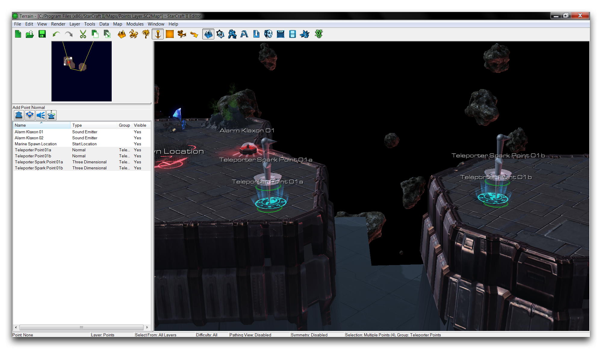
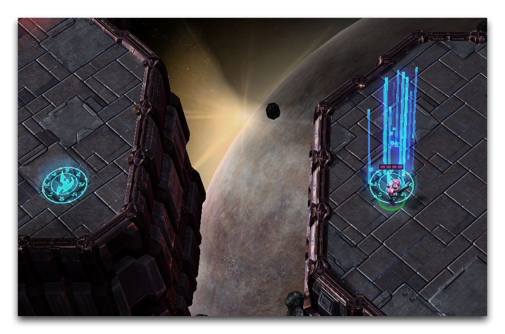

現在，您應該確保使用組選擇，方法是導航至 工具 ▶ 使用組選擇。這意味著移動組中的任何一個點也會移動該組中的所有其他點。請選擇其中一個分組的傳送點使用此功能。將最左側的點移動到太空平台上最左側的信標。現在，兩組點應該與信標對齊，如下所示。

*將點對齊到傳送信標*

現在運行地圖以進行測試，應該會在“海軍出生點”生成一位海軍。從那裡，您可以將海軍移動到信標上，這將使他從最右側平台傳送，然後再返回。

*傳送完成*

## 附件

 * [023_Points_Layer_Completed.SC2Map](./maps/023_Points_Layer_Completed.SC2Map)
 * [023_Points_Layer_Start.SC2Map](./maps/023_Points_Layer_Start.SC2Map)