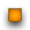
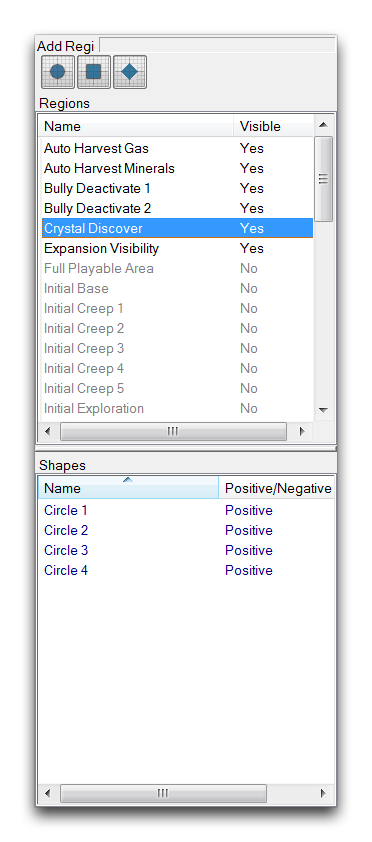
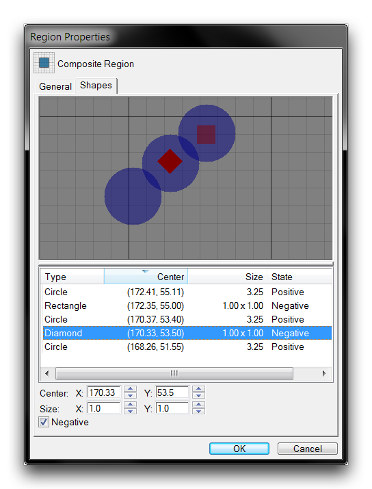
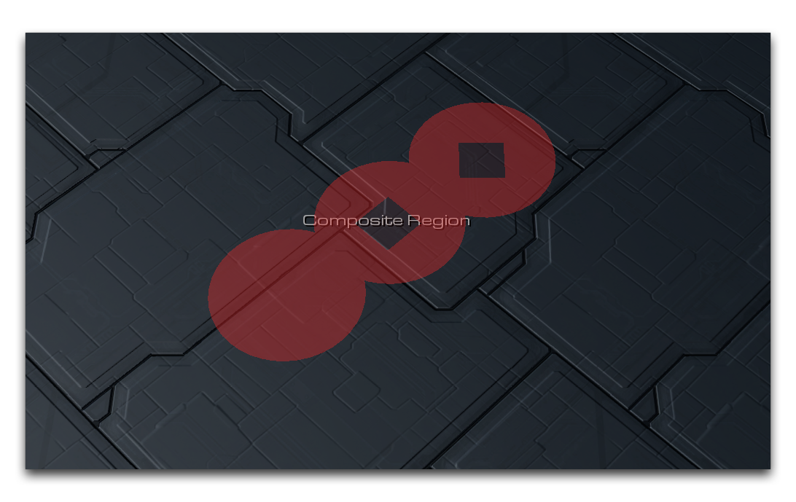
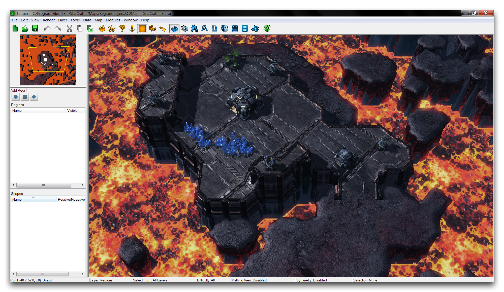
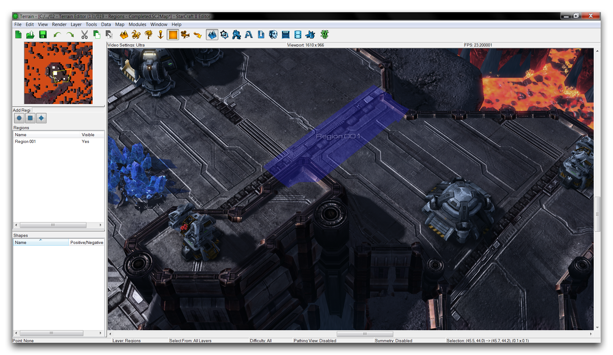
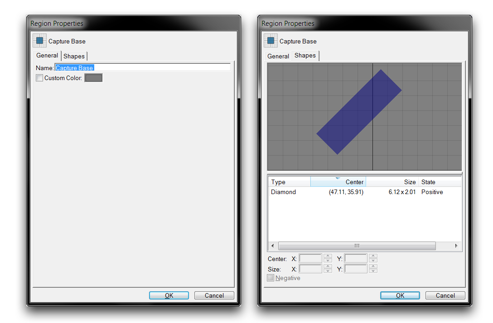
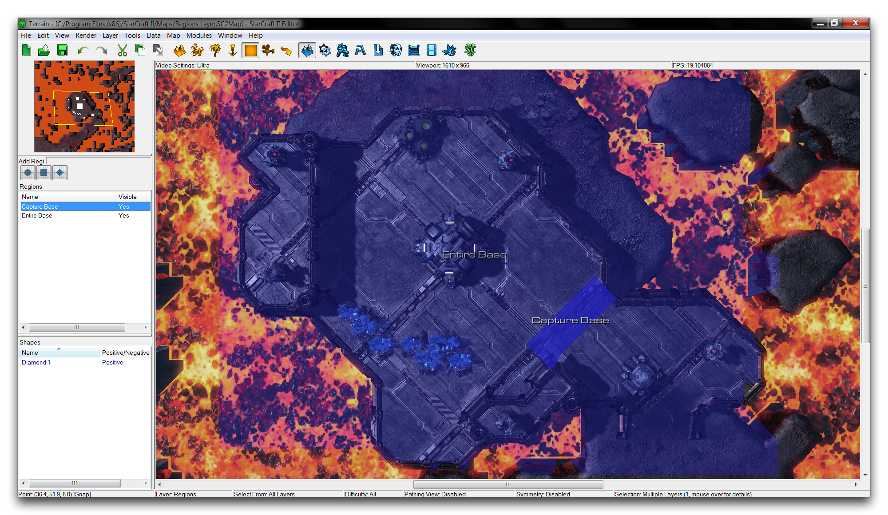
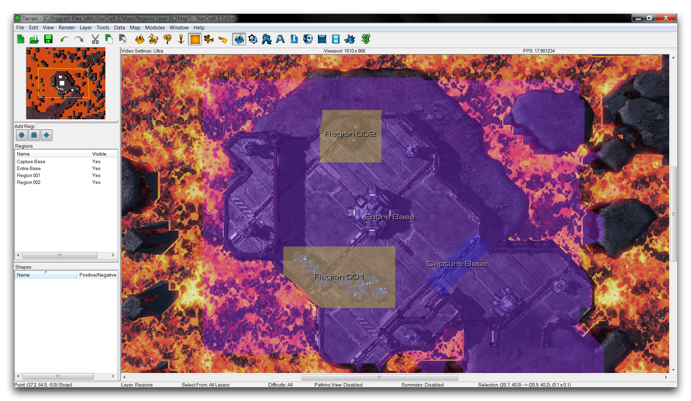
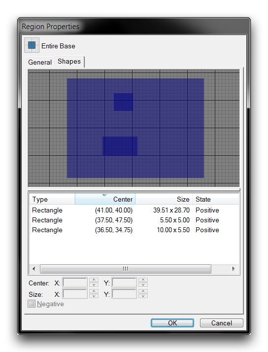

# 区域层

区域层允许您创建区域。区域是地图上标记的区域，通信其他模块中可以使用的区域。区域与点不同，它们标记地图上的特定形状，而不是单个坐标。使用下面显示的图标从地形栏中选择此层。

*区域层图标*

## 区域调色板

区域调色板是您将找到用于创建区域的控件以及地图上已有的任何区域的列表的地方。当地形编辑器的区域层处于活动状态时，此调色板位于主视口的左侧。它看起来像下面的图片。

*区域调色板*

区域由使用三种工具应用于地图的形状组成：矩形、圆形和菱形。在编辑器中，区域的区域用有色覆盖标记，但在正常游戏中是不可见的。您还可以通过组合任意数量的基本形状来构建组合区域。可以以正的方式组合形状，使它们的区域相加，也可以以负的方式组合，使一个区域从现有区域中减去。

您可以通过选择区域并查看区域调色板的底部子视图来检查区域的组成。此列表将显示该区域中包含的所有基本形式的总计以及它们是以积极还是消极的方式组合。

## 区域属性

使用“区域属性”窗口构建组合区域。可以通过双击地图视图中的现有区域或在“区域”调色板中找到该区域来查找此窗口。您可以在下面的图片中看到“区域属性”窗口的示例。

*组合区域构建*

在这里，您可以通过从单个正区域开始来构建组合。然后，通过右键单击形状列表并选择“添加圆形”、“添加矩形”或“添加菱形”来添加形状。这些形状中的任何一个都可以选择“否定”选项更改为切割。正区域显示为蓝色覆盖，而负区域显示为红色。在地图视图中，实际形状将显示为有色覆盖，其中负切除区域将显示为透明。在地图视图中，上述示例将显示如下。

*编辑器中的组合区域*

## 演示区域

打开本文附带的演示地图。该地图由位于山顶的小要塞组成，距离一对玩家拥有的地狱火有一段距离。

*演示地图路线*

如果您检查该地图中的触发器编辑器，您将发现在“玩家1占领基地”下有一个简短的操作，一旦单位进入区域，将把要塞的中立单位控制权交给玩家。为了实现这一点，您需要在要塞入口附近创建一个区域，然后将其与此触发器连接起来。

通过单击“区域”调色板中的三个区域工具之一创建一个区域。在这里，添加区域菱形工具最为恰当。选择它，然后在地图视图上点击并拖动以绘制区域。这将给您一个看起来像下面图片的东西。

*创建区域*

如果您不喜欢区域的放置位置，可以通过将光标切换到选择模式来调整其大小。按下键盘上的空格键将鼠标光标在普通指针和用于区域创建的带加号的指针之间切换。一旦进入选择模式，单击区域将重新激活它，使您可以通过将其点击并拖动到另一个位置来移动它。您可以按住Ctrl键并单击区域边缘来调整区域的大小，将其拖动到新的尺寸。

现在，单击“区域”调色板中的区域以启动其“区域属性”窗口，然后导航到“常规”选项卡。将名称设置为“占领基地”。属性窗口应该看起来像下面显示的那样。

*区域属性内容*

您可以在上述“常规”选项卡下的最左侧视图中编辑该区域。值得注意的是，区域的尺寸和位置在“形状”选项卡下显示为大小和中心。如果您在原始位置时遇到问题，可以在这里确认区域大小。

接下来，返回地形模块，并通过选择“添加区域矩形”工具准备另一个区域。这次，创建区域以包含整个山顶要塞。将此区域重命名为“整个基地”。您将得到下面的图片。

*当前区域布局*

如果看不到整个场景，请尝试缩小或通过转到“查看” ▶︎ “整个地图”来设置摄像机为俯视视图。从这个视图，您可以放大并获得与示例图中看到的透视相同的视角。请注意，您也可以通过在地图视图中选择特定区域来突出显示特定区域，正如上面的“占领基地”区域所做的那样。

不幸的是，“整个基地”区域现在内含矿物区和一处虚拟气露。根据触发器模块中的操作，这将导致玩家获得对这些资源的控制。资源通常必须属于中立玩家。您可以使用组合区域来构建一个包括基地的区域，但也要考虑到这些元素。

通过创建两个矩形区域准备您的组合区域，一个围绕着矿区，另一个围绕着虚拟气田。您可以将这些区域更改为负区域，这样它们将从较大形状中切除出来，确保资源不被包括在区域内。完成此过程后，应呈现以下视图。

*预备的切割区域*

为了确保一切清晰易读，已为新区域和“占领基地”区域设置了自定义颜色。您可以通过前往区域属性 ▶︎ 常规 ▶︎ 自定义颜色来执行此操作。您现在可以通过选择其三个组成区域，然后导航到“区域属性”窗口，创建一个组合区域。通过按住Shift键单击“占领基地”、“区域001”和“区域002”来选择所有区域。现在右键单击“区域”调色板，并导航到编辑 ▶︎ 合并选择。

*收集的区域属性*