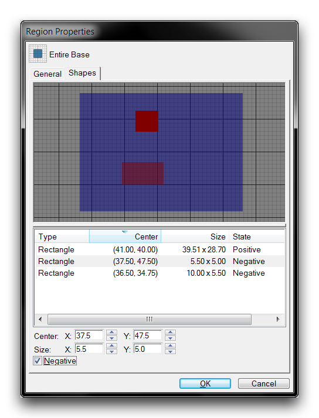
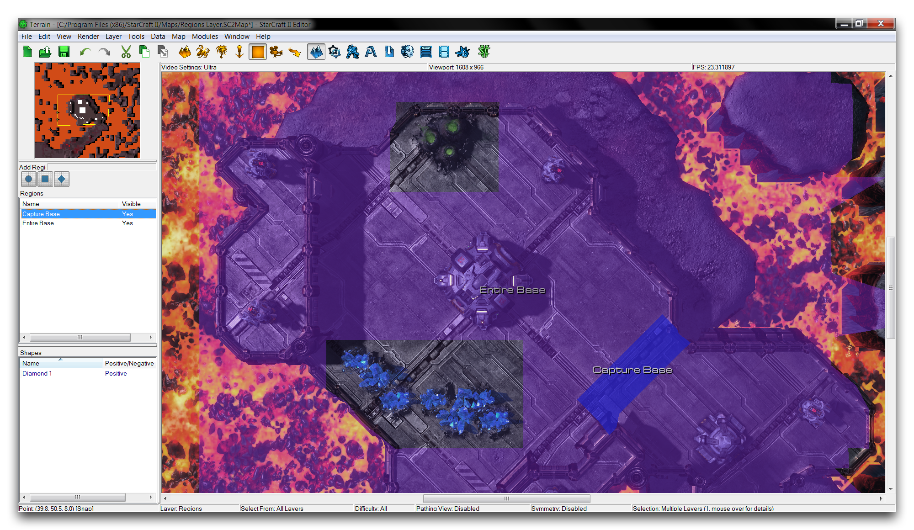
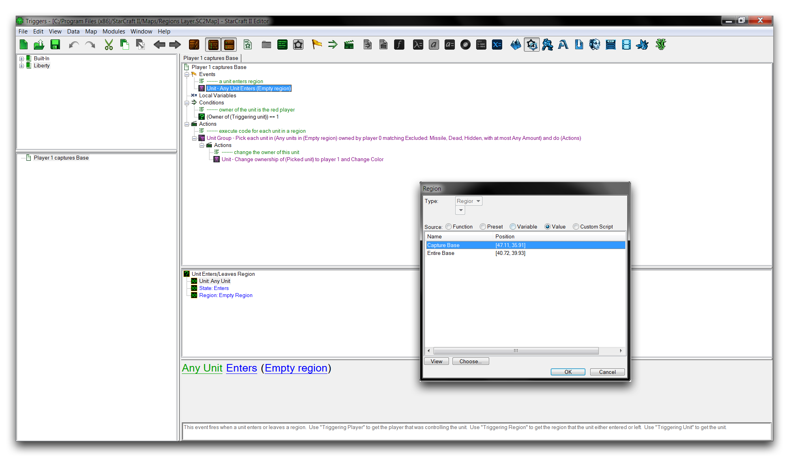
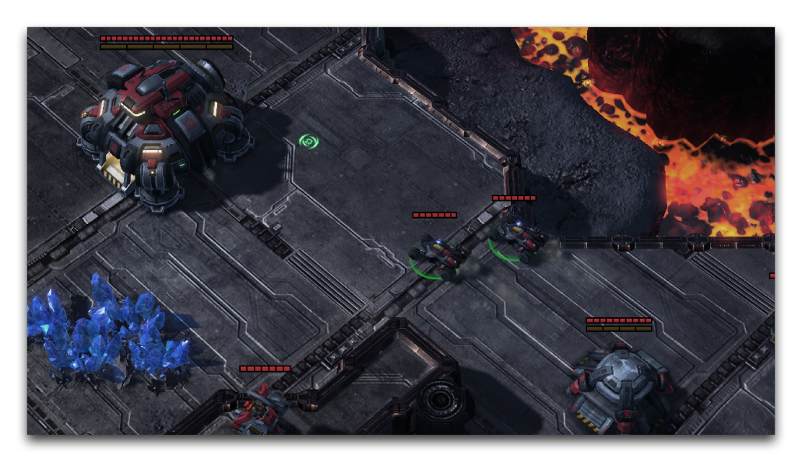

这个视图呈现了在地形编辑器中所见的抽象内容。从这里，您可以通过选择两个最小的区域并将它们的状态更改为负来创建切口。负形状将会以红色绘制，这应该会给您一个类似于下面区域属性窗口中所示的结果。

*构建的复合区域*

返回地图视图现在应该显示包含整个要塞的区域，但是周围有两个资源空隙。

*准备切口区域*

现在这些区域有意义了，您可以切换至触发器编辑器，然后返回到“Player 1 Capture Base”触发器。选择“单位进入/离开区域”事件，并双击“区域”字段。这将打开一个“区域”窗口，其中列出了地图上的活动区域。选择复合区域“Capture Base”，然后点击“确定”，如下图所示。

*选择复合区域*

然后移至“更改所有者”动作，并使用前面描述的方法将“区域”字段设置为“Capture Base”。

项目完成后，您可以花点时间审查其功能。通过将山脚下的恶灵移动到“Capture Base”区域，触发事件将把“整个基地”区域中的一切转移到玩家控制下。由于复合区域中的切口，矿石和气矿应保持为中立实体。

如果一切正常，点击“测试文档”并引导恶灵进入要塞入口应会正确地转移所有权，如下图所示。

*占领要塞*

## 附件

- [024_Regions_Start.SC2Map](./maps/024_Regions_Start.SC2Map)
- [024_Regions_Completed.SC2Map](./maps/024_Regions_Completed.SC2Map)