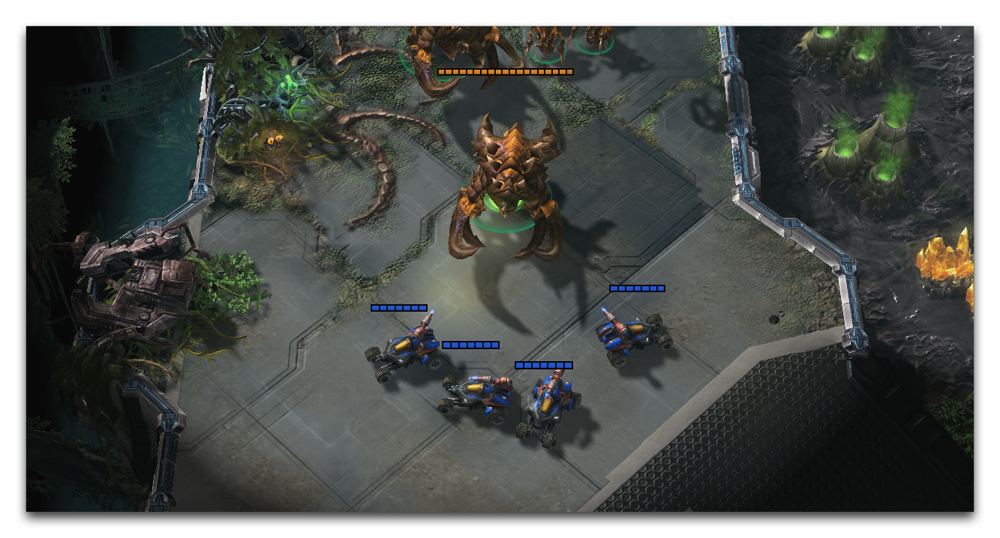
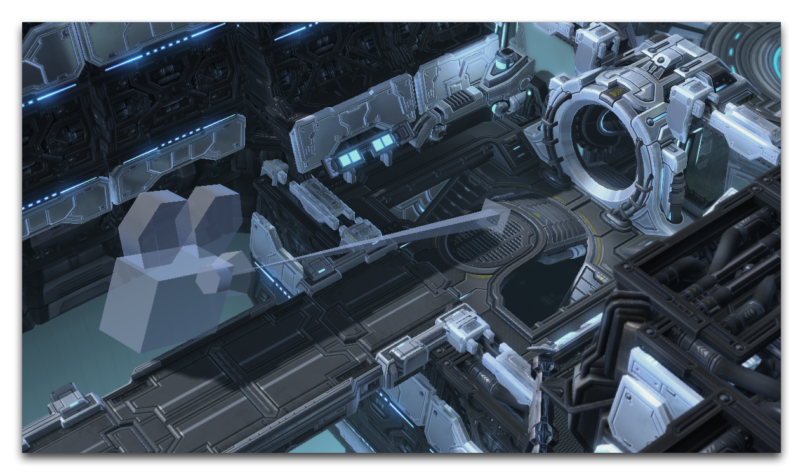
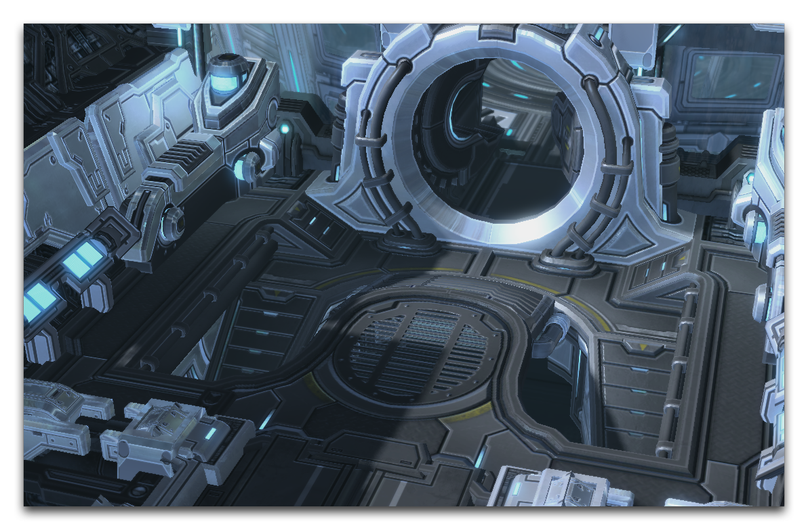
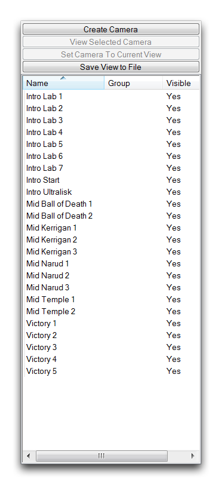
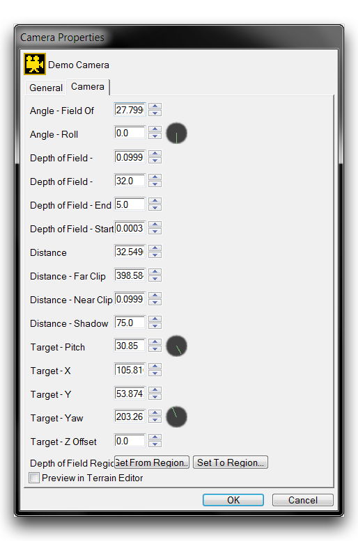
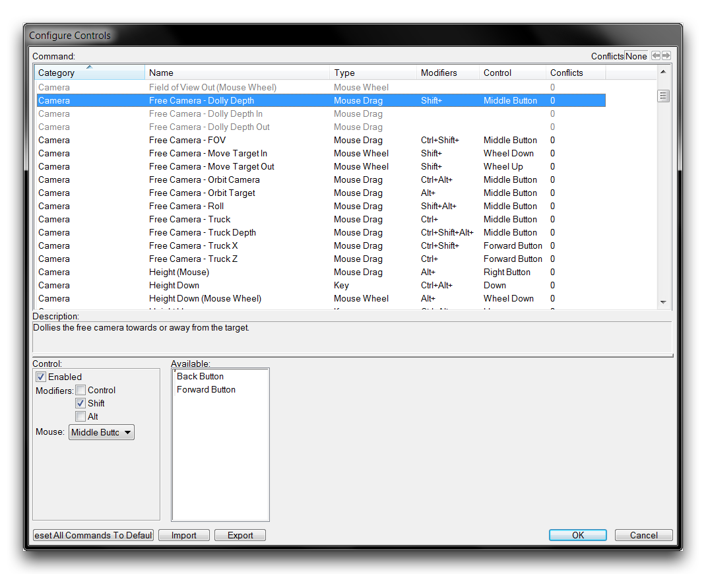

# 摄像头层

StarCraft通常以标准的近战游戏所特有的俯视角度呈现。

*标准近战视图*

很容易忽视这个视角是游戏视觉设计的中心要点。尽管引擎在单人游戏中经常使用电影效果，但玩家们经常会忘记他们是通过一个动态、完全可移动的摄像头观看游戏。

通过摄像头层，可以使用一种名为摄像头的游戏对象来描述独特的视角、效果和动作。这一层使您能够轻松进入这些对象内部，可以从它们的视角看事物并为使用配置它们。然后，您可以使用触发器编辑器和剧情编辑器在各种电影或游戏中使用摄像头，以为玩家提供更丰富的体验。要了解更多关于摄像头的信息，请使用下面图片所示的图标从地形栏中切换到摄像头图层。

*摄像头层图标*

## 摄像头对象

一旦创建，摄像头会在编辑器中显示为标记对象，显示其位置和方向，就像实际摄像头一样。摄像头只会出现在编辑器中，它们显示为幻影3D模型，如下图所示。

*摄像头对象*

尽管它具有说明性外观，但此帧左侧的摄像头本质上与“点层”中找到的点相同。摄像头与“3D点”紧密相关，因为它是空间中具有X、Y和Z值的点。摄像头和3D点之间的主要区别在于，摄像头还具有向量。这个向量是在3D空间中描述方向的箭头。

摄像头的点和向量的组合相当于位置和视角。当引入一个摄像头对象时，摄像头会传输描述“它在哪里”和“它在看什么”的信息给游戏，为玩家设置视角。透过上述摄像头的镜头看到的视图如下。

*摄像头视图*

记住编辑器中摄像头的3D模型标记，将它们视为物理摄像头会使工作更容易。在构建游戏场景和影视时，您可能会发现自己需要管理许多摄像头。在这些情况下，将自己视为导演，设置场景并放置特定的摄像头镜头会有所帮助。

## 摄像头调色板

您将在摄像头层的摄像头调色板中找到摄像头和创建控制。如下所示。

*摄像头调色板*

此调色板上的主列表跟踪当前地图中可用的每个摄像头。您可以通过从列表中选择摄像头然后单击“查看所选摄像头”来查看任何摄像头。在这里，您还可以通过“保存视图到文件”选项支持将摄像头配置导出到文件。通过此处的“创建摄像头”按钮创建摄像头，在编辑器中生成一个与您当前视角相对应的摄像头。

## 摄像头属性

一旦创建摄像头，您可以通过其“摄像头属性”对其进行配置。这可以通过在摄像头调色板上右键单击摄像头并导航到“摄像头属性”来实现。然后将显示如下的“摄像头属性”窗口，以及其选项的详细说明。

*摄像头属性*

| 属性            | 描述                                                                                                                                                            |
| --------------- | --------------------------------------------------------------------------------------------------------------------------------------------------------------- |
| 距离            | 确定摄像头与其目标之间的距离。                                                                                                                                   |
| 横滚            | 以页面平面上的角度旋转摄像头。如果将摄像头视为您的头部，则横滚可被视为以能够将视图颠倒的方向旋转。                                                             |
| 偏航            | 将摄像头左右旋转。如果将摄像头视为您的头部，这将相当于从左到右看或摇摆头部产生“否”动作。                                                                        |
| 俯仰            | 将摄像头上下旋转。如果将摄像头视为您的头部，这将相当于以“是”动作点头。                                                                                           |
| 目标X           | 摄像头向其指向的地图X坐标。                                                                                                                                       |
| 目标Y           | 摄像头向其指向的地图Y坐标。                                                                                                                                       |
| 目标Z偏移      | 摄像头与目标点之间的差别。本质上是摄像头的Z坐标或高度。也称为高度偏移。                                                                                        |
| 脚下虚化      | 使视图中的组件模糊以类似于现实世界视觉。此设置设置此效果的开始、结束和程度。                                                                                     |
| 视野            | 控制相机可见的游戏世界范围。                                                                                                                                     |
| 近裁剪         | 最接近裁剪平面的距离，超出此距离不会渲染任何游戏元素。在3D空间中，渲染开始的起始距离。                                                                         |
| 远裁剪         | 最远裁剪平面的距离，超出此距离不会渲染任何游戏元素。在3D空间中，渲染停止的距离。                                                                             |
| 阴影裁剪     | 绘制阴影的最小距离。                                                                                                                                              |
| 自定义颜色    | 在编辑器中对摄像头模型进行染色。                                                                                                                                  |

## 自由摄像头控制

编辑器提供了一组用于在3D空间中移动视点的热键，称为自由摄像头控制。通过在使用创建摄像头工具之前定位视点，您可以使用这些控件作为一种直观设计摄像头的方式。您可以通过导航到“文件”▶︎“配置控件”，然后搜索“自由摄像头”标签来查看这些控件，如下图所示。

*自由摄像头控制*