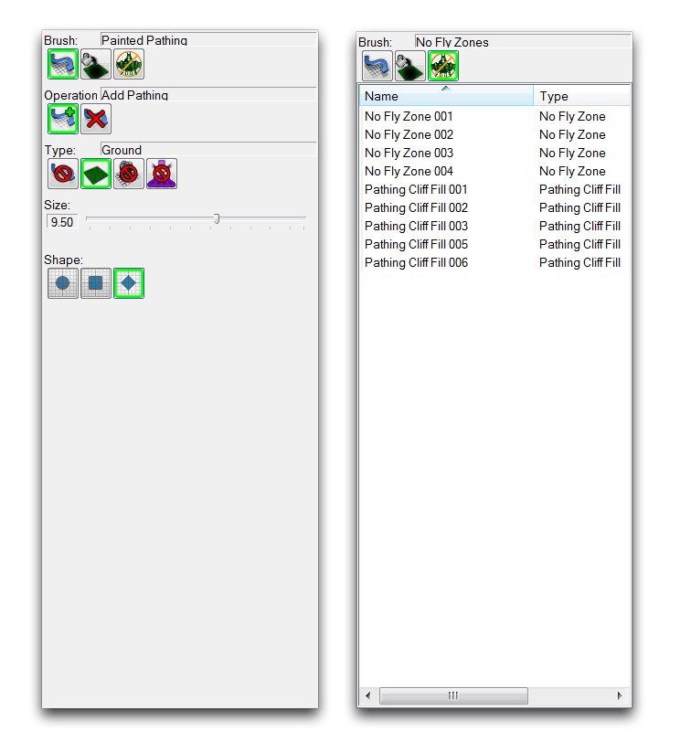
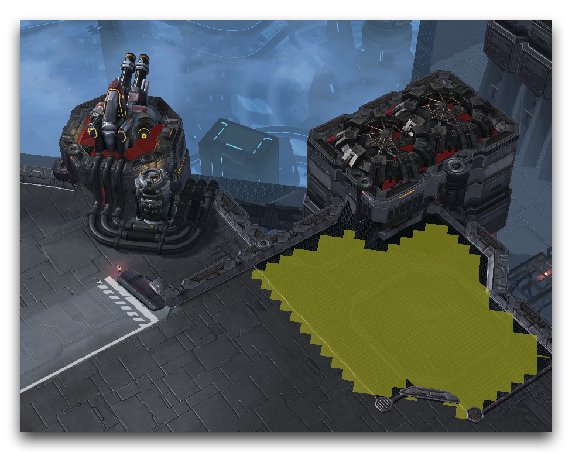
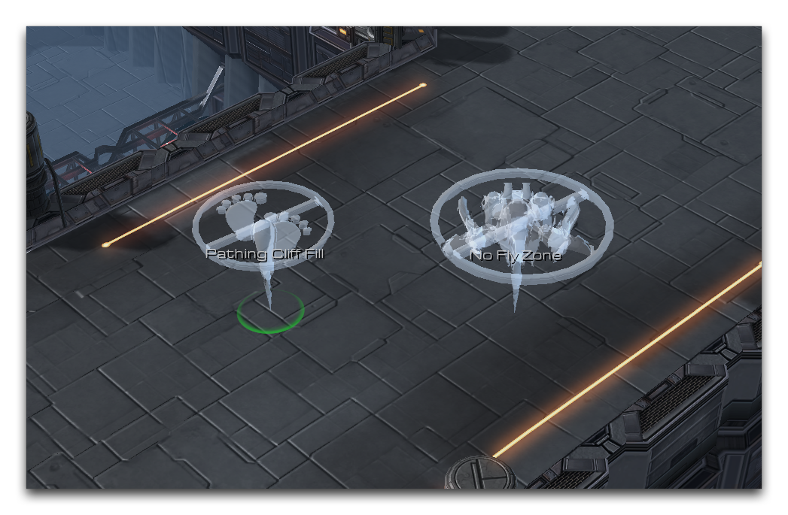

# 路径层

路径层是您控制地图中路径的地方。作为一个概念，路径描述了在一个区域内允许哪些动作，比如移动、建造或飞行。铺设路径区域确定了规定这些动作可以发生的地方。您可以通过点击下面图片所示的图标在“地形栏”中访问该层。

*路径层图标*

## 路径调色板

无论在编辑器中如何清楚地界定环境，玩家总是会探索地图边缘并超越预期的边界。因此，地图需要关于哪些类型的基本动作应该允许，哪些不应该允许的信息，否则游戏玩法就会崩溃。您可以使用规则强制的路径区域为地图引入这些信息。

创建路径区域非常直截了当。您只需要了解特定类型的区域禁止做什么，然后决定在哪里应用这些规则就行。您可以在“路径调色板”中找到创建路径区域的工具。调色板本身位于“地形编辑器”中的路径层。

*路径调色板视图*

## 路径类型

 使用类似笔刷的工具绘制了几种路径区域类型。这些区域被绘制到地形上作为覆盖层，为四种不同的路径类型之一着色地图。当玩家启动您的游戏时，路径规则将应用于标记的区域。下面将详细介绍此工具可用的修饰符。

| 属性         | 效果                                                                                                                |
| ------------ | ------------------------------------------------------------------------------------------------------------------- |
| 添加路径     | 将选定的路径类型应用于目标区域。                                                                                   |
| 移除路径     | 从目标区域移除所有路径。                                                                                           |
| 大小         | 更改正在应用路径的区域大小。                                                                                       |
| 形状         | 更改正在应用路径的区域形状。                                                                                       |
| 无路径       | 此路径类型阻止任何单位进入此区域。红色着色。                                                                     |
| 地面         | 此路径类型描述了具有特定规则的区域，如地面，适用于某些能力和其他数据类型。绿色着色。                             |
| 无建筑       | 此路径类型阻止任何单位在该区域建造结构。黄色着色。                                                                |
| 无挖掘       | 此路径类型阻止任何单位在该区域使用挖掘能力。蓝色着色。                                                            |

下图显示了使用绘制路径的区域。

*绘制的路径区域*

请注意，塔结构已标记为无路径区域，以防止单位被投放到它们的装饰高地。地面上的某个区域已标记为无建筑区域。在这里，设计者认为该区域的金属栅栏不适合作为任何建筑的目标。

 创建无路径区域的选项。它将将目标点的地形水平设置为不支持路径，类似于泛洪方式。

 路径填充，但适用于飞行单位在该区域的路径。

您可以在路径调色板的单独视图下找到最后两个路径选项。此视图提供了每个活动动态路径对象的列表，类似于“点层”和“区域层”中找到的列表。与绘制路径着色区域不同，动态路径对象在编辑器中使用标记显示，如下图所示。

*动态路径填充和无飞行区域*