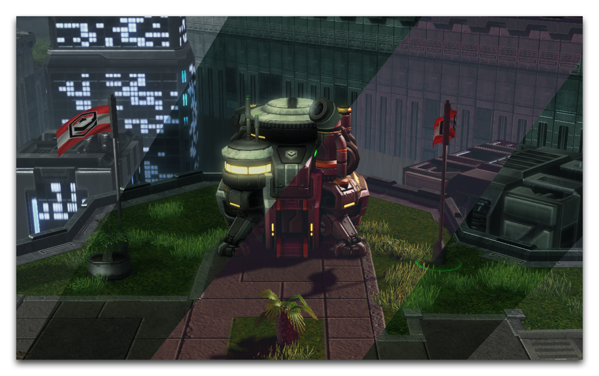
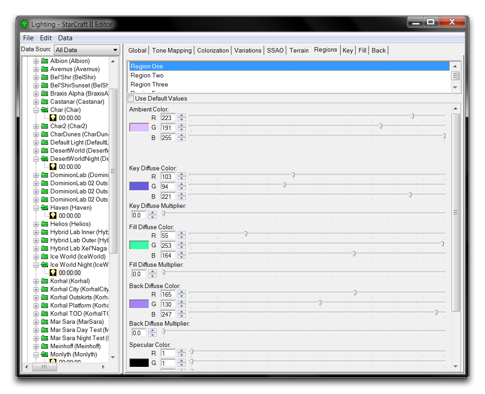
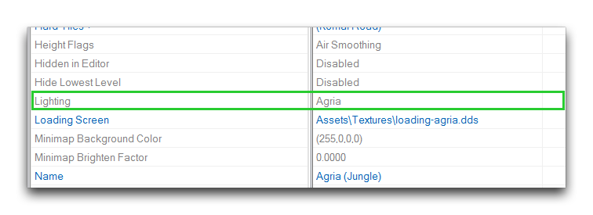
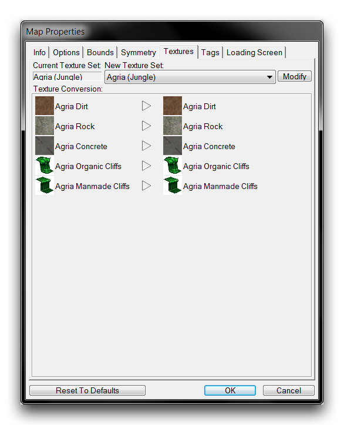
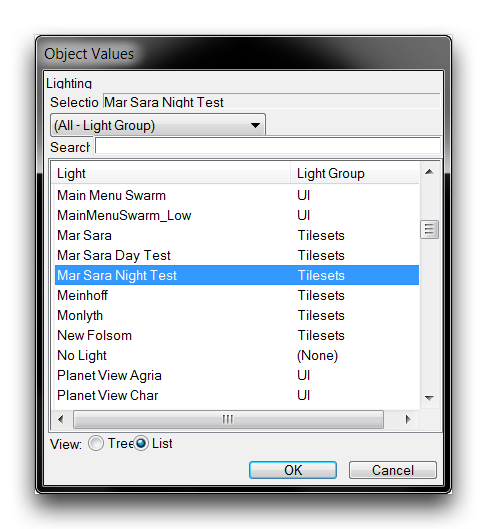
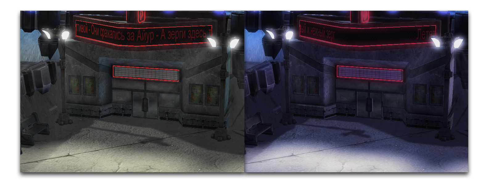
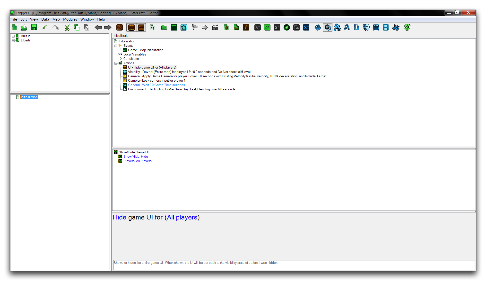

# 灯光

编辑器拥有强大的灯光系统，您可以使用它为项目创建各种情绪、外观和感觉。下面的图像是通过仅编辑灯光就能以不同方式实现相同场景的示例。

*同一场景的不同灯光效果*

## 灯光细节

实际上，在“星际争霸”引擎中可以通过多种方式实现灯光。您可能还记得在角色身上附加了街灯道具和矿业灯等光源。一些法术和能力效果甚至可以以有趣的方式动态照亮场景，但本文将关注地图中的全局灯光效果。

地图中的灯光一次设置为特定风格。然后可以在游戏中动态地将其改变为其他风格。您将在一个名为“Lights”的广泛数据类型中找到这些灯光风格，它直接通过数据编辑器进行处理。由于在处理灯光时提供了许多选项，编辑器还配备了一个名为灯光窗口的特殊工具。这个界面将所有灯光控件收集起来，与编辑器中预构建的灯光风格一起放置。

*同一场景的不同灯光效果*

## 展示灯光

打开本文提供的演示地图。您将看到其中含有的一个场景，其中酒吧前部用默认灯光设置照亮，看起来像自然阳光。首先，您将学习如何将灯光从白天变为黑夜，然后如何使用触发器逐渐引入白天灯光，模拟日出。

最好从数据编辑器开始。灯光是基于当前地形类型应用的。这是指数据中用于控制纹理、道具风格等地形的指定。演示地图设置为“Agria (Jungle)”类型。点击“新建标签”+按钮并导航到编辑地形数据 ▶︎ 地形类型来打开“地形类型标签”。现在，通过双击下方显示的“灯光”属性来设置灯光。

*灯光数据属性*

如果不确定地图使用的地形类型是什么，可以通过导航到地图 ▶︎ 地图纹理 来查看。字段“当前纹理集”将提供答案，如下所示。

*检查地形类型*

单击“灯光”字段将启动“对象值”窗口。找到“Mar Sara夜间测试”灯光，选择它，然后单击“确定”。

*选择灯光*

确认已成功更改地形的灯光设置，方法是打开地形模块并选择渲染 ▶︎ 显示灯光 ▶︎ 游戏灯光。主视图应显示出更加黑暗、黄昏般的场景。以下显示了原始灯光设置与新设置之间的差异。

*灯光变化*

现在进入触发器编辑器，打开“初始化”触发器。该触发器使用一些操作来移除游戏的用户界面，显示地图以供查看，并应用标准相机。通过在“操作”标题下右键单击并导航到新建 ▶︎ 新建操作 来添加一个新的“等待”操作。将此操作的“时间”字段设置为2.0。然后添加“设置灯光”操作，使用相同的过程。将“灯光”字段设置为“Mar Sara白天测试”，并将“融合时间”更改为6.0。这样，您将得到以下结果。

*准备好的触发器*

地图现在已完成。如果运行测试，在短暂等待后，“Mar Sara夜间测试”当前的灯光风格将逐渐变化，混合成“Mar Sara白天测试”。给予了一个类似日出的黑夜转白天的灯光过渡。启动“测试地图”功能以查看结果。它将缓慢改变场景的设置，类似于下面显示的顺序。

*模拟日出的灯光变化*

## 附件

- [027_Lighting_Completed.SC2Map](./maps/027_Lighting_Completed.SC2Map)
- [027_Lighting_Start.SC2Map](./maps/027_Lighting_Start.SC2Map)