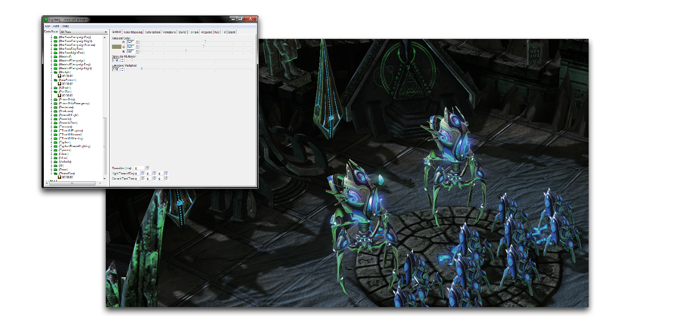
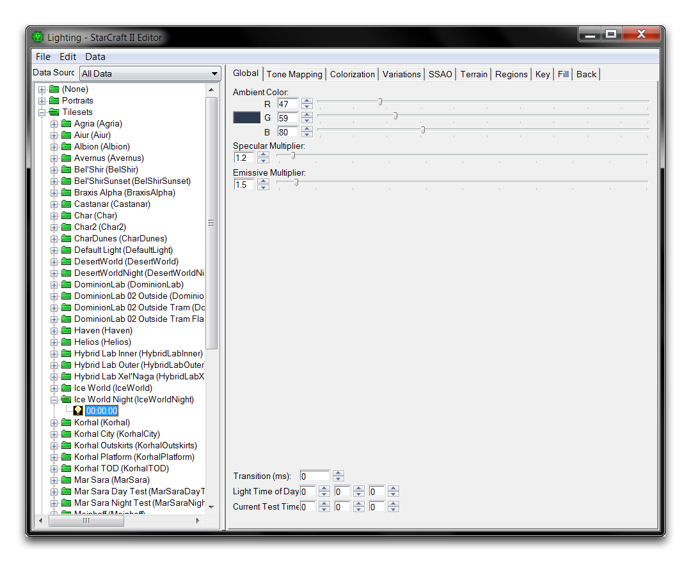
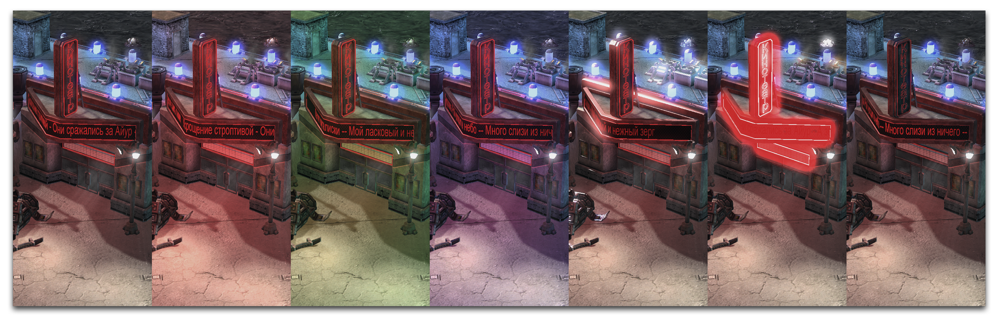
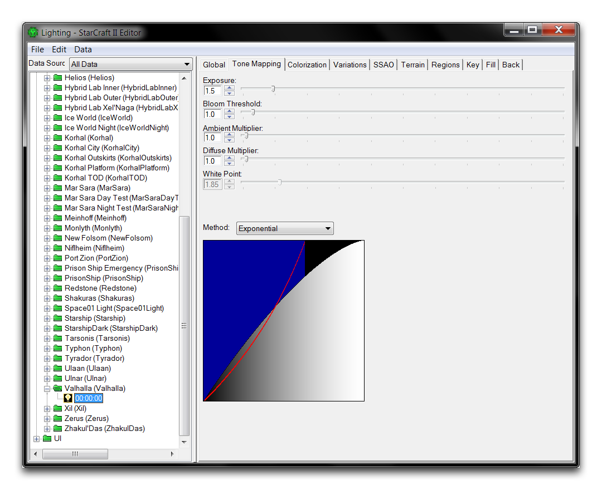
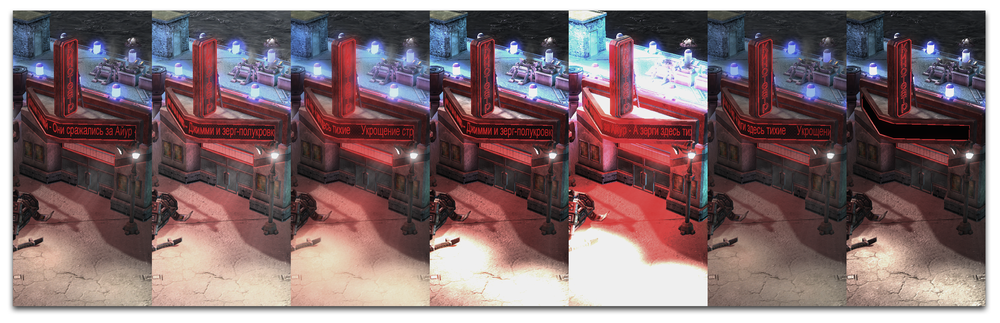
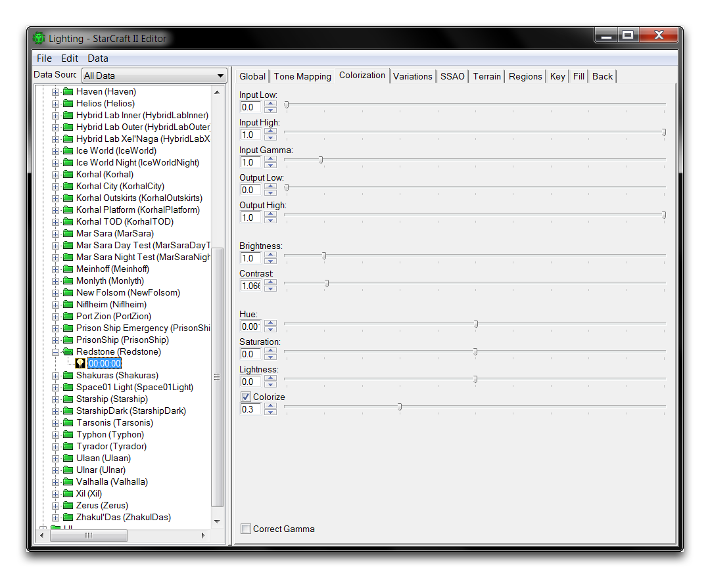
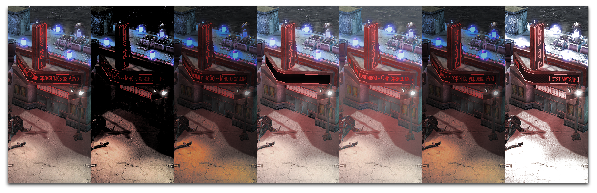
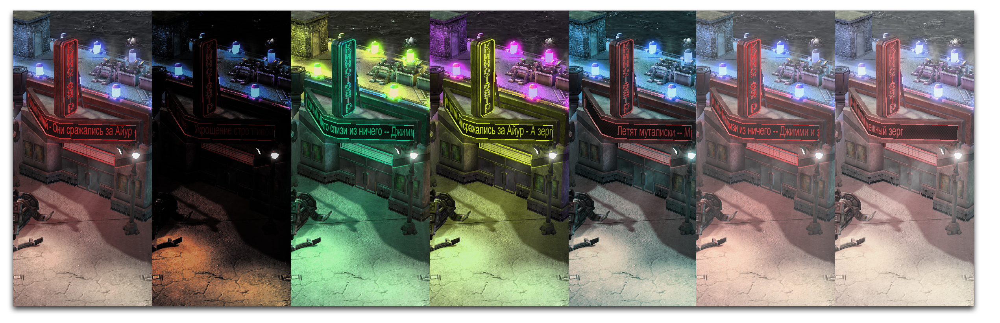
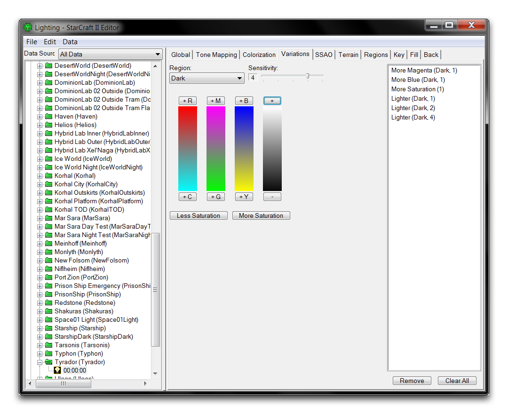

# 光照窗口

光照窗口是一个用于修改和预览编辑器内灯光的界面。您可以使用它来创建全新的照明布局，也可以使用游戏中现有的任何照明资源。您可以在下方的图片中看到其外观。

*光照窗口及其用途*

您可以通过在编辑器的任何位置导航到 窗口 ▶︎ 光照 来访问光照窗口。游戏中的每个灯光设置都在此处找到，分组为 UI灯光，图块集灯光，人物肖像灯光和电影灯光等类别。在这里，您可以浏览和修改这些设置，甚至在项目之间导入和导出灯光。要执行此操作，请导航至 文件 ▶︎ 导出灯光 或 文件 ▶︎ 导入灯光。在编辑器外部，这些被存储为 .SC2Lighting 文件。

由于光照窗口中参数繁多，修改灯光可能令人望而生畏。这些参数被分为全局、色调映射、颜色化、变化、SSAO、地形、区域、主光、填充和背光等十个类别。以下将更详细地讨论这些类别。

理解这些属性的最简单方法是使用光照窗口在主编辑器视图中预览灯光，这将随着每次更改而动态更新。您可以通过打开窗口，然后移至地形编辑器来实现此目的。通过导航至 渲染 ▶︎ 显示灯光 ▶︎ 游戏灯光 来配置灯光以显示游戏灯光。对灯光选择和更改的任何操作都应立即在编辑器视图中呈现，给您充分的机会进行测试和实验。

接下来的部分将探讨灯光选项卡中每个功能，包括其属性描述和一些效果的预览。每个预览都展示了位于最左侧的基础照明布局，设置为 'Agria (Jungle)' 照明。这将与每个图像的标题中描述的各种照明修改一起显示。这些修改不是累积的，每个修改都是基础照明的修改。

## 全局

*全局灯光*

| 属性               | 详情                                                                                                          |
| ------------------ | ------------------------------------------------------------------------------------------------------------- |
| 环境光颜色       | 定义影响每个表面的全局照明颜色。                                                                           |
| 镜面光系数       | 设置从反射表面发射光的大小。                                                                              |
| 发射光系数       | 设置从发射纹理发射光的大小。                                                                             |
| 光照日时间       | 设置光照的时间值。这些时间值用于“白天时间”照明，通过一系列光来模拟行星运动中发生的变化。 |
| 当前测试时间     | 在编辑器预览中设置当前时间。将其设置为光照日时间将测试当前光照。                                 |

基础 -- 红色环境 -- 绿色环境 -- 蓝色环境 -- 高镜面光 -- 高发射光 -- 低发射光

## 色调映射

*色调映射*

| 属性                | 详情                                                                                                                                                  |
| ------------------- | ----------------------------------------------------------------------------------------------------------------------------------------------------- |
| 曝光度              | 设置应用于场景的光量。                                                                                                                               |
| 泛光阈值            | 设置应用泛光的最低光值。泛光是一种具有明显出血效果的边缘光，从光滑的物体中发出。低泛光常见于夜间。                                            |
| 环境光系数          | 设置环境光的强度。目前在编辑器中未激活。                                                                                                              |
| 扩散光系数          | 设置对象产生的白光量。                                                                                                                               |
| 白点                | 当方法设置为 Reinhards 时，设置应用于场景的光量。                                                                                                     |
| 方法                | 更改应用色调映射的方式。每种方法都是一种不同的算法，影响亮度和对比度。                                                                               |

基础 -- 高曝光度 -- 低泛光阈值 -- 高扩散光系数 -- 极端扩散光系数 -- 高白点带 Reinhards 映射 -- 线性色调映射

## 颜色化

*颜色化*

| 属性            | 详情                                                                                                                         |
| --------------- | --------------------------------------------------------------------------------------------------------------------------- |
| 输入低点      | 控制场景中暗部的对比度。必须低于输入高点。                                                                              |
| 输入高点      | 控制场景中高光的对比度。必须高于输入低点。                                                                              |
| 输入伽马      | 控制场景中中间调的对比度。                                                                                                |
| 输出低点      | 调整场景中的暗部，同时保留颜色。必须低于输入高点。                                                                    |
| 输出高点      | 调整高光的亮度，同时保留颜色。必须高于输入低点。                                                                      |
| 亮度            | 设置在场景中反射的光量的强度。                                                                                           |
| 对比度          | 设置暗部和高光之间差异的强调。                                                                                          |
| 色调            | 色调改变场景中所有物体的颜色值。这在关闭 Colorize 的情况下更容易识别。                                           |
| 饱和度          | 设置场景中颜色的强度。                                                                                                    |
| 亮度度          | 改变场景中的总体光量。                                                                                                   |
| 调色            | 修改场景中颜色的强度和对比度。关闭此选项会修改色调、饱和度和亮度对光照的影响方式。                            |
| 校正伽马    | 在激活时，根据显示器的伽马设置校正场景的颜色。                                                                          |

基础 -- 提高输入低点 -- 降低输入高点 -- 高输入伽马 -- 增加输出低点 -- 增加输出高点 -- 高对比度

基础 -- 高对比度 -- 关闭 Colorize 的情况下降低色调 -- 关闭 Colorize 的情况下增加色调 -- 低饱和度 -- 增加亮度 -- 关闭校正伽马

## 变化

变化是可以影响场景整体照明的简单滤镜。选择任何变化控件将向光添加相关属性。

*光照变化*