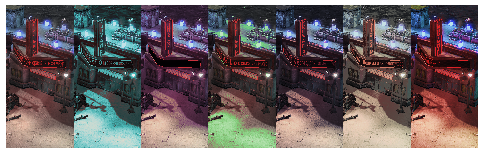
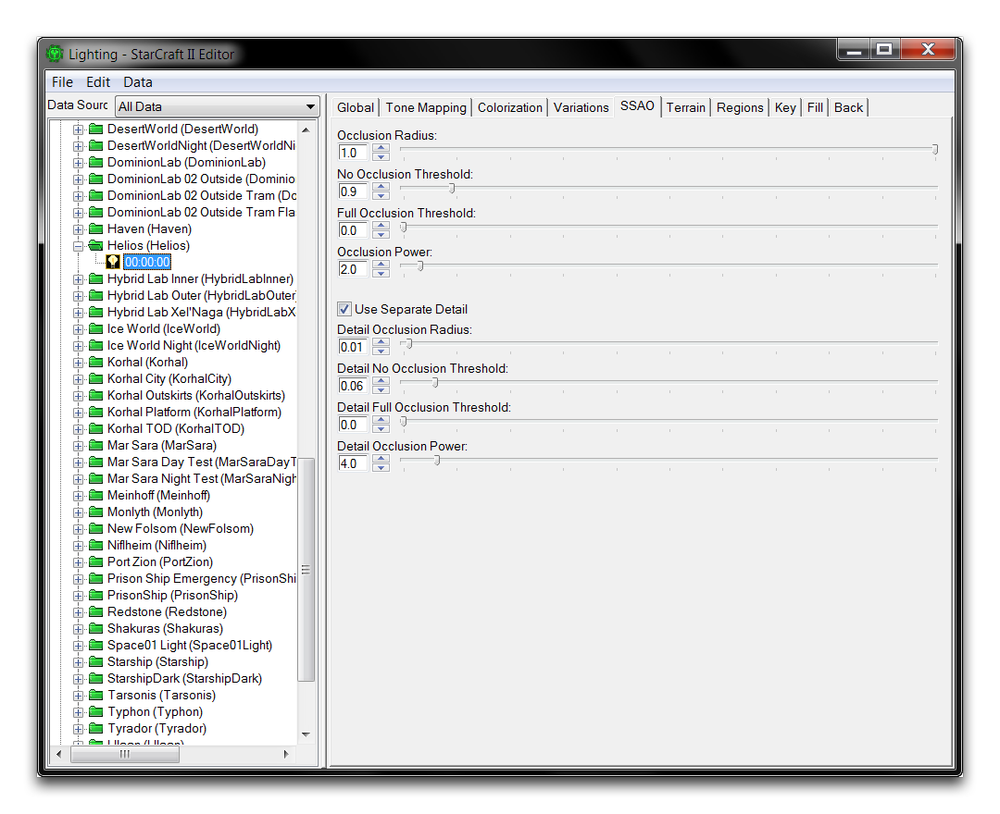
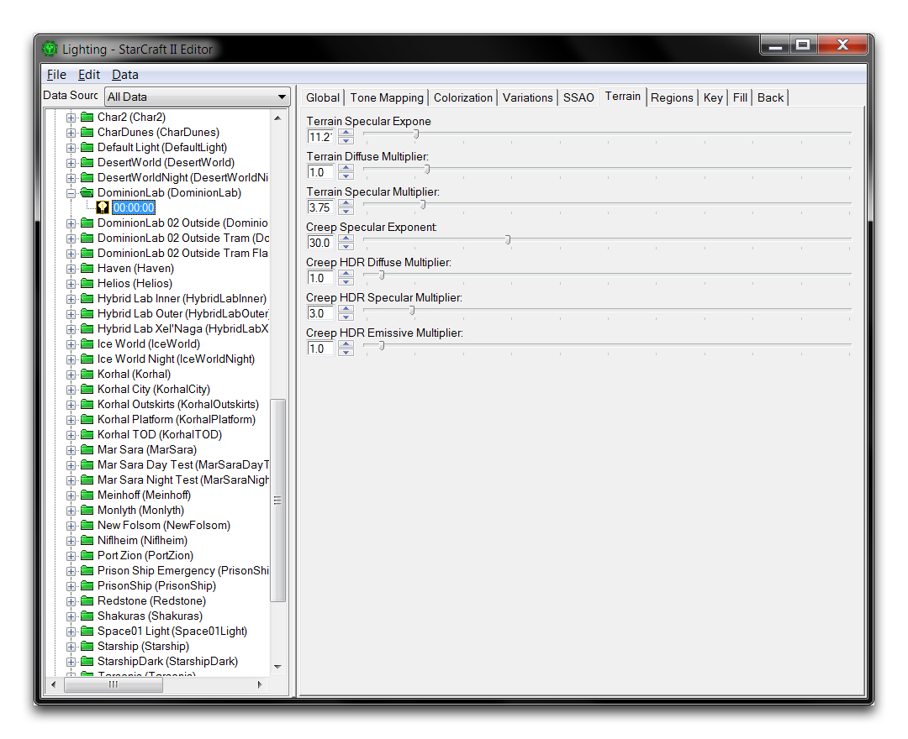
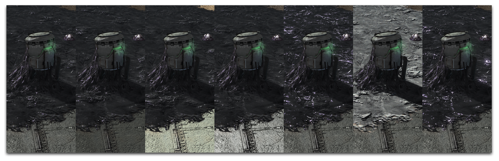
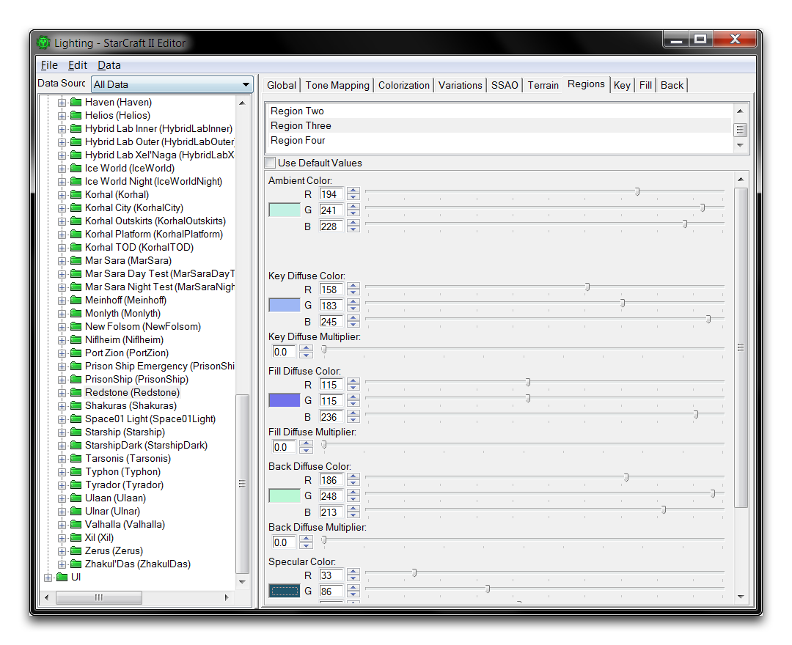
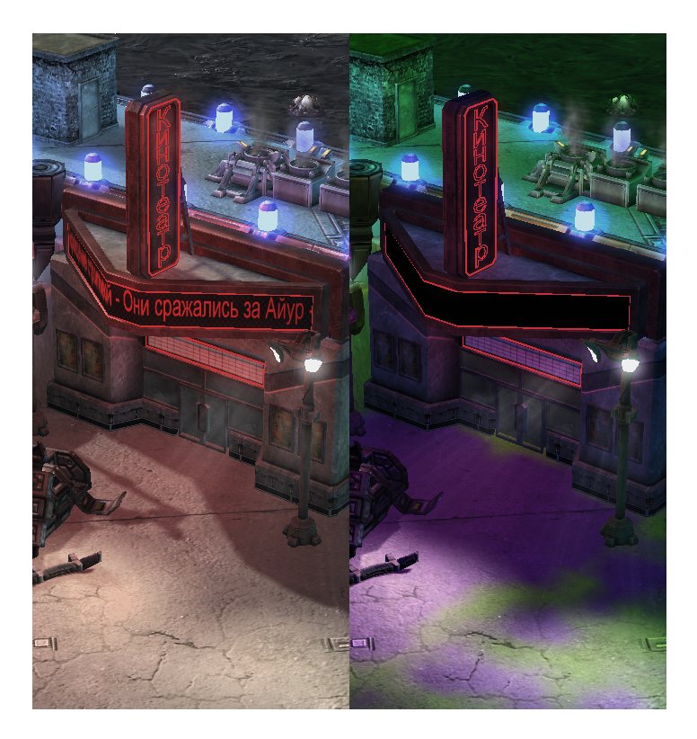
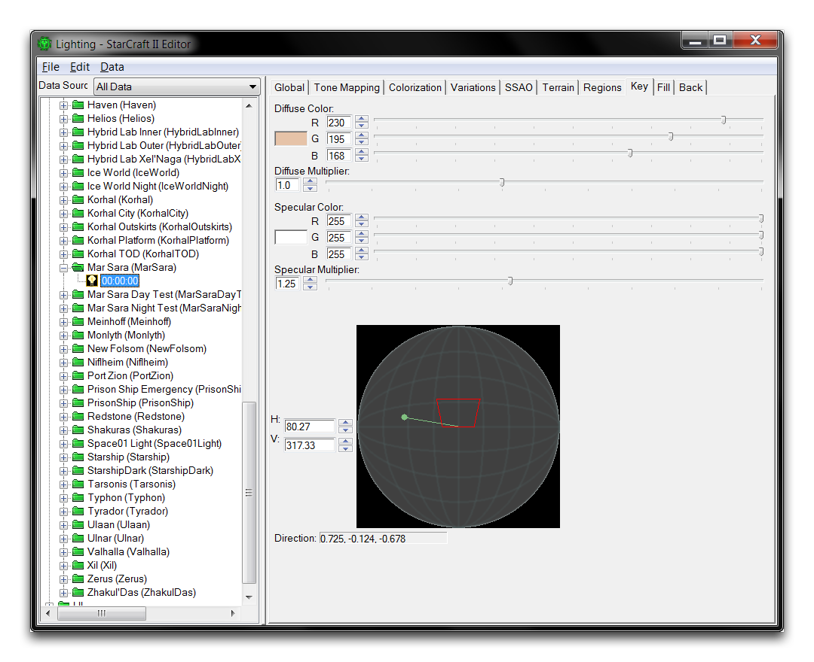
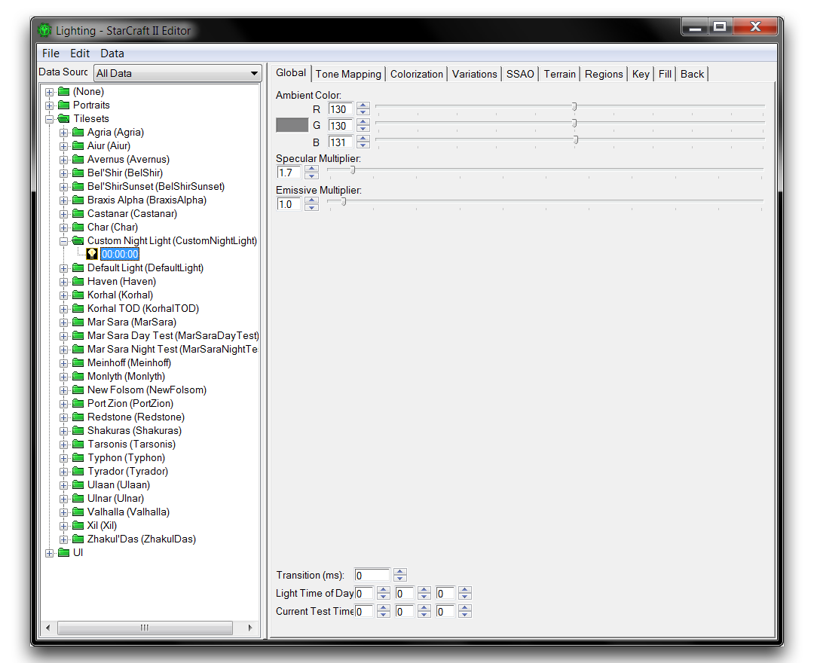

| 属性                               | 详情                                                                                                                                               |
| ---------------------------------- | ------------------------------------------------------------------------------------------------------------------------------------------------- |
| 区域                               | 设置变化是否适用于场景的暗部、中间色调或高光部分。                                                                                                 |
| 灵敏度                             | 控制应用滤镜的强度。这些是相加的；红5等于五次应用红1。                                                                                        |
| 颜色设置                           | 应用所选颜色。选项包括红色、青色、洋红色、绿色、蓝色和黄色。                                                                                  |
| 光照设置                           | 对场景应用更多的明暗。这些元素相互抵消。                                                                                                       |
| 降低饱和度和增加饱和度             | 对场景应用更多或更少的饱和度，改变对颜色的重点。这些元素相互抵消。                                                                            |

基础 - 青色中间调 - 紫色暗部 - 绿色高光 - 更深的蓝色暗部 - 黄色较亮中间调 - 更饱和度

## Ssao

*环境光遮蔽*

屏幕空间环境光遮蔽（SSAO）是一种渲染技术，根据物体与摄像机的距离进行着色。这些设置当前不活动。

## 地形

*地形光照*

| 属性                           | 详情                                                                                                       |
| ------------------------------ | ---------------------------------------------------------------------------------------------------------- |
| 地形镜面指数                   | 设置从地形高光反射的基本光量。                                                                              |
| 地形漫反射倍增器               | 设置地形一般光反射的幅度。                                                                                 |
| 地形高光倍增器                 | 设置地形高光反射的幅度。                                                                                   |
| 蔓延镜面指数                   | 设置从蔓延反射的基本光量。                                                                                 |
| 蔓延 HDR 漫反射倍增器          | 设置蔓延的一般光反射的幅度。                                                                               |
| 蔓延 HDR 高光倍增器            | 设置蔓延的高光反射的幅度。                                                                                 |
| 蔓延 HDR 自发射倍增器          | 设置从蔓延自发光贴图中创建的光的数量。                                                                     |

基础 - 增加地形镜面指数 - 增加地形漫反射 - 增加地形高光倍增器 - 减小蔓延镜面指数 - 增加蔓延 HDR 漫反射倍增器 - 增加蔓延 HDR 高光倍增器

## 区域

*区域光照*

区域定义将独立应用于地图某一区域的光照设置。在地形模块的地形层中，可以使用光照刷在最多四个区域上绘制光照。每个区域都具有高度可配置性，支持独立的关键、背景、填充和环境设置。设置后，该区域内的光照将覆盖全局光照。您可以在地形模块的地形层中将光照区域应用于地形。

*基础 - 绘制区域*

## 关键、填充和背景光照

这三个相关类别构成了三点照明模型，是各种媒体中对场景进行照明的传统方法。关键是主要光源，它照亮场景的主要组件，并且是外观、颜色和阴影的主要强调者。填充是传统上从关键光源侧面照射的次要光源。填充光源有助于衬托物体，减轻个别阴影的影响，并产生柔和的照明。

背光，顾名思义，要么在场景后方照亮，要么从场景另一边照亮。通常，背光设置为给场景中的对象产生一种光环效果，用照明环绕它们的边缘将它们与周围环境分开。您将在光照窗口的三个类似选项卡中找到这些照明类型。下面显示其中一个。

*主要照明*

| 属性                 | 详情                                                                                                                                                                                                   |
| -------------------- | ------------------------------------------------------------------------------------------------------------------------------------------------------------------------------------------------------ |
| 漫反射颜色           | 设置光的整体表面反射的颜色。                                                                                                                                                                         |
| 漫反射倍增器         | 设置光的整体表面反射的强度。                                                                                                                                                                         |
| 镜面颜色             | 设置光的直接反射的颜色。                                                                                                                                                                             |
| 镜面倍增器           | 设置光的直接反射的强度。                                                                                                                                                                             |
| 方向                 | 使用 H 和 V 控件设置光的方向。 H 或水平角对应的正北是 0，正东是 90，正南是 180，正西是 270。V 或垂直角对应于光的高度。目标正上方是 90，直接正下方是 270。请注意，位于地平线下方的光源将不会照亮地形的纹理。 |

## 自定义光照

打开本文提供的演示地图。在那里，您应该看到用于创建本文某些图像的场景。这是一个电影风格的黑色幽默酒吧前台。不幸的是，明亮的白天照明破坏了氛围。您可以使用光照界面解决这个问题。要探索光照定制，请通过**窗口 ▶︎ 光照窗口**导航到光照窗口。现在选择预设光照设置“自定义夜光”并单击“00:00:00”以打开光源。

*起始光*

从这里开始对光照进行一系列调整，效果将在下方的照片条中列出。与我们先前示例中使用的图像不同，这些效果是累积的。通过比较每个步骤的结果，使用此示例图像来感受不同光照属性的效果。通过此练习结束时，这个场景应该具有更多的电影风格吸引力。