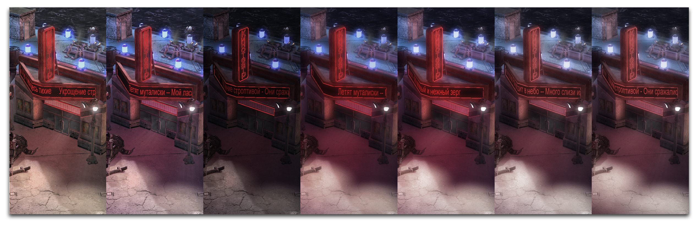

```markdown
1. 在全局设置中，将环境颜色设置为R86、G79、B147。将镜面光强度系数设置为0.6，散射光强度系数设置为1.1。
2. 在色调映射中，将曝光度从1.5降低至0.6。
3. 将泛光阈值从1.0降低至0.1。将漫反射光强度系数从1.0增加至1.4。
4. 在着色设置中，将输入低阈值从0增加至0.05。将输入高阈值从1减少至0.9。
5. 将着色强度从0.3增加至0.5。
6. 在地形设置中，将地形漫反射光强度系数从1.0减少至0。将地形镜面光强度系数从3.75减少至0。


*基础 -- 步骤1 -- 步骤2 -- 步骤3 -- 步骤4 -- 步骤5 -- 步骤6*

## 附件

 * [028_Lighting_Window_Start.SC2Map](./maps/028_Lighting_Window_Start.SC2Map)
 * [028_Lighting_Window_Completed.SC2Map](./maps/028_Lighting_Window_Completed.SC2Map)
```