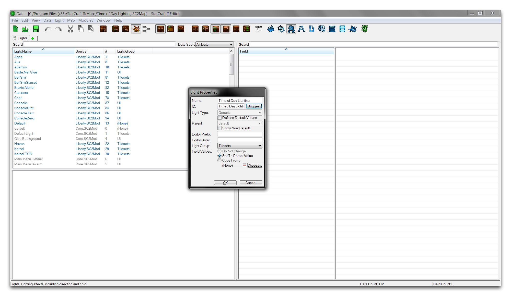
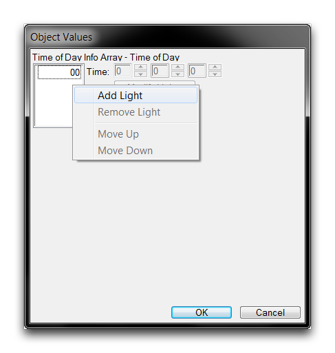
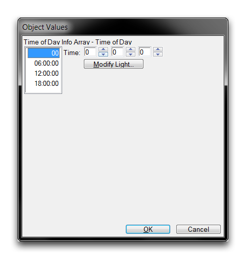
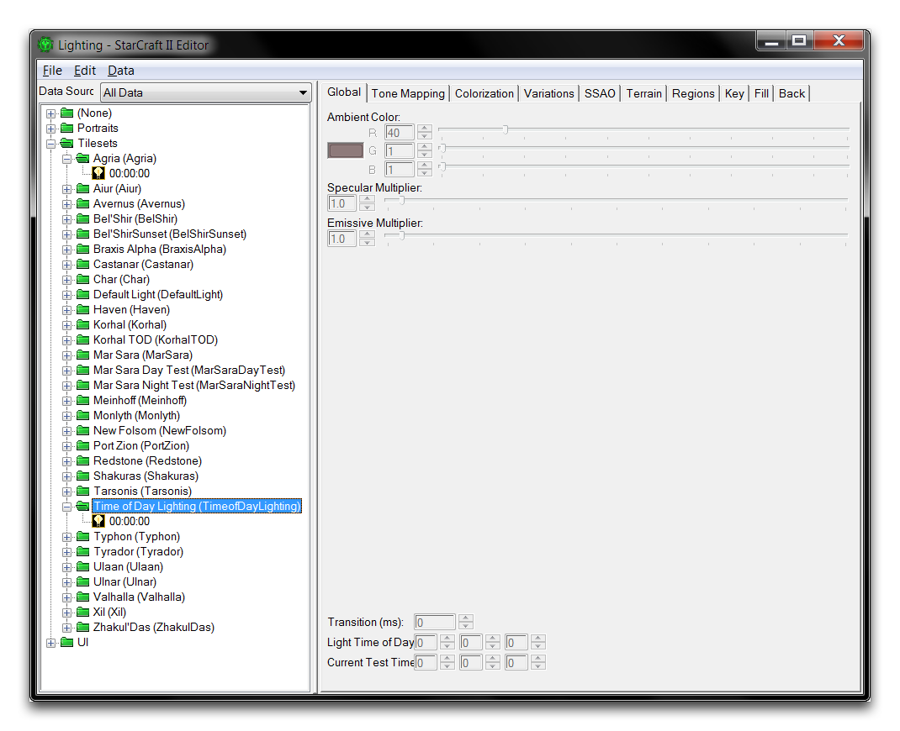
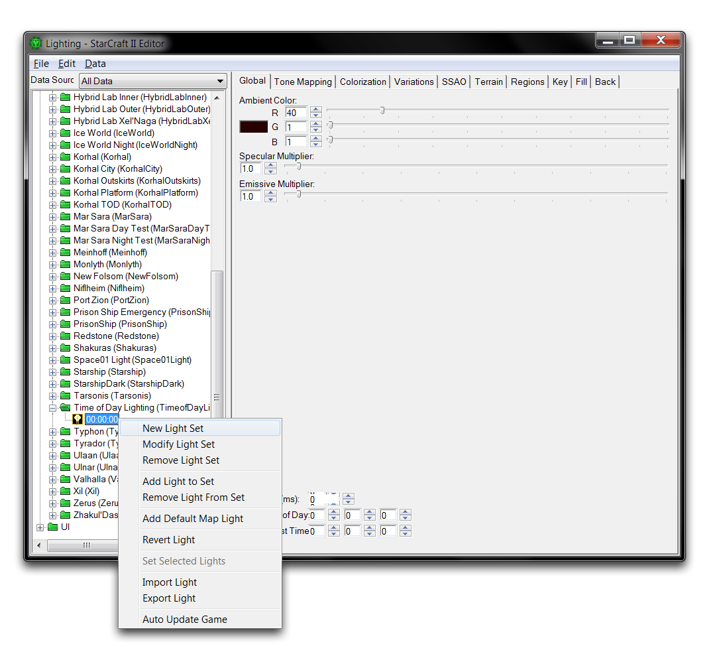
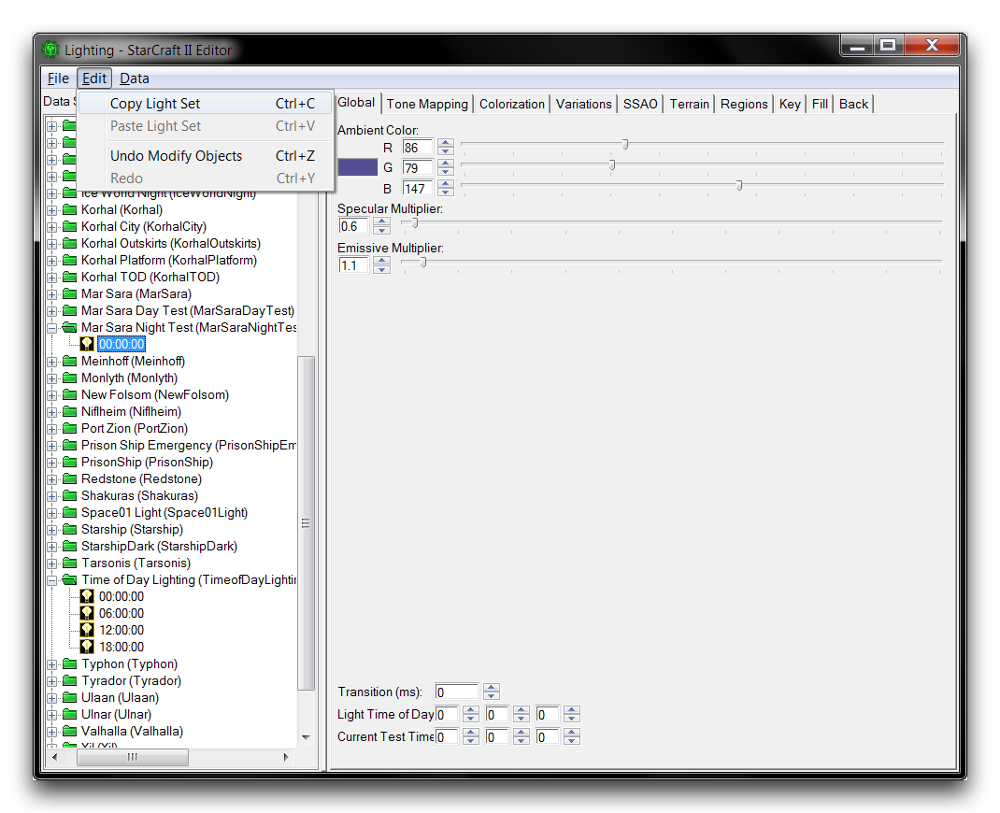
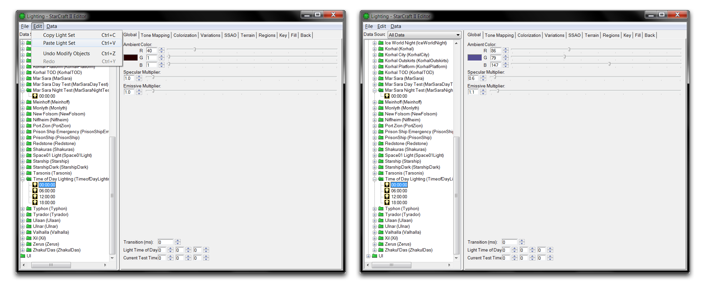
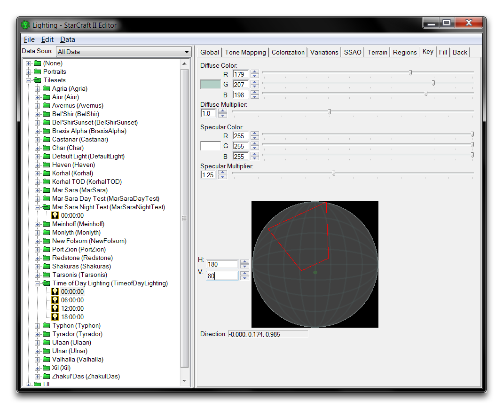

# 白天照明

作为一款实时战略游戏，星际争霸拥有许多以时间为中心的系统。对于照明来说，有一个有用的设置叫做白天照明。这个系统允许照明根据时间的流逝而反应，改变其条件以模拟白天和黑夜的交替。循环将会重复，除非被告知停止，只要游戏持续存在。您可以将其应用作为建立情绪和氛围的策略，但它也通过连接一组白天验证器支持各种游戏特性。这使您能够在游戏循环中触发不同的效果。

## 创建白天照明

打开本文附带的演示地图。在里面，您会看到一个场景，外面是一家酒吧，背景是一些燃烧的残骸。转到数据编辑器，通过点击绿色+，然后导航到编辑艺术和声音数据 ▶︎ 灯光，打开灯光选项卡。通过右键单击主视图内部并选择添加灯光，创建一个新的灯光。将灯光命名为“白天照明”，然后点击建议以生成一个ID。接下来，使用下拉菜单将“灯光组”设置为“平铺集”。这个过程应该看起来像下面的图片。

*创建灯光*

点击您的新灯光，然后双击“白天”字段。如果未激活“组合结构值”选项，此字段将标记为“白天信息数组”。这将启动“对象值”窗口。

在这个窗口中，您会看到所有当前有灯光行为的时间的列表。目前您只会看到值为00，这是00:00:00的缩写。白天时间使用HH:MM:SS的24小时制格式记录，即小时，分钟，秒。00值等于零点，即午夜。如果这里只有一个值，那么白天行为默认是恒定的，这意味着您游戏的照明将保持恒定。

右键单击白框内并选择“添加灯光”以添加一个新的白天时间。下面是此操作的示例。

*添加白天灯光*

通过点击“时间”字段的第一个术语并输入6，将这个新灯光设置为06:00:00。该字段反映了HH:MM:SS格式。现在，添加另外两个灯光，分别为12:00:00和18:00:00，以总共创建四个白天时间点。完成后的数组应该看起来像这样。

*数组中的四个白天灯光*

点击“确定”以关闭窗口，更新数据编辑器中的灯光。现在再次双击“白天”字段以重新打开它。值得注意的是，灯光窗口是一个需要大量更新的接口。它会直接将数据推送到编辑器视图，创建一个非常有用的灯光样式动态渲染。将信息直接发送到编辑器的数据和触发功能有时可能会卡住。经常手动刷新几次可以避免此行为，这就是您刚刚做的。

现在，点击数组中的第一个灯光00以突出显示它，然后点击“修改灯光”按钮以在灯光窗口中打开当前灯光。

*灯光在灯光窗口中打开*

灯光窗口将启动，然后自动显示当前灯光中所选的白天灯光。请注意，该文件夹按您在创建时选择的平铺集类型进行分类。灯光窗口通常尚未更新包含数组中所有白天值。如果文件夹只包含00:00:00值，请通过突出显示00:00:00，右键单击并选择“添加到套”的方式刷新窗口。如下图所示。

*刷新灯光集*

灯光窗口将更新，并应该在“白天照明”集合下显示五个条目。右键单击额外的00:00:00灯光（用于刷新窗口），然后选择“从套中删除灯光”。

现在，您可以配置您的四个白天灯光，为每个设置不同的属性。游戏将白天照明用作规划。随着时间的流逝，游戏逐渐改变其照明属性，从当前值转变为数组中下一个灯光的值。它一遍又一遍地重复此过程，因此通过为每天的各个部分制作逼真的灯光，您将看到一个可识别的白昼和黑夜周期发展。

从头开始配置灯光属性可能会非常耗时。最好是从现有灯光中复制数据并将其用作修改的基础。您可以通过使用“马萨拉夜间测试”文件夹中的一些设置作为您白天和黑夜照明的基础。导航至“马萨拉夜间测试”文件夹并突出显示其中的灯光。选择该灯光后，使用编辑 ▶︎ 复制灯光集来复制其属性。

*复制灯光集*

返回“白天照明”设置中的00:00:00灯光，突出显示它并使用编辑 ▶︎ 粘贴灯光集将复制的数据粘贴进去。您可以在下面和左侧看到这个过程，而更新为粘贴属性的灯光则显示在右侧。

*粘贴灯光集 -- 粘贴的灯光*

使用复制的属性作为基础，现在您可以配置00:00:00时刻的灯光。转到其“键”选项卡，并将水平角（H）设置为180，垂直角（V）设置为80。将灯光移动到这个低角度高位置将有助于创造00:00:00，即午夜时期所期望的黑暗氛围。这应该看起来像下面的图片。

*设置关键照明*