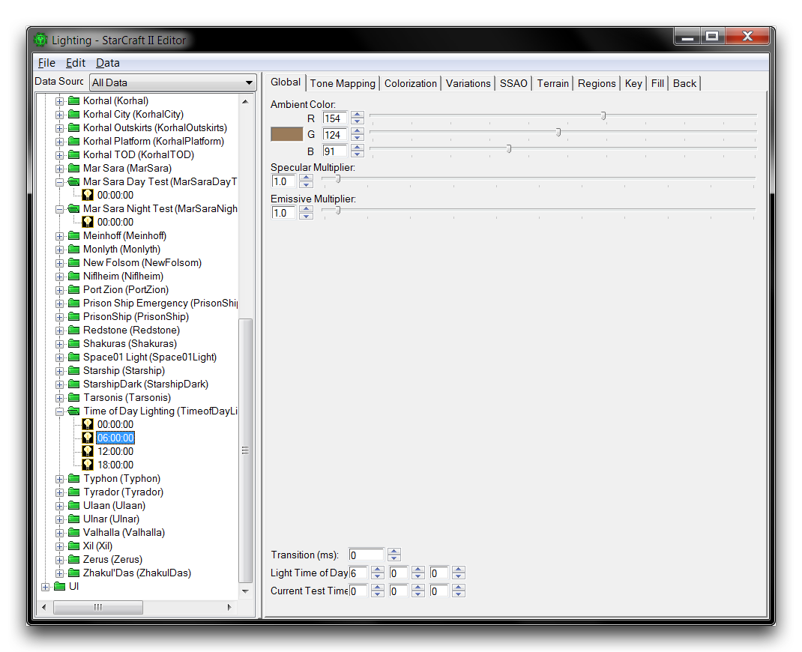
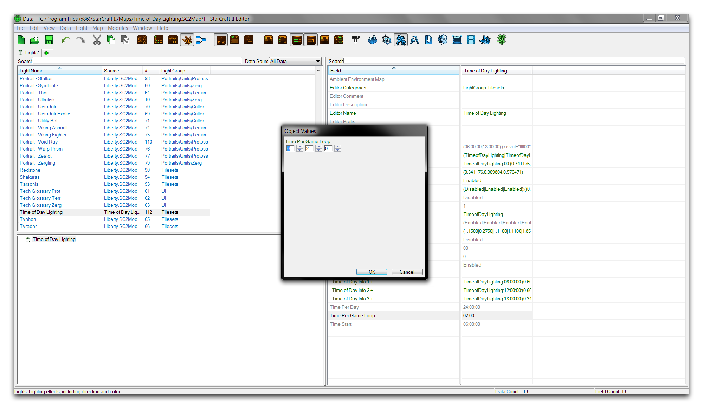
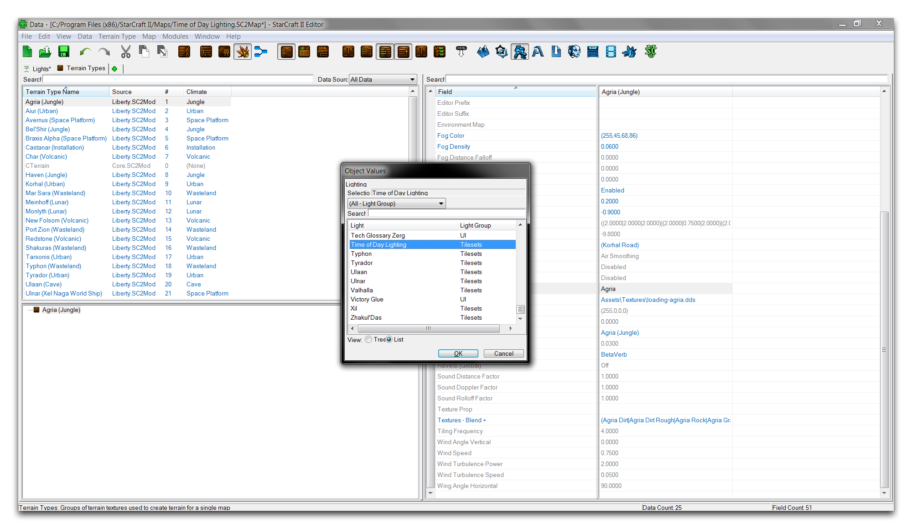
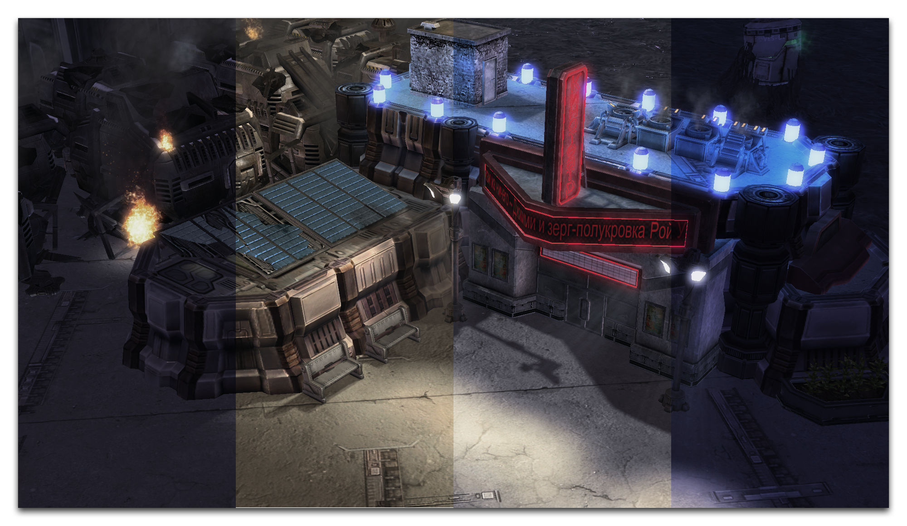

要完成设置这个灯光，转到“填充”标签，将H设置为45，V设置为45。在“背面”标签下，将H设置为0，V设置为45。现在移动到“Mar Sara Day Test”文件夹，突出显示其00:00:00灯，并将其复制。将其数值粘贴到“Time of Day Lighting”设置中的06:00:00灯。导航至“全局”标签，并将“光照时间”设置为6 0 0。这是设置白天光照时间最重要的字段。您不需要在上一个示例中设置它，因为默认值为0 0 0。下面的图片展示了如何设置数值。

*设置光照时间*

对于此灯光，将关键H设置为270，V设置为350。将填充H设置为135，V设置为5。然后将背景H设置为90，V设置为45。这些设置使得这个模拟日出的灯光在物体上产生非常长的阴影和大量的背景光。

重复这个过程，完成最后两个灯光的设置，并使用以下输入。

对于12:00:00的灯光。

  - 将“Mar Sara Day Test”中的00:00:00灯复制到“Time of Day Lighting”中的12:00:00灯。
  - 将“光照时间”设置为12 0 0。
  - 将关键H设置为0，V设置为275。将填充H设置为225，V设置为60。将背景H设置为180，V设置为45。

这将配置光照几乎直射，就像太阳处于正午时分一样。

对于18:00:00的灯光。

  - 将“Mar Sara Night Test”中的00:00:00灯复制到“Time of Day Lighting”中的18:00:00灯。
  - 将“光照时间”设置为18 0 0。
  - 将关键H设置为90，V设置为350。将填充H设置为315，V设置为5。将背景H设置为270，V设置为45。

这将使灯光设置在西方，产生类似于06:00:00日出的长阴影，但方向相反。

关闭光照窗口并打开数据编辑器。如果尚未完成，请突出显示“Time of Day Light”灯。

转到“每个游戏循环的时间”，将其设置为0 20 0，如下图所示。

*设置游戏循环时间*

这个值确定全天光照循环所需的时间。在这里设置一个短暂的20秒时段将允许您在地图测试中预览效果。最后，转到“地形类型”标签，突出显示“Agria (Jungle)，并将“光照”设置为“Time of Day Lighting”。下面显示了这个步骤。

*在地形类型中启用自定义灯光*

您的灯光设置现在已经完成。使用“测试文档”功能来测试地图。这将显示一个夸张的昼夜循环，其中夜景被日出打断，白天快速过去，太阳落下，场景又陷入黑夜，无限重复。这种行为是由于场景在短短几秒钟内快速经过这四种灯光设置，将它们的特点从一个到另一个融合。要更好地了解如何使用时间设置的灯光融合，请随时使用光照窗口检查个别灯光。

您可以在下面看到此测试运行的结果。

*使用时间光照从日出到日落*

## 附件

 * [029_Time_of_Day_Lighting_Start.SC2Map](./maps/029_Time_of_Day_Lighting_Start.SC2Map)
 * [029_Time_of_Day_Lighting_Completed.SC2Map](./maps/029_Time_of_Day_Lighting_Completed.SC2Map)