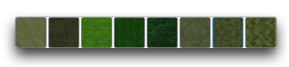
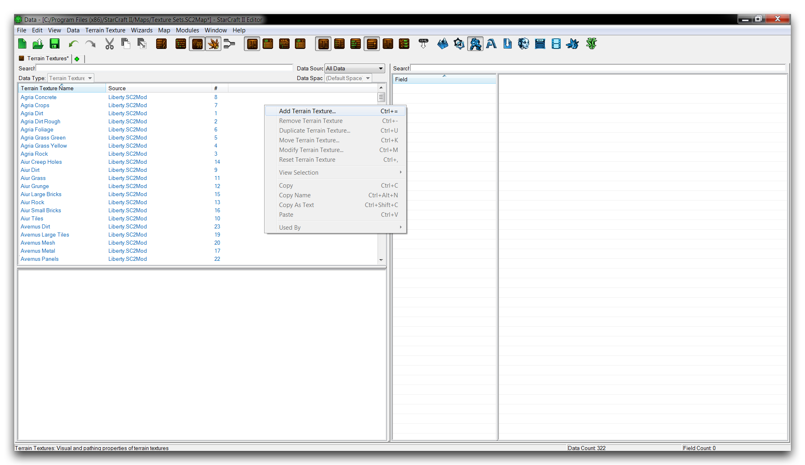
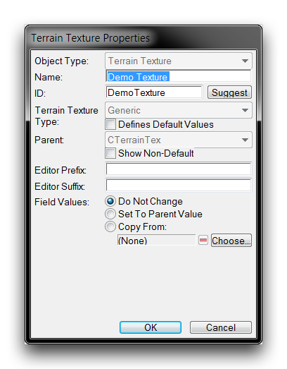
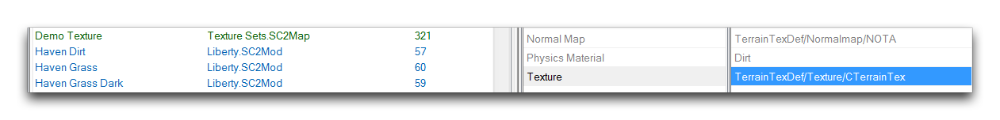
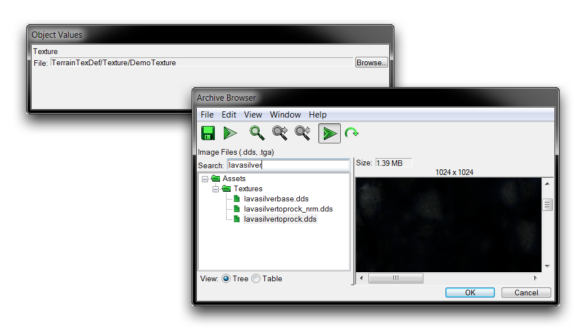
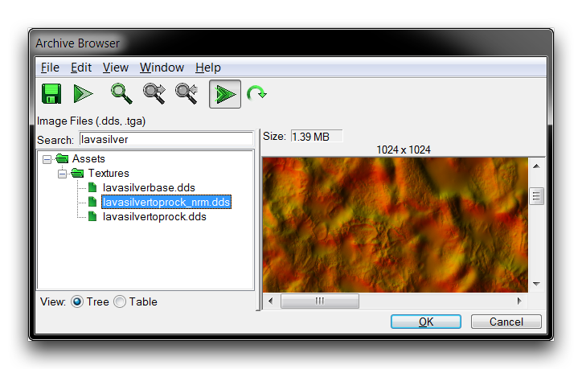
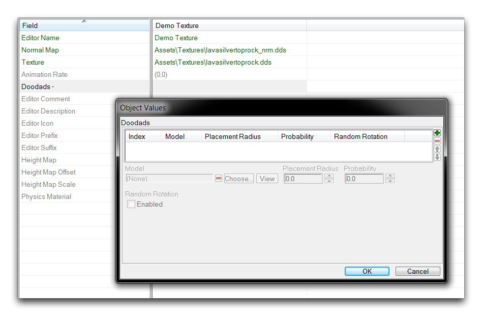
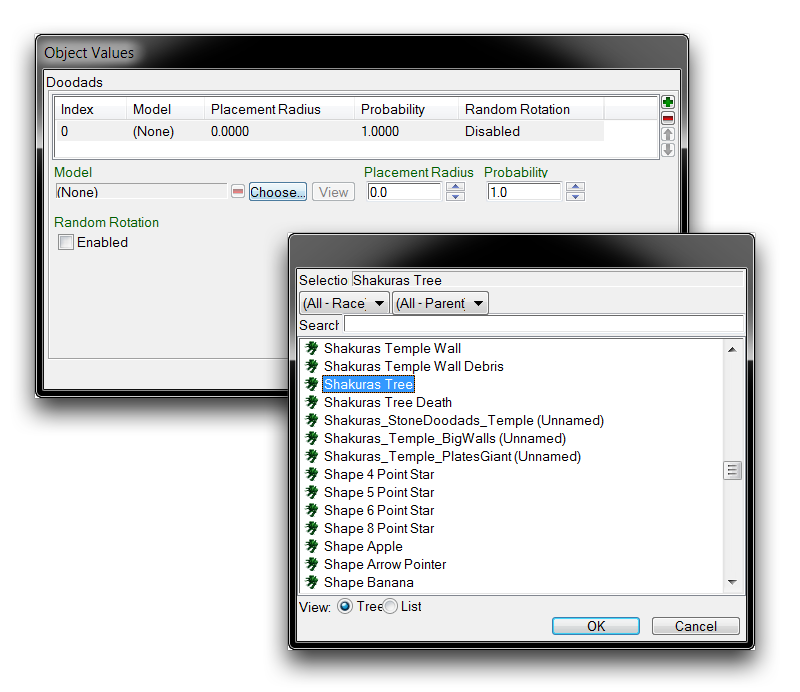

# 纹理设置

在任意地图的地形上可用的纹理类型被组织成集合。从历史上看，这些集合被称为瓷砖集合，这归因于实时战略游戏类型的2D根源。不过现在，在《星际争霸II编辑器》中，它们被称为纹理设置，指的是它们由单独的纹理资产组成这一事实。这个命名游戏实际上延伸得更远，纹理设置的数据类型在数据编辑器中被称为地形类型。那些预设集合的名称对于有着战役或竞技星际争霸经验的人可能会很熟悉。例如：贝尔希尔（Bel'Shir）、夏库拉斯（Shakuras）和夏尔（Char）。下面是在地形调色板中呈现的一个这样的设置示例。

*Bel'Shir纹理设置*

纹理设置/类型的构成受限于性能原因。地形编辑器提供的强大景观绘制允许在其纹理调色板之间有大量的混合。因此，任何给定时间可用的纹理范围必须受到限制。幸运的是，现有的调色板可以进行配置，也可以完全新建以打开更多多样化的纹理选项供特定项目使用。

## 地形纹理

地形类型由一组八个单独的纹理组成，这些保存在数据中作为地形纹理。这种类型是由原始纹理文件构建的，然后注入了几个字段。这样做可以为纹理提供适当的信息，如物理、光照和植被类型，使其能够在游戏中使用。地形纹理类型的一些重要字段可以在下表中找到。

| 属性              | 详情                                                                                                                                                                                                                   |
| ----------------- | ---------------------------------------------------------------------------------------------------------------------------------------------------------------------------------------------------------------------- |
| 物理材质         | 报告给演员系统的材质，用于在该纹理空间上发生某些事件。例如，在触发编辑器中，可以让演员播放不同的声音或使用替代模型，这取决于纹理的物理材质。                                                                 |
| 装饰物             | 通过地形调色板的生成植被功能，确定在该地形上生成何种类型的植被。                                                                                                                                             |
| 纹理               | 为地形纹理设置可见纹理。它提供了特定纹理的外观，但如果需要法线贴图，则不会始终通过编辑器精确反映其实际游戏内外观。                                                                                       |
| 法线贴图        | 设置法线贴图，控制反射颜色和游戏光照数据。省略法线贴图可能导致图形错误。                                                                                                                                    |

## 创建自定义地形纹理

首先，创建一个新的Arcade地图，并将其默认纹理设置为'贝尔希尔（Jungle）'。对于本教程，您不需要指定任何其他地图属性。现在移动到数据编辑器，方法是导航到Modules ▶︎ Data。

在数据中，打开地形纹理选项卡，并通过右键单击对象列表并选择“添加地形纹理”来创建一个地形纹理。这应该显示如下。

*创建地形纹理*

这将启动一个'地形纹理属性'窗口。在“名称”下输入“演示纹理”，然后点击“建议”按钮生成一个ID。完成的地形纹理创建屏幕应如下所示。

*创建地形纹理*

点击“确定”以创建您的地形纹理，然后继续到新创建的纹理字段。您现在应该通过双击“纹理”字段来选择一个原始纹理，如下图所示。

*创建地形纹理*

打开“纹理”字段将启动一个“对象数值”窗口，其中包含浏览选项。点击“浏览”按钮会将您带到存档浏览器，您可以在那里选择一个纹理。快速通过搜索功能选择lavasilvertoprock.dds纹理，然后点击“确定”完成选择。

*选择地形纹理*

您还必须提供一个法线贴图纹理，与基础纹理一起。双击“法线贴图”字段右侧的单元格，并重复与“纹理”字段相同的过程。这次，找到 texturelavasilvertoprock\_nrm.dds 纹理并点击“确定”以选择。

*选择地形纹理法线贴图*

请注意，纹理名称中的后缀 \_nrm 标识着这是与您的纹理相关联的法线贴图。然而，值得注意的是，编辑器中有些法线贴图使用结束为 \_normal 或 \_norm。如果编辑器找不到与您的纹理相关联的法线贴图，您应该为“法线贴图”字段选择与“纹理”字段使用过的相同纹理文件。如果您根本不提供任何法线贴图，可能会由于引擎缺少某些灯光和颜色信息而遇到图形问题。

## 设置自定义植被

使用地形编辑器中的“生成植被”功能，您可以在“允许植被”区域中的每个地形纹理中填充其相关类型的植被，这些植被从“装饰物”字段绘制。向正在构建的纹理添加此功能应该有教育性。要为新纹理添加植被支持，双击“装饰物 - ”标题右侧的单元格。

*植被装饰物输入*

从刚刚打开的“对象数值”窗口中点击绿色 + 按钮以将一个新植被装饰物添加到地形纹理中。这样会添加一个新的空白装饰物。您可以通过选择“选择”按钮来定义它。点击此按钮将启动一个弹出窗口，允许您从项目数据中选择任何模型类型。该过程如下所示。

*植被装饰物选择*

选择“夏库拉斯树”模型并点击“确定”。这时，植被生成将支持该地形纹理。每当该纹理位于“允许植被”区域内时，激活地形编辑器中的“生成植被”功能将根据地形调色板中的密度（每单元）设置创建装饰物。