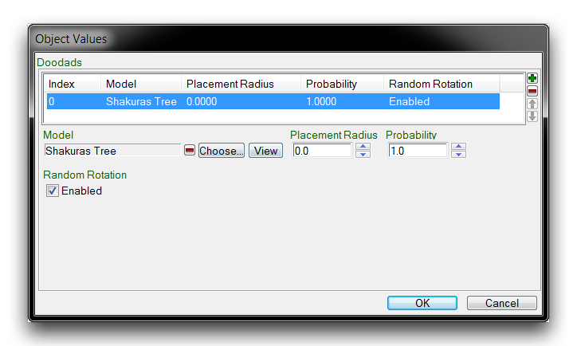
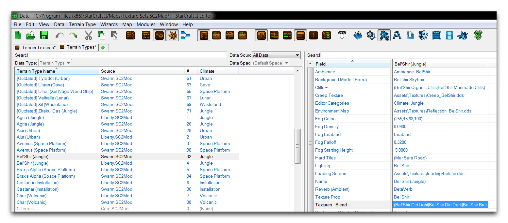
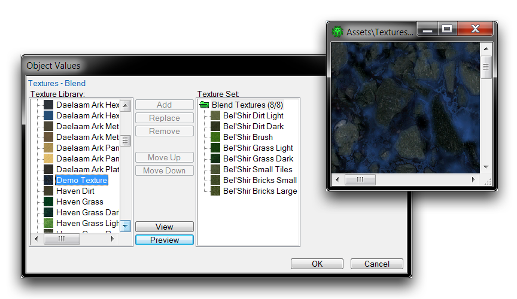
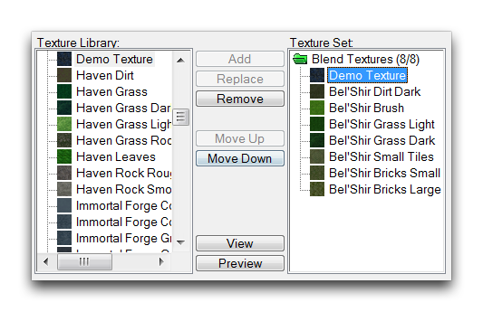
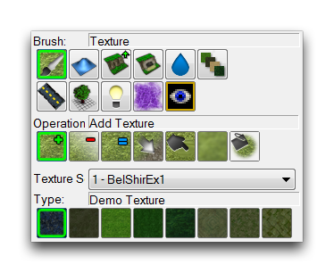
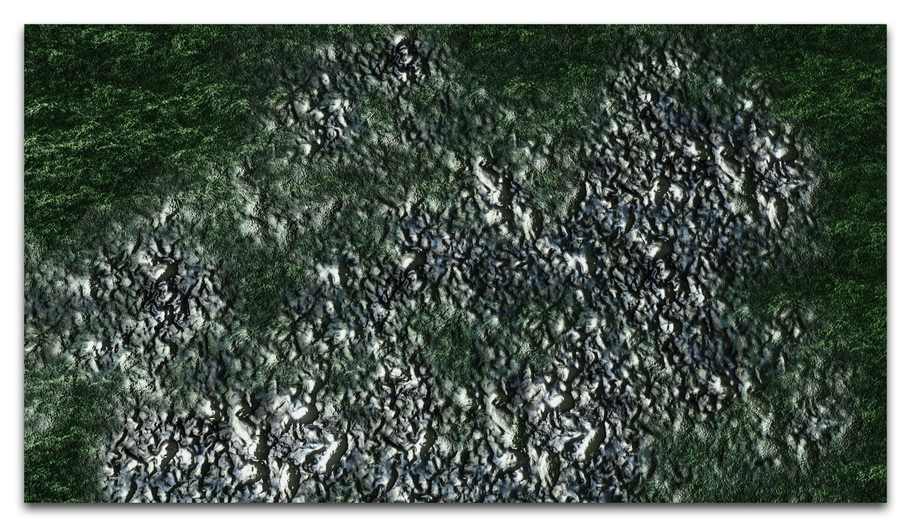
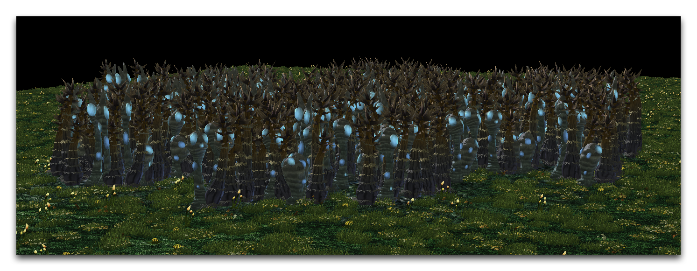

Foliage tends to look best when it is created with some randomness. This mimics a natural environment. There are a few options in this menu to help with this. One option here is the checkbox titled 'Random Rotation.' If you activate this, it will rotate each doodad model to face a random direction on generation. Check the 'Random Rotation' box to enable it and click 'OK' to finish.

*已完成的小配件输入*

Another option not addressed in this article is to populate this doodad list with multiple types of possible foliage to ensure a distribution of different models. You can then set the Probability of each doodad, which will change the proportion in which they are generated. For now though, stick to the single model already selected.

## 修改纹理集

现在您已经准备好地形纹理，需要将其添加到地图本身正在使用的纹理集中。记住，您已选择了此地图的“Bel'Shir（丛林）”集。正如前面提到的，这些集合在数据编辑器的数据类型“地形类型”下内部收集。您可以创建全新的地形类型，但目前只需修改当前的地图集，将“演示纹理”替换为其八种默认纹理之一。

通过导航到+ ▶︎ 编辑地形数据 ▶︎ 地形类型来打开地形纹理选项卡，然后在对象列表中找到现有类型“Bel'Shir（丛林）”。将其突出显示以查看其字段，然后通过双击“纹理 - 混合”来替换新纹理，如下所示。

*修改 Bel'Shir 地形类型*

这将启动一个带有“纹理 - 混合”注释的“对象数值”窗口。

*地形类型定义视图*

此编辑器列出了所有可用地形纹理库以及当前选定的地形类型的两个并行列表。中间控件允许添加、移除、重新定位和在库和纹理集之间来回交换纹理。此外，“预览”按钮可用于查看“演示纹理”的基础纹理和法线贴图的组合。从“纹理库”中选择“演示纹理”，然后在“纹理集”中突出显示“Bel'Shir 土壤浅色”，并点击“替换”。如下图所示，应该交换了纹理。

*交换地形纹理*

在这个阶段点击“确定”将完成地形类型更新并完成练习。

## 测试自定义纹理集

返回到地形编辑器，并在地形图标中找到画笔工具。您应该会看到“演示纹理”在纹理集的最左侧位置上有缩略图预览。如下图所示。

*地形调色板上的定制纹理集*

现在纹理已经准备好涂抹在地形上，随时可以开始尝试。

*Bel'Shir 中的火山灰*

您可以通过铺设一块该新纹理区域，然后用“允许植被”选项涂抹该区域来测试该新纹理的植被功能。如果点击生成植被，应该会得到类似下图截图的效果。

*生成的 Shakuras 树植被*

## 附件

* [030_Texture_Sets.SC2Map](./maps/030_Texture_Sets.SC2Map)