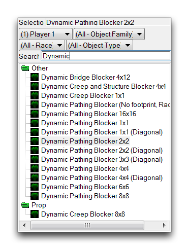
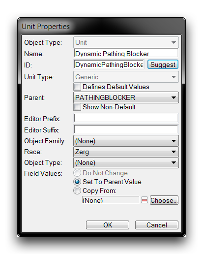
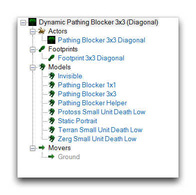
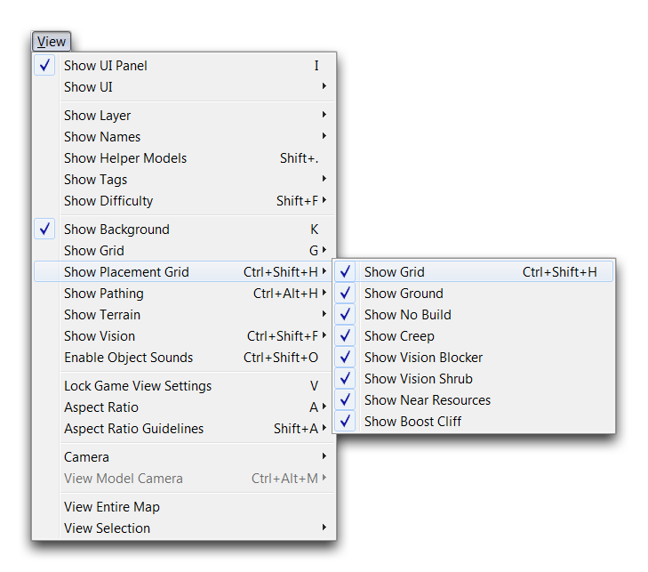
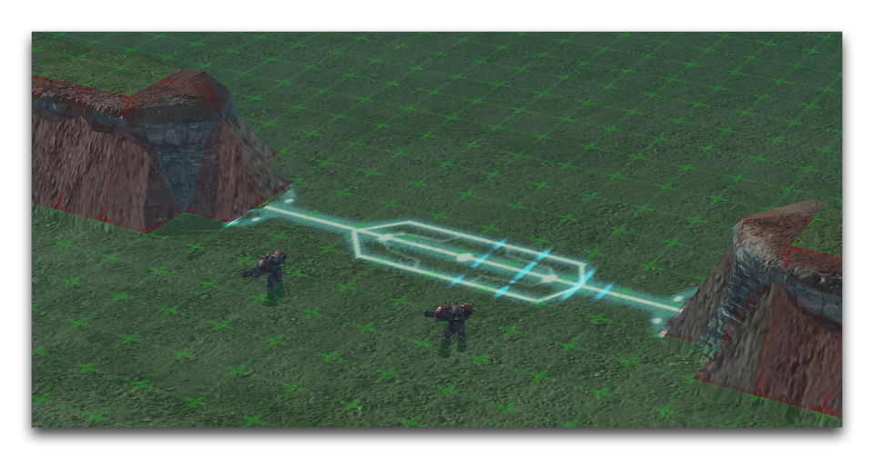
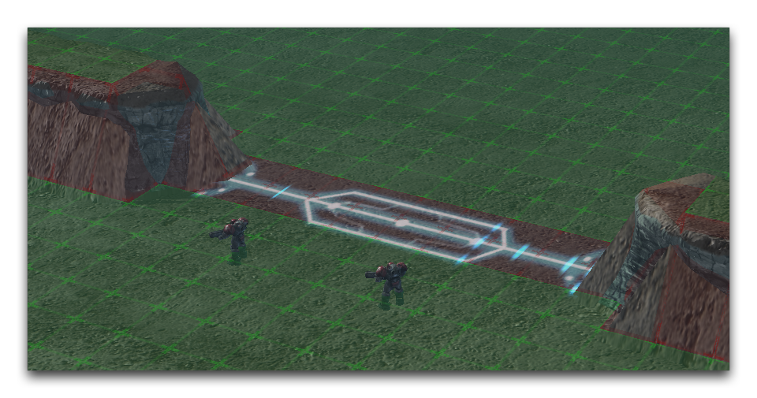
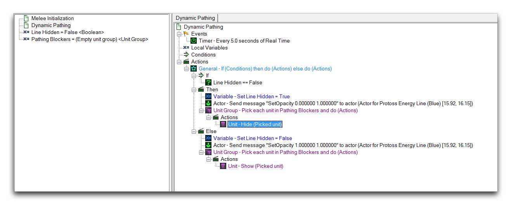
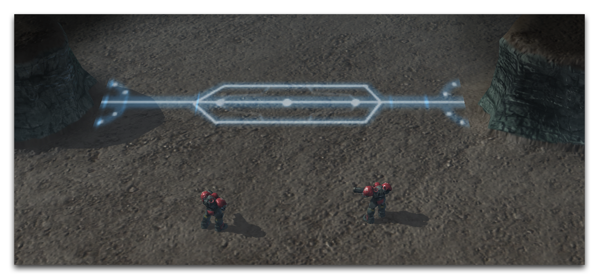
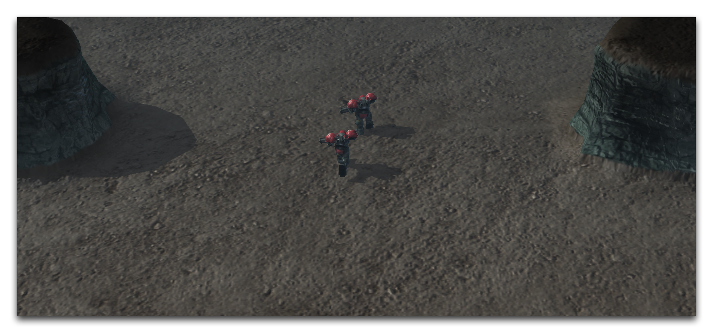

# 动态路径阻挡器

动态路径阻挡器允许您构建可以在游戏过程中开启和关闭的路径区域。这种功能基于它们实际上是单位，这意味着它们可以通过触发动作显示或隐藏。隐藏一个单位会暂停其印记，相应地移除其路径。当再次显示该阻挡器时，其路径将被恢复。

像这样动态调整路径的用途有很多。其中最显著的是，您可以限制对地图某些部分的访问，直到满足条件或任务类型的操作。动态路径阻挡器还会在地形编辑器中显示其印记，使其比其他临时阻塞解决方案更易于处理。

## 创建动态路径阻挡器

您可以在单位面板中搜索术语“Dynamic”找到预制的动态路径阻挡器。

*Dynamic Pathing Blockers*

每个阻挡器的名称通常注明其印记大小和形状，以及它所阻挡的路径类型。动态路径阻挡器不应与路径层中的动态填充选项混淆。前者是可在游戏过程中改变的路径区域，而后者会在编辑器中填充一个“无路径”区域。

您还可以根据模板 PATHINGBLOCKER，在单位创建过程中从头开始构建动态路径阻挡器，如下图所示。

*Dynamic Pathing Blockers*

创建完成后，您需要将路径阻挡器的“印记”字段设置为所需的印记对象。它还需要连接到一个单位角色，以便将其连接到其标准模型上。普通阻挡器的蓝图如下所示。

*Dynamic Pathing Blocker Data Composition*

## 放置动态路径阻挡器

在放置动态路径阻挡器时，放置网格特别有用。您可以通过导航到“视图”▶︎“显示放置网格”，然后勾选所有选项来启用它。

*放置网格视图选项*

在这个演示地图中，动态放置阻挡器用于模拟一种能量门。地图使用“Protoss Energy Line（蓝色）”小装饰物以及一些悬崖面来为放置阻挡器增加视觉元素。您可以在下图中看到这些元素。

*能量门位置*

由于地图的构造，只有一个八单位宽的区域可以让陆战队通过门。这是使用动态路径阻挡器的理想场景，地图已配备了四个“Dynamic Pathing Blocker 2x2”来填补空隙。

*带动态路径阻挡器的能量门*

由于动态阻挡器关闭了路径，您可以打开和关闭它们，以提供门或闸的功能。

## 使用动态路径阻挡器

由于动态路径阻挡器是单位，它们只有在地图上激活时才会应用其印记。您可以使用触发动作“显示/隐藏单位”来更改阻挡器的状态，根据需要开启和关闭它们。任何能够以单位为目标的其他动作都可以与动态路径阻挡器一起使用，产生不同效果，其中包括“杀死单位”、“创建单位”和“即时移动单位”。

在此演示中，将动态路径阻挡器添加到了地图初始化时的一个组中。随后添加了以下触发器。

*Dynamic Pathing Blocker Toggling Trigger*

此触发器每五秒改变一次动态路径阻挡器的状态。当“Line Hidden”变量设置为 False 时，门会使用 SetOpacity 单元消息淡入。同一语句块还会通过“显示单位”动作激活动态路径阻挡器。关闭的门将如下所示。

*Path Blocked by Closed Gate*

当变量切换为 True 时，通过 SetOpacity 和“隐藏单位”分别切换不透明度和阻挡器状态。这将消除门和阻挡器，使单位可以通过。

*Path Revealed by Open Gate*

## 附件

* [031_Dynamic_Pathing_Blockers.SC2Map](./maps/031_Dynamic_Pathing_Blockers.SC2Map)