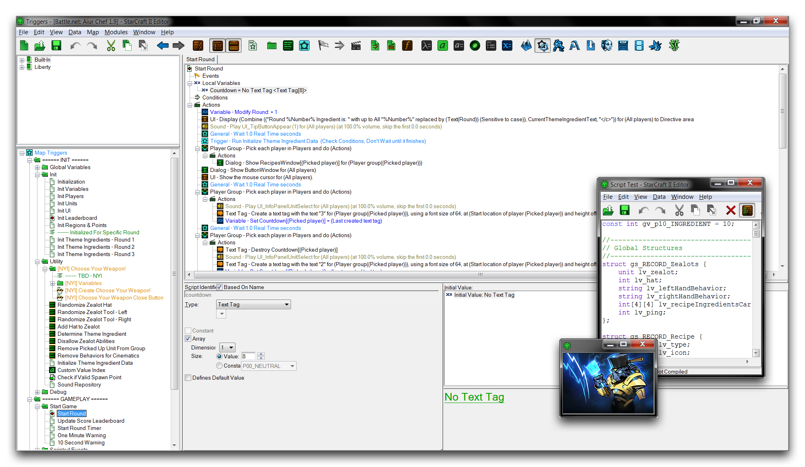

# 触发器编辑器介绍

触发器编辑器是您构建项目逻辑的地方。触发器是将您的编辑器项目转变为交互式可玩地图的关键。您可以使用此系统构建具有明文元素的游戏，这意味着您不需要使用编程语言。使用编辑器预先构建的这些元素库，使开发人员在制作游戏时能够快速轻松地工作。

作为一种工具，触发器的直观、视觉化编程方法一直是暴雪RTS游戏历史中业余爱好者和专业人士的长青之爱。作为一种工具，触发器可以随着用户的使用而发展，使他们最终可以通过研究Galaxy Script来深入编程，该语言是在系统背后起作用的语言。高级用法通过编辑器的广泛功能集得到支持，包括用于调试和性能优化的分析器。

*触发器编辑器的使用*

## 元素

触发器编辑器通过构建逻辑块来运作，并在游戏监视的的反应中发生。事件反过来可以与相匹配进行监视。触发器本身本质上是游戏中变化的的容器。条件、事件、触发器和动作的相互作用构成了将项目带入生活的基本游戏循环。

还有当事件发生时。然后通过动作将其处理、修改，然后将其反馈到游戏中。通过自定义动作或函数也可以制作任何基本元素的新变种。

通过复杂的数据类型和数据可以被命名并排序在文档中，以便于映射到具有的地图，驯服一个不断扩大的项目。通过转换为可在地图、朋友或队友之间共享的对象。随着开发者的学习和成长，他们可以开始利用自定义整个引擎的驱动程序的编程语言。