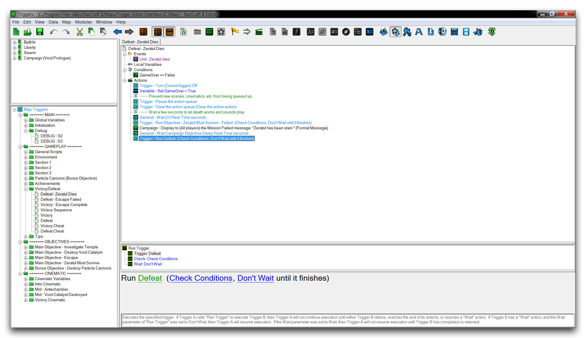
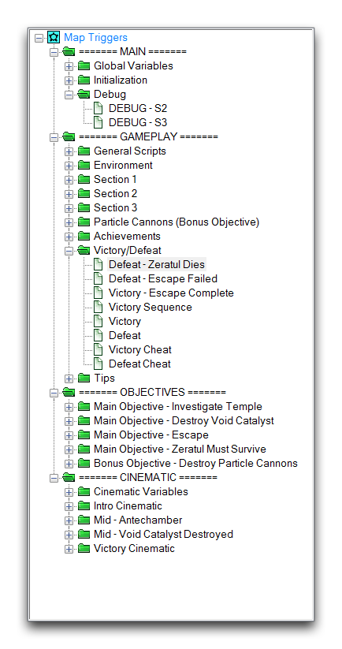
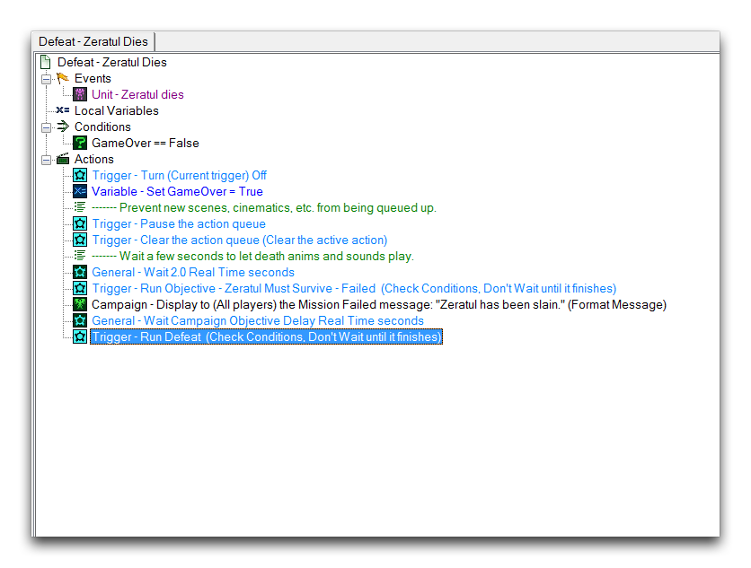
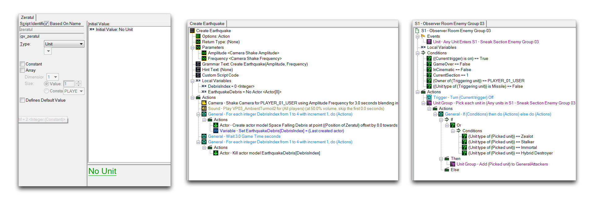
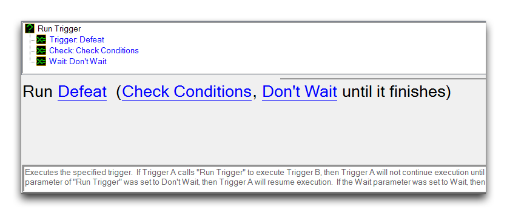
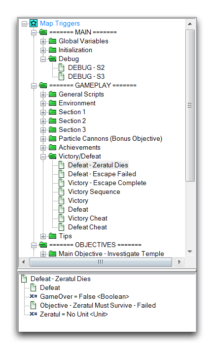
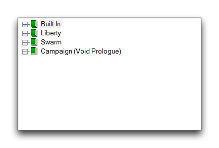
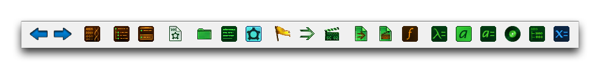
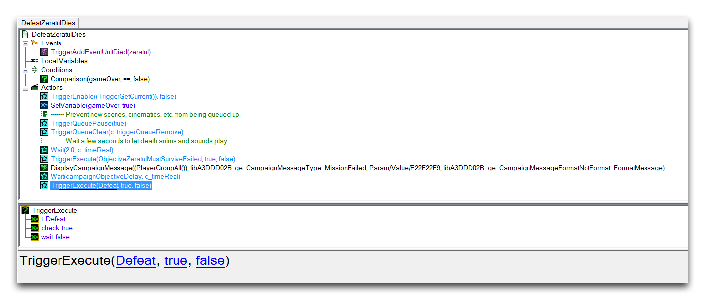
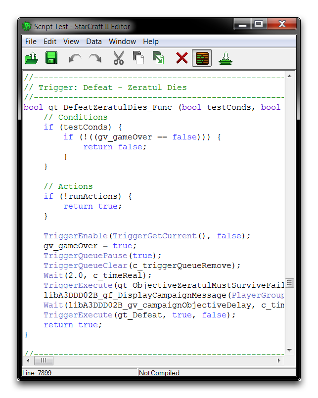

# 触发器编辑器界面

触发器编辑器是一个用于触发器、动作、事件以及组成触发器系统逻辑的所有其他元素的施工现场。一旦开始在触发器编辑器中工作，您构建的逻辑将立即在地图中生效，执行规则、构建机制并创建游戏玩法。

## 界面

*触发器编辑器界面视图*

触发器编辑器提供了一个干净、有序的表示项目中所有活动逻辑元素的界面。任何具有编程经验的开发人员都会注意到它与标准文本编辑器的相似之处。此界面的关键是下面显示的触发器面板。

*触发器面板*

在触发器面板中，您会发现项目中所有活动触发器元素的列表。除了提供概述外，这也是您导航项目的主要手段。在此面板中选择一个元素，其信息将显示在屏幕中间，内部是触发器内容面板。

*触发器内容面板*

根据您选择的元素类型，此面板可能会采用许多不同的布局。

*变量内容 - 定义内容 - 触发器内容*

当启用“使用子视图”选项时，此视图还将介绍一个触发器内容面板子视图，显示元素的字段以及可用的工具提示。

*触发器内容面板子视图*

随着项目的扩大，您将发现另一个可用的可管理性选项是触发器资源管理器。启用此选项将在触发器面板中追加一个查看器，显示当前选定元素内部组件的详细信息。您可以使用此功能快速扫描较大项目的各个组件。

*触发器资源管理器*

项目可能会扩展到包括库，这些库是在多个地图之间共享的触发器元素集合。所有标准的预制元素也通过库包含在地图中。您可以在“库面板”中找到当前地图中所有库的列表。

*库面板*

从此模块可用的主工具栏部分是触发器栏。

*触发器栏*

所有触发器编辑器的查看和创建选项都在此处方便地提供。下面是一个表格，详细说明了从触发器栏中可用的选项。

| 操作                    | 效果                                                                                                                                                                |
| ----------------------- | -------------------------------------------------------------------------------------------------------------------------------------------------------------------- |
| 后退                    | 通过触发器编辑器历史向后撤销命令。                                                                                                                                    |
| 前进                    | 通过触发器编辑器历史向前撤销命令。                                                                                                                                    |
| 显示原始数据            | 将视图从普通语言更改为原始脚本标识符和Galaxy函数调用。                                                                                                             |
| 显示库                  | 打开或关闭库面板。                                                                                                                                                   |
| 使用子视图              | 打开或关闭触发器内容面板子视图。                                                                                                                                     |
| 新建元素                | 创建与当前选择类型相同的新元素。                                                                                                                                     |
| 新建文件夹              | 在触发器面板中创建一个文件夹。                                                                                                                                      |
| 新建注释                | 在当前光标位置创建一个注释。                                                                                                                                        |
| 新建触发器              | 在触发器面板中创建一个触发器。                                                                                                                                      |
| 新建事件                | 在触发器内容面板中创建一个事件。                                                                                                                                    |
| 新建条件                | 在触发器内容面板中创建一个条件。                                                                                                                                    |
| 新建动作                | 在触发器内容面板中创建一个动作。                                                                                                                                    |
| 新建条件定义            | 在触发器面板中创建一个条件定义。                                                                                                                                    |
| 新建动作定义            | 在触发器面板中创建一个动作定义。                                                                                                                                    |
| 新建函数                | 在触发器面板中创建一个函数。                                                                                                                                        |
| 新建参数                | 在触发器内容面板内的活动定义中创建一个参数。                                                                                                                        |
| 新建预设类型            | 在触发器面板中创建一个预设。                                                                                                                                      |
| 新建预设值              | 在触发器内容面板内的活动预设中创建一个值。                                                                                                                        |
| 新建记录                | 在触发器面板中创建一个记录。                                                                                                                                      |
| 新建子函数类型          | 在触发器内容面板内当前活动函数中创建一个子函数。为此，您必须在“功能选项”中勾选“子函数”标志。                                                                             |
| 新建变量                | 在触发器面板中创建全局变量或在触发器内容面板中的光标位置创建本地变量，具体取决于光标位置。                                                                             |

## 查看选项

使用“显示原始数据”选项将触发器编辑器的普通语言语句转换为Galaxy函数调用，如下图所示。

*显示原始数据*

如果您希望进行脚本编辑，则此功能非常有用。此外，您可以选择“查看脚本”选项来查看实际游戏脚本。选择此选项将启动下面显示的脚本测试窗口。

*通过查看脚本浏览的脚本测试窗口*