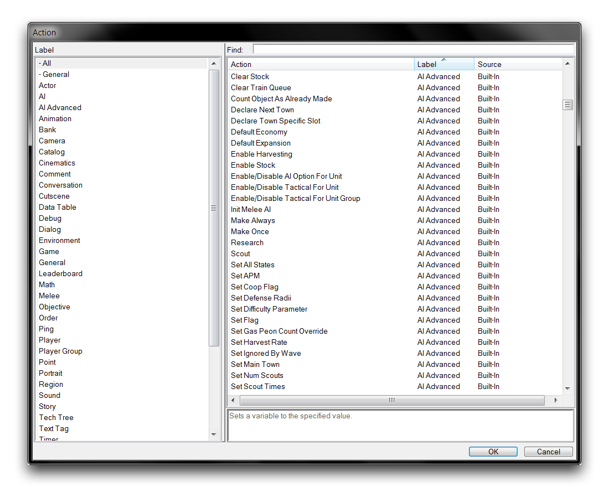
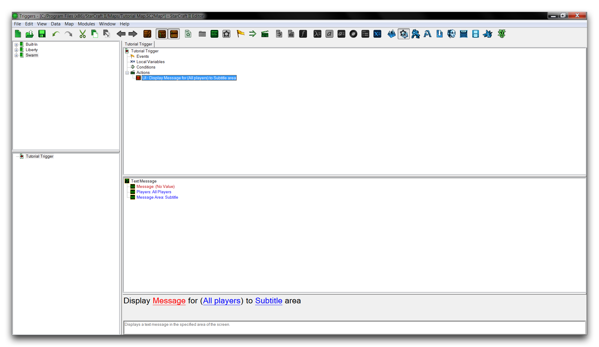
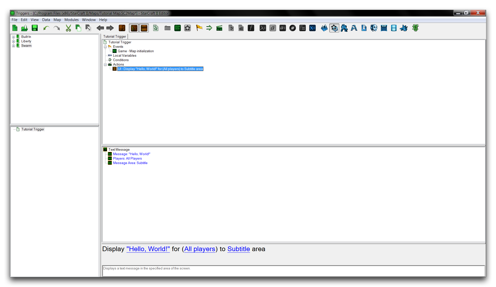
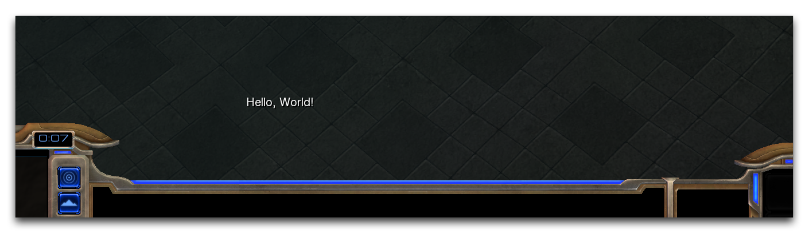

# 动作

动作是触发器内部的各个命令，用于在游戏中进行更改。激活的触发器通过按照指定顺序运行每个动作来解决。每个动作都提供了一个独特的功能，可以与任意数量的其他动作结合以创建更大的效果。本质上，动作是您用来指导游戏的基本语句。

## 创建动作

首先，通过右键单击“触发器面板”并导航到“新建 ▶️ 新建触发器”来创建一个新的触发器。在新触发器中，通过双击“动作”标题或右键单击主选项卡内部并导航到“新建 ▶️ 新建动作”来启动“动作”窗口。

*动作窗口*

“动作”窗口在其最右侧视图中显示一系列可用动作。在这里您还会看到一些搜索选项，允许您按类别搜索，通过左侧侧边栏浏览，或者从顶部搜索栏搜索。

在搜索框中键入“文本消息”并选择名为“文本消息”的动作。这会显示以下视图。

*文本消息动作*

## 设置动作条款

在主选项卡的子视图中显示了动作的解剖结构。您会注意到术语“消息”以红色显示。红色文本表示一个动作要有效所需的值。相比之下，动作的另外两个术语的蓝色文本显示它们的默认值。在选项卡视图中，您会看到动作标记为具有独特的红色 X，表示它是无效的。具有无效元素的地图将无法正确运行，因此重要的是您注意它们。

要启用此动作，需要一条消息。单击“消息”一词，将文字“Hello, World\!” 添加到弹出窗口中。单击“确定”并返回主界面以验证您的动作。要测试此动作，必须以某种方式调用其触发器。在这种情况下，您将通过导航到事件 ▶️ 地图初始化 添加一个“地图初始化”事件。这将带您到以下视图。

*已配置的动作*

运行“测试文档”动作应导致此触发器在地图开始后触发。消息将打印到游戏 UI 上方的默认“字幕”区域。您的测试运行应返回类似下面所示的结果。

*动作屏幕输出*

## 动作效果与类型

事件的条件（地图初始化）已发生，导致动作触发，并将您的消息显示在屏幕上。这是游戏过程产生的基本过程。通过研究基本库中提供的动作，您可以变化能够进行的事务类型。在“动作”窗口中突出显示一个动作将显示列表下方的基本提示。这些相同的提示也可在主选项卡的底部子视图中找到。以下是一些常用动作的简要介绍。

| 动作                        | 效果                                                                                                                                                       |
| -------------------------- | ---------------------------------------------------------------------------------------------------------------------------------------------------------- |
| 设置变量                    | 确定地图可用的任何变量的值。                                                                                                                                |
| 创建对话框                   | 创建一个对话框容器用于“对话框项”，允许自定义 UI 结构。                                                                                                       |
| 创建单位（朝向角度）          | 在地图平面上生成具有特定旋转方向的单位。                                                                                                                   |
| 播放声音                     | 从星际争霸资产库中运行声音文件。                                                                                                                            |
| 显示/隐藏 \_                | 一组改变玩家可见性的操作。例如，显示/隐藏对话框项可以为每个玩家创建独特的 UI 项目。                                                                           |
| 设置 \_                     | 一组值更改操作。例如，“设置联盟”定义玩家或玩家组之间是否相互敌对。                                                                                                   |
| 移除 \_                     | 一组移除操作。这些操作将从游戏中消除许多类型的实体，如移除单位、移除行为或移除物品。                                                                                  |