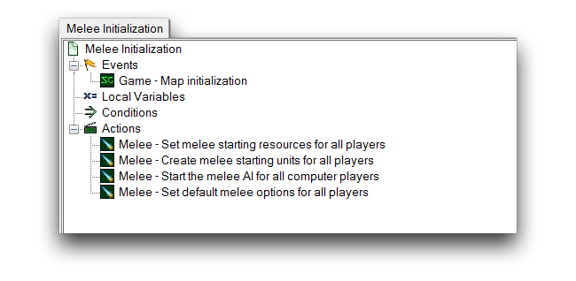
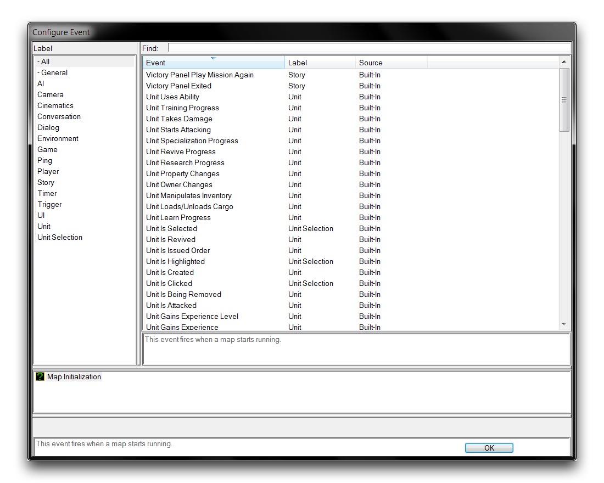
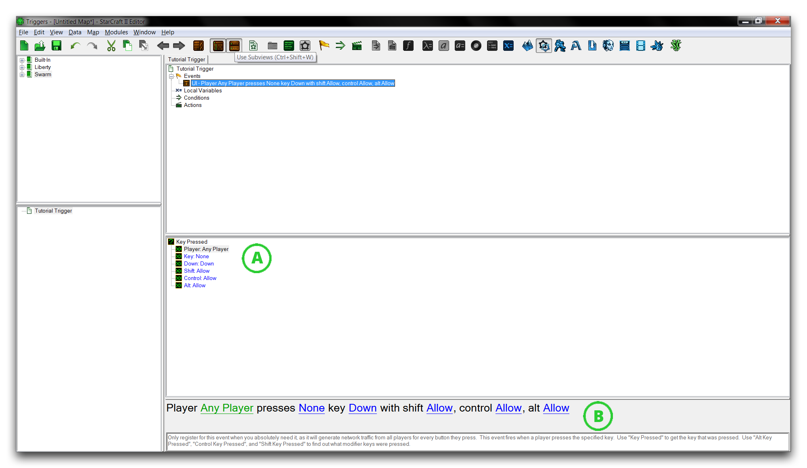

# 事件

事件是编辑器中任何典型触发器的起始点。通过选择一个事件，您正在选择游戏将要监视的一组情况。当这组情况发生时，相关的触发器就会被触发。触发器将按照从上到下的顺序进行，从而对游戏进行更改。每个地图的核心都有某种事件识别。即使是近战地图也包含对'地图初始化'事件的单个触发器，如下所示。

*默认近战触发器*

## 设置一个事件

通过在**触发器面板**中右键单击，然后导航到新建 ▶︎ 新建触发器来创建一个触发器。选择此新触发器以填充主选项卡中的触发器详细信息。这些详细信息将在几个标题下进行拆分，双击'事件'标题以打开'配置事件'窗口。

*配置事件窗口*

此窗口显示了您当前项目可用的事件库。最左侧视图允许您按照已标记的任何类型对事件进行排序。它还提供了搜索功能以及一些简要的工具提示来解释所选事件的用法。值得注意的是，每个事件也已被标记了来源。在这种情况下，每个事件将列出'内建'。来源标题描述了事件是否来自星际争霸触发器库或自定义定义。

花点时间浏览事件可能性，然后找到位于“UI”标签下的“按键按下”事件。双击此事件以选择它。

## 事件的组成

与之前看到的'Melee Initialization'事件不同，大多数事件包含需要配置的几个子选项。一旦选定，'按键按下'事件将在主选项卡的子视图中显示其选项，如下所示。如果这些选项看不到，请确保从触发器栏中选择“使用子视图”选项。

*带子选项的事件视图*

子选项以两种格式呈现。标有“A”的格式显示成对的子选项。这会给出一个垂直列表，其中每个标题采用“变量类型：变量输入”的形式。或者，“B”格式显示了所列变量的明文解释。蓝色下划线的每个单词代表变量组件。请注意两种情况，因为在某些情况下，这些格式可能不同。最常见的情况是'A'提供了'B'没有呈现的其他选项。

在'A'列表中向下滚动，您可以为此事件设置以下选项。

| 子选项             | 描述                                                                                                                     |
| ----------------- | ---------------------------------------------------------------------------------------------------------------------- |
| 玩家            | 设置要监视按键按下的玩家。                                                                         |
| 按键               | 设置要监视按下的按键。                                                                              |
| 按下              | 设置要监视的按键按下方向。键盘上的每次击键都会产生按下和抬起。  |
| Shift/Control/Alt | 定义按键按下时允许的修改器。 这些是互斥的，因此任何可用的组合都是有效的。   |