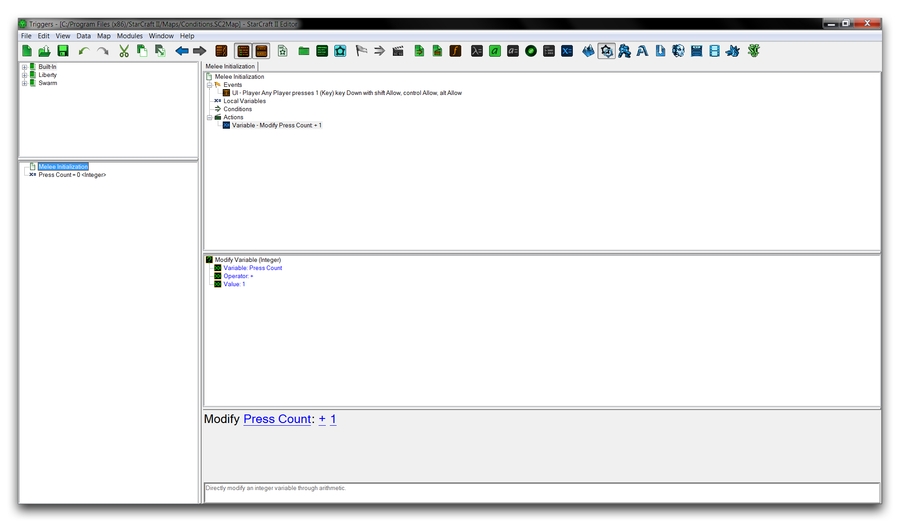
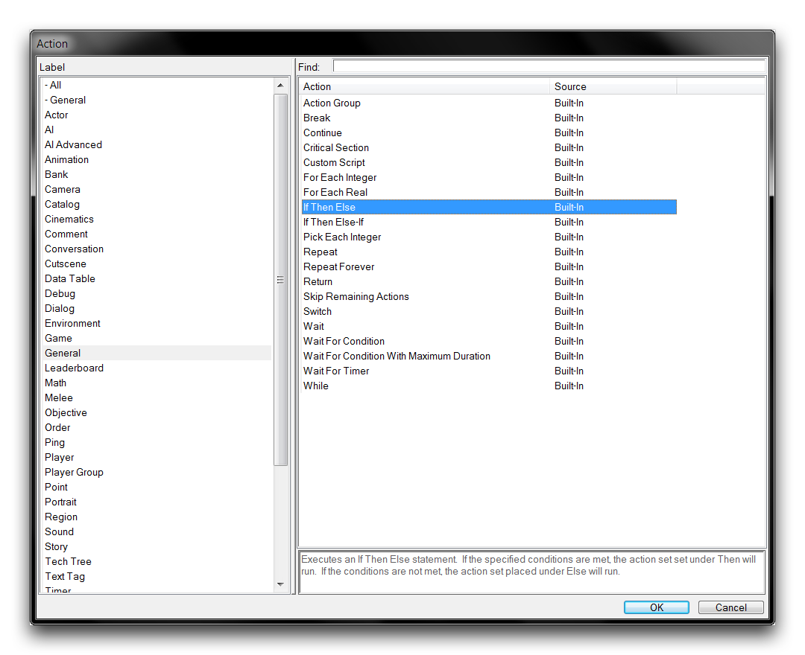
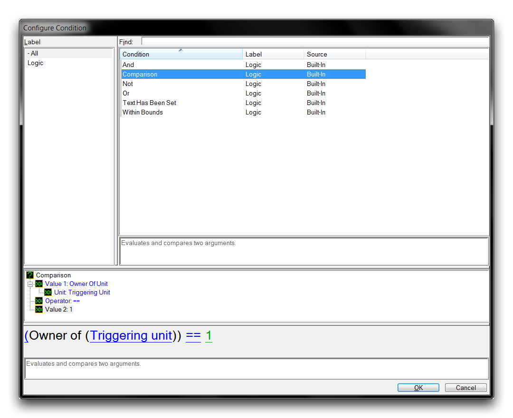

# 条件

条件在触发器中使用，用于确定关于游戏的某些内容是否为真或假。这里的模棱两可是有意为之的，因为条件几乎可以应用于游戏中的任何对象和任何事件。

基本上，条件提出了对于游戏的问题。一个例子可能是，“这个玩家是否至少有五个单位？”游戏然后根据其对该属性的了解，玩家的单位计数，以及答案（true或false）进行回应。根据回答，编辑器中的语句可以以不同的方式进行，通常被称为“控制”。

控制允许您打破编辑器的基本线性行为。借助条件，诸如触发器之类的元素可以变得非线性，避免执行某些代码段，多次重复执行某些代码段，或完全停止并跳转到完全不同的位置。条件允许进行选择，这是创建动态、生动和有趣事物的重要方面。

将条件视为问题的想法是您应该谨记的一点。这是一个有用的习惯，可以帮助您弄清楚某种情况下是否适用条件。当您开始学习星际争霸编辑器中表达条件的数学符号时，这也会有所帮助。

## 准备触发器

为展示条件的使用，您需要组装一个触发器。请使用以下步骤准备基本触发器。

  - 创建一个新的自定义地图，并进入触发器编辑器。
  - 转到“Melee Initialization”触发器，并删除其中包含的所有默认动作和事件。
  - 通过转到Events ▶︎ Key Pressed创建一个新的事件。
  - 将事件的“Key”项设置为键“1”。
  - 通过Local Variables ▶︎ New Element创建一个新变量。
  - 将本地变量命名为“Press Count”，并将其类型设置为“整数”。
  - 通过Actions ▶︎ Modify Variable（Integer）创建一个新动作。
  - 将动作的“Variable”项设置为变量“Press Count”。
  - 将动作的“Value”项设置为“1”。

这样，您应该会得到以下内容。

*触发器基础*

## 控制语句

条件不仅限于触发器中的“Conditions”标题，它们还出现在一种名为控制语句的动作类型中。其中一种动作是“If Then Else”。此动作允许您指定一个条件，根据真假问题的结果之一，将继续执行两种可能的语句块之一，一个用于真，一个用于假。然后该语句块仅运行一次，而另一个块则被跳过。条件在控制语句的“If”标题下指定，而真响应的语句块在“Then”标题下，假响应的语句块在“Else”标题下。

因此，“If Then Else”控制语句可以被视为“如果发生这种情况，则执行此操作，否则执行此操作”的形式。

您可以在触发器中在“Modify Press Count + 1”语句下通过New ▶︎ New Action ▶︎ If Then Else添加“If Then Else”控制语句以进行调查。您将在“Actions”窗口的“-- 一般”类别下找到控制语句。

*选择“If Then Else”动作*

## 条件运算符

通过右键单击“If”标题并转到New ▶︎ New Condition，向“If Then Else”动作添加条件。这将打开如下所示的“配置条件”窗口。

*运算符视图*

配置条件需要两个步骤，即组装条件的术语和选择所谓的运算符。在问题模型中，前者涉及条件所询问的内容，而后者形成条件提出的问题类型。当涉及形成条件时，每个运算符在描述条件方面具有其独特的功能，这些功能在下表中描述。

| 运算符         | 详细信息                                                                                                                                                                                                         |
| ----------------- | ---------------------------------------------------------------------------------------------------------------------------------------------------------------------------------------------------------------------------------------------------------------------------------- |
| 与               | 在两个术语之间创建一个并集。然后同时测试这两个术语。                                                                                                                                                                                                            |
|                   | 如果两个术语同时测试为真，则结果为真。如果两个术语同时测试为假，则结果为假。如果一个术语测试为真，但另一个未测试为真，则结果为假。                                                                                                    |
| 比较      | 评估比较两个术语。实际上是一组运算符，列在接下来的六个条目中。                                                                                                                                                                        |
| \!=               | 如果术语不相等，则返回真。如果相等，则返回假。                                                                                                                                                                                                                    |
| \<                | 如果左侧术语小于右侧术语，则返回真。如果不是，则返回假。相等的术语返回假。                                                                                                                                                             |
| \<=               | 如果左侧术语小于右侧术语，则返回真。如果不是，则返回假。相等的术语返回假。                                                                                                                                                              |
| \==               | 如果术语相等，则返回真。如果不是，则返回假。                                                                                                                                                                                                                       |
| \>                | 如果左侧术语大于右侧术语，则返回真。如果不是，则返回假。相等的术语返回假。                                                                                                                                                               |
| \>=               | 如果左侧术语大于右侧术语，则返回真。如果不是，则返回假。相等的术语返回真。                                                                                                                                                                |
| 非               | 反转术语。测试术语的非版本将提供与正常术语结果相反的结果。                                                                                                                                                           |
| 或                | 在两个术语之间创建一个并集。然后同时测试这两个术语。                                                                                                                                                                                                            |
|                   | 与“与”不同，如果单个术语测试为真，则结果为真。如果两个术语都测试为真，则结果为真。如果两者都测试为假，则结果为假。                                                                                                     |
| 文本已设置 | 如果测试的文本参数不为空，则返回真。                                                                                                                                                                                                                       |
| 在范围内   | 一个复合运算符，用于测试术语是否在两个值之间。如果该值等于任一术语，则也将返回真，因为它使用了两个\<=运算符，形式为Min Value \<= Term \<= Max Value。此运算符仅支持整数、字节和实数值类型。 |

## 配置您的条件