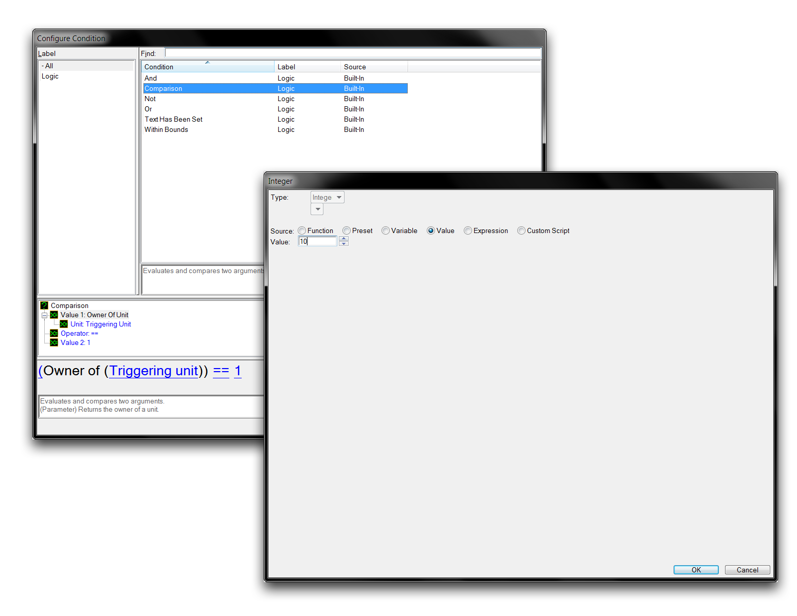
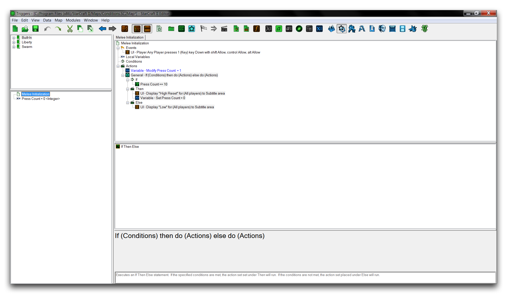
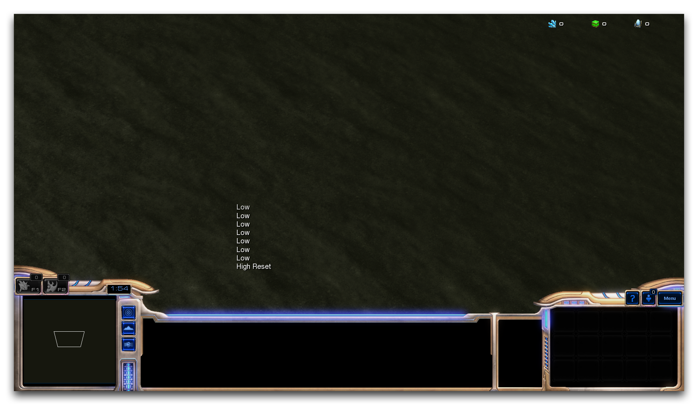

完成设置您的条件，通过导航到“Configure Condition”窗口中的“Comparison”，设置条件。通过点击子视图中的标题来设置条件。 "Value 1" 对应于第一个术语，而 "Value 2" 对应于第二个术语，后跟运算符。通过双击“Value 1”并导航到变量▶︎ Press Count 来设置第一个术语。通过双击“Value 2”并导航到数值来设置第二个术语，并输入10。现在通过双击“Operator”并导航到 == 来设置运算符。

*设置术语*

点击“确定”返回到触发器编辑器。现在您可以通过以下步骤完成触发器。

  - 在 "Then" 标题下，创建一个 "文本消息" 动作。将消息设置为 "高重置。"
  - 同样在这里，创建一个 “设置变量” 动作。将变量设置为 Press Count，将值设置为 “0。”
  - 在 "Else" 标题下，创建一个 "文本消息" 动作。将消息设置为 "低。"

您现在应该留下类似下面图片的内容。

*完成触发器*

您已经组合了一个触发器，每当玩家按键盘上的 1 键时触发。这将每次递增变量。然后，根据条件 Press Count == 10，将运行两个块语句中的一个。一个为真的语句会产生消息 “高重置”，一个为假的语句会产生消息 “低”。因此，每个触发器都会提出问题，“变量是否等于 10？” 它然后根据条件的响应确定应该遵循哪个程序。

在实践中，这应该对前九个触发器而言是假的，然后对第十个触发器而言是真的。 "高重置" 消息将在第十次按键时显示。您可以测试地图以确认其是否正常工作，方式是导航到文件▶︎ 测试文档。如果您已经做对了一切，您应该会得到下面显示的结果。

*成功输出*

## 附件

 * [036_Conditions.SC2Map](./maps/036_Conditions.SC2Map)