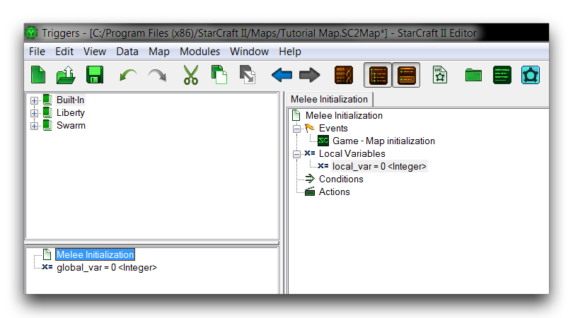
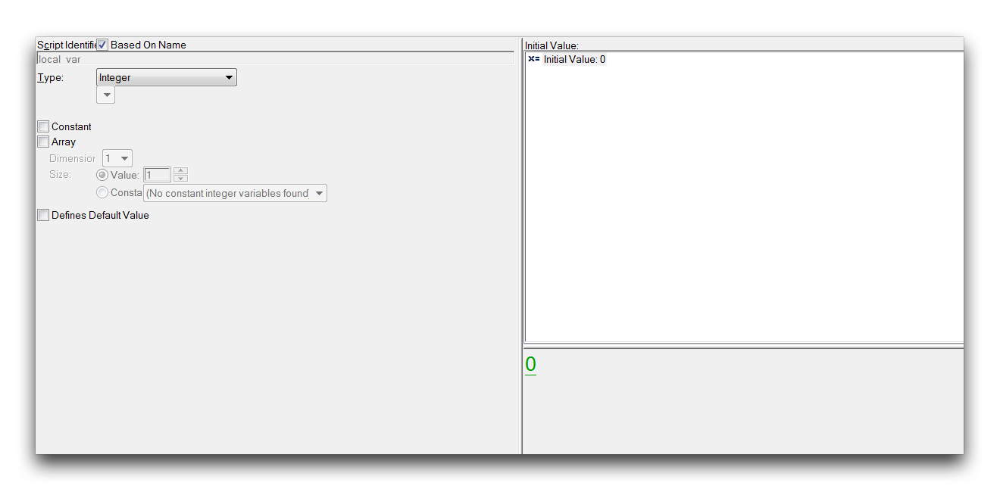

# 变量

变量是一个值的符号表示，可以代表数字，点，模型或StarCraft引擎中发现的任何可能类型的数据。通过将数据类型抽象为符号，变量可以充当容器，存储或传递其选择类型的任何值。

变量也可以适用于更大的结构，比如动作或条件，在那里它们将传递其获取和传递数据的能力。一旦获赋予了使用不断变化的值进行操作的能力，一开始静态的语句将变得生动起来，成为游戏开发的动态，中心构成单元。

## 变量作用域

变量有两种不同的分类，局部变量和全局变量。它们都具有上述相同的属性，但可以在触发器编辑器的不同位置使用。您可以从触发器面板中创建全局变量，方法是导航至新建 ▶︎ 新建变量。局部变量可以从几个位置创建，尤其是在触发器内。通过右键单击“局部变量”标题，然后导航到新建 ▶︎ 新建变量，可以在触发器内创建一个局部变量。在一个新的空白项目中创建一个每种类型的变量，您将得到以下结果。

*本地和全局变量*

全局变量位于触发器面板中，而局部变量仅在其父触发器中可见。这种分离不仅仅是为了美观，它显示了这两种变量类型之间的特性差异，即作用域。作用域描述了任何组件的可用级别。像全局变量这样的全局作用域中的东西可以在单个项目的触发器中的任何位置访问。每个项目只有一个全局作用域。相比之下，局部作用域是众多的，每个触发器都有自己的作用域。局部变量是一个特定触发器的本地变量。如果没有特殊操作，它不能在该触发器之外访问。

全局变量由于其普遍可访问性而提供了更大的使用便利性，但它们始终保留在内存中，您可以使用触发器调试器来确认。正如您所期望的那样，全局变量的性能成本比其局部等效更高。您还应注意，每次运行触发器时都会重新创建局部变量，并将其实例化为在触发器内设置的初始值。与全局变量的稳定值形成对比。每种分类都提供了不同的组织选项。

## 变量选项

变量具有几个可配置选项，您可以通过启动变量子视图并单击任何变量来设置这些选项。您可以在下面的图像中看到该视图，然后是其选项的详细说明。

*变量选项*

| 选项                | 描述                                                                                                                                                                                                                                                                                                                          |
| --------------------- | -------------------------------------------------------------------------------------------------------------------------------------------------------------------------------------------------------------------------------------------------------------------------------------------------------------------------------- |
| 脚本标识符     | 变量 在 Galaxy Code 中的名称。选择基于名称将基于GUI中的名称生成标识符，取消此选项后允许您输入标识符。                                                                                                                                                              |
| 类型                  | 变量的数据类型。突出显示某些类型将启用用于设置记录，链接类型和文件类型等附加选项。                                                                                                                                                                   |
| 常量              | 确定变量的初始值是否可以更改。对于不需要在任何情况下更改的数据片段，常量是一个有用的安全功能。                                                                                                                                                     |
| 数组                 | 选择此项将使变量变成所选类型的变量数组。Size 控制每个维度中元素的数量。Dimension 控制元素层级的数量。具有 Size 值为 5 和 Dimension 为 3 的数组将具有 5*5*5，总共125个元素。常量选项允许您使用预定义常量变量定义数组的大小。 |
| 定义默认值 | 选择此选项将将此变量的初始值定义为所选类型的所有其他变量的默认初始值。                                                                                                                                                                                             |
| 初始值         | 设置变量在其选择数据类型中的初始值。                                                                                                                                                                                                                                                                              |