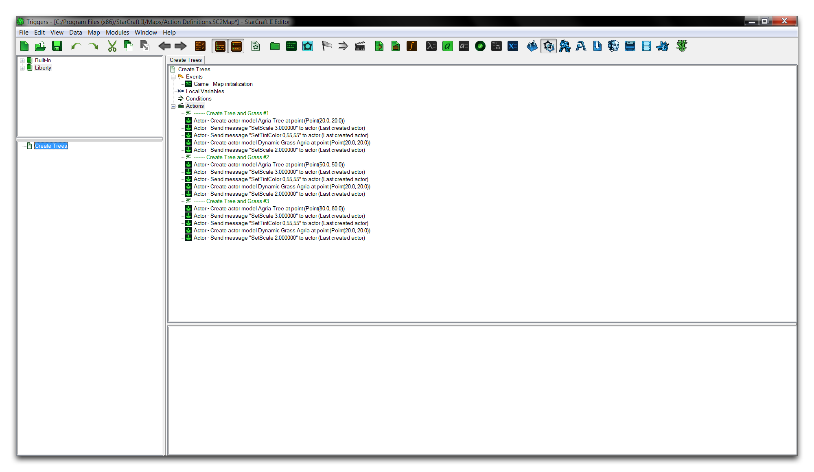
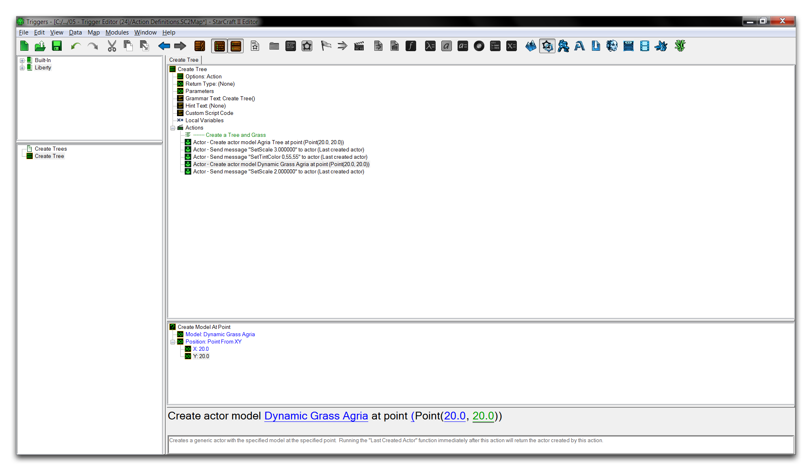
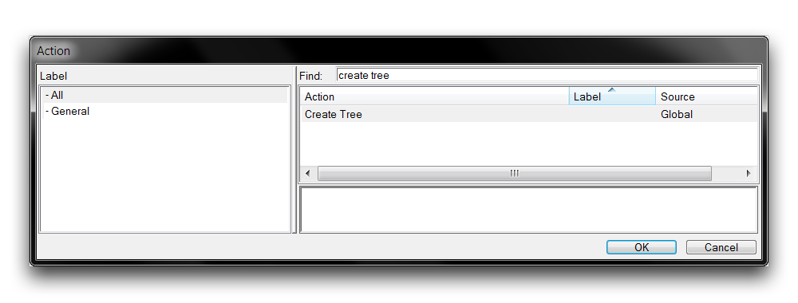
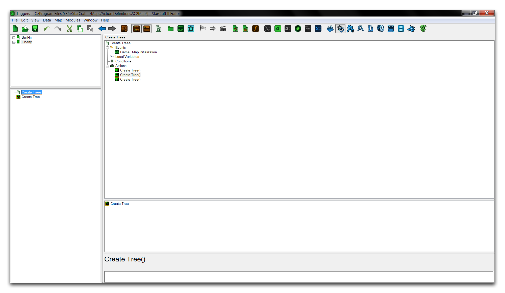
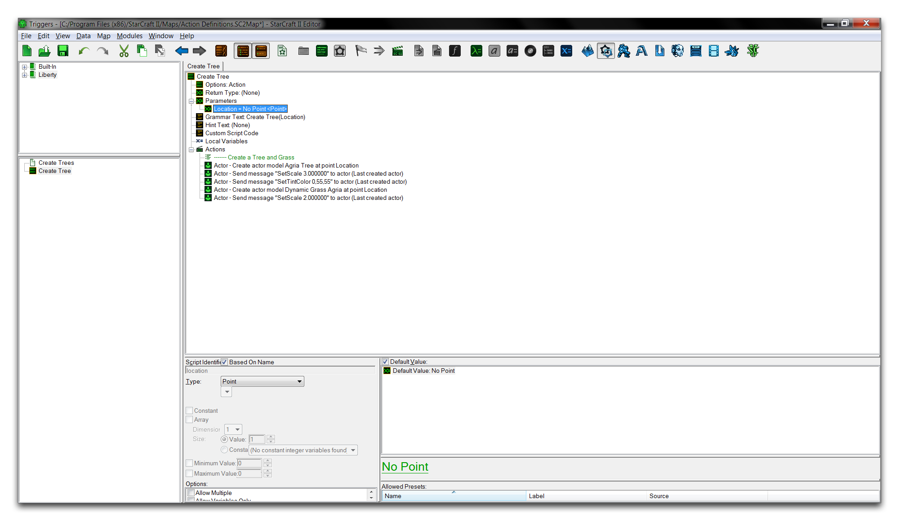
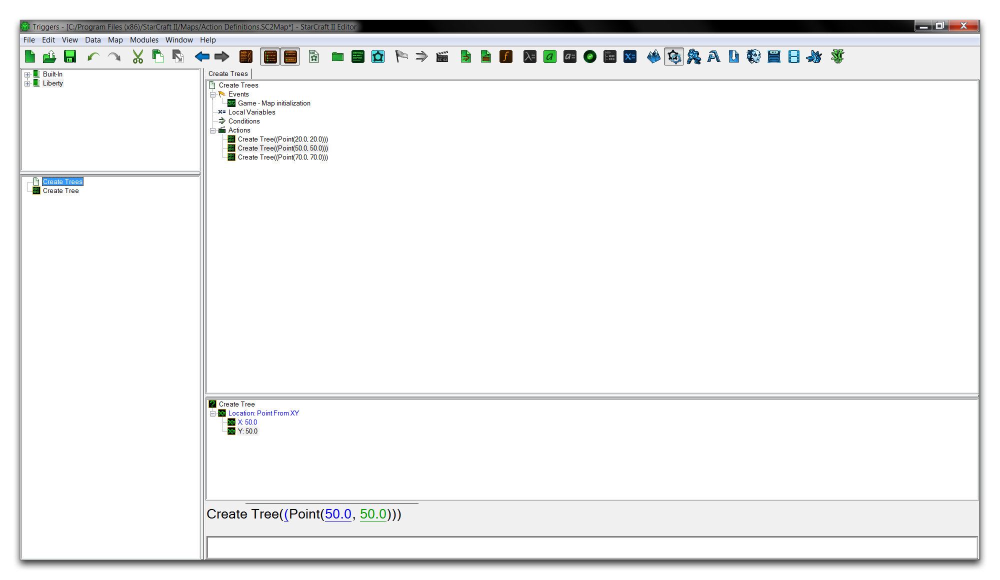

# 操作定义

操作定义允许您创建定制的操作语句序列。一旦组装好，它们可以在与其组件操作相同的上下文中使用。它们还支持参数，即可以改变定义行为的输入值。通过将操作组织成更大的层次块，您可以使用操作定义将经常重复的程序抽象化为一个强大的工具，根据需要部署。正确使用的话，这样做将为您节省时间，使您的代码更易于理解，甚至优化性能。

## 演示操作定义

打开本文提供的演示地图，并导航到触发器编辑器。该项目包含一个在地图初始化时运行的触发器，用三组不同的树和一片草填充地图，并在生成时对模型进行一些角色修改。

*树木和草生成操作*

总体操作相当简单，但由于创建对象的位置不同，它由三个类似的过程组成。多余、臃肿的触发应凸显为可以作为操作语句的潜在位置。在这种情况下，重复的模型创建选项及其各种角色信息可以全部移至操作定义。

要创建一个操作定义，请右键单击触发器面板，然后导航至新建 ▶ 新建操作定义。将定义命名为“创建树木”。现在，按住 Shift 键并选择主要触发器的前五个操作。将这些操作复制到新的操作定义中，以便最终看到以下视图。

*创建树木操作定义*

您现在已将冗余操作重构为自定义操作定义。此时，您可以将“创建树木”触发器更改为三次使用操作定义，而不是当前的冗余代码。通过从其“调用”位置，即操作列表中，访问操作定义，将操作定义添加到触发器中。右键单击触发器，选择新建操作，然后找到“创建树木”定义，如下所示。

*使用新操作定义*

重复此操作三次，以反映要替换的三个操作，并清除所有不必要的代码。这将使您得到以下结果。

*重新组织的主要触发器*

## 操作定义参数

尽管主要触发器已经大大简化，但仍有一些遗漏。请记住，每棵树和草地组合都是在不同的位置生成的。目前，该定义仅在一个位置（点（20，20））生成树和草地。

您可以使用参数使操作定义具有可变结果。参数值可以向操作定义传递附加信息。在三个不同位置创建对象将需要使用不同的点参数。您可以通过移至“创建树木”操作定义，右键单击“参数”标题，然后导航至新建 ▶ 新建参数来进行安排。将参数命名为“位置”，并将其类型设置为点。对每个使用点（20,20）作为位置字段的操作，将其修改为“位置”变量。您将看到以下结果。

*带参数的操作定义*

现在返回主要触发器。您将看到每个操作都需要一个“位置”输入参数。将每个操作的值更改为与树木生成时的原始位置匹配。这将给您一个功能性的最终触发器，如下图所示。

## 附件

* [038_Action_Definitions_Start.SC2Map](./maps/038_Action_Definitions_Start.SC2Map)
* [038_Action_Definitions_Completed.SC2Map](./maps/038_Action_Definitions_Completed.SC2Map)