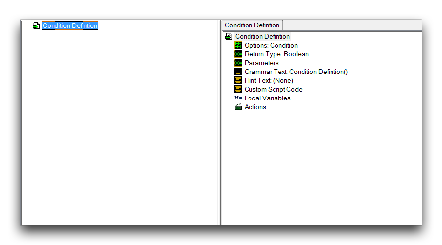
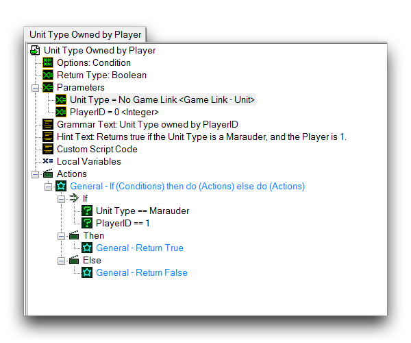
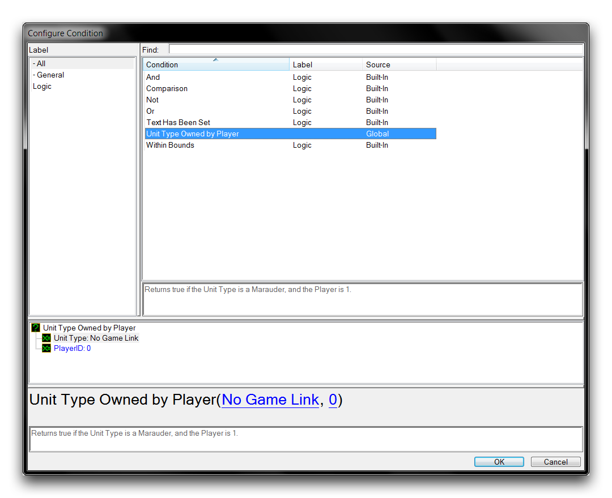
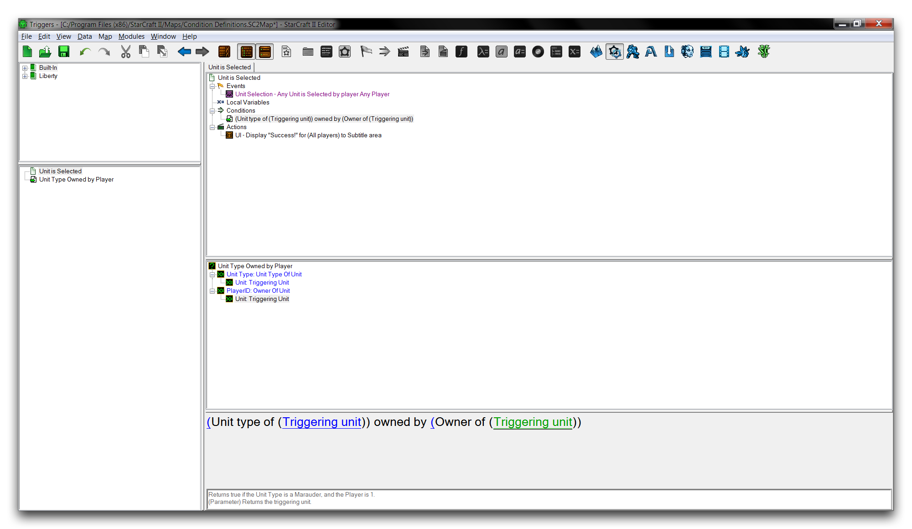
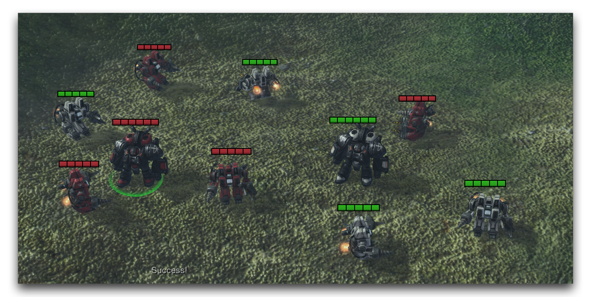

# 条件定义

条件定义用于创建自定义定义条件。条件已经在选择术语和应用运算符方面提供了一些定制选项。定义允许您通过定义可以使用编辑器中的任何现有语句的自定义操作来进一步扩展这些功能。通过这些操作，您可以发展对游戏状态的新探究。它们也可以是组织和合并常见条件的有用方法。

*条件定义视图*

| 字段              | 详细信息                                                                                                                               |
| ------------------ | -------------------------------------------------------------------------------------------------------------------------------------- |
| 选项              | 这选择定义类型，条件定义在这里特别感兴趣。                                                                                          |
| 返回类型          | 这决定条件的响应值。布尔类型提供标准的 'true' 或 'false'。整数类型允许在二进制之外提供额外响应。                                 |
| 参数              | 传递给条件的值。                                                                                                                       |
| 语法文本          | 设定将条件短语化为自然英语的 GUI 文本。                                                                                                |
| 提示文本          | 设置在选择此条件时在提示子视图中显示的说明性文本。                                                                                     |
| 自定义脚本代码    | 允许以星际脚本而非 GUI 语句对条件进行编码。                                                                                           |
| 本地变量          | 在此条件范围内可用的变量。                                                                                                             |
| 操作              | 构成条件操作的动作语句。                                                                                                                |

## 演示条件定义

打开本文提供的演示地图，查看地形编辑器。在那里，您将找到一组 SCV 和一对掠夺者。这些单位均匀分布在红色玩家一和白色玩家二之间。在本练习中，您将构建一个自定义定义，用于测试单位选择事件。本定义提出问题：'此单位是玩家一拥有的掠夺者吗？'

首先移动到触发器编辑器，然后右键单击触发面板并选择新建 ▶︎ 新条件定义。将新定义命名为 '单位类型由玩家拥有'。这个名称现在可能看起来有点奇怪，但一会儿您就会明白的。该条件定义将需要两段信息来进行评估，即单位类型和玩家编号。为了接收这些信息，定义将使用参数。进入定义内部，右键单击 '参数' 标题，然后导航到 新建 ▶︎ 新参数。重复此过程一次。将第一个参数命名为 '单位类型'，将其类型设置为--游戏链接，将 '链接类型' 设置为单位。将第二个参数命名为 '玩家编号'，将其类型设置为整数。

最后，创建 '若条件为真则执行，否则执行' 操作。在 '若' 标题下创建两个条件，并分别将它们设置为 '单位类型 == 掠夺者' 和 '玩家编号 == 1'。确保将单位类型和玩家编号设置为您创建的参数。

## 返回语句

为了让条件运行，它必须提供某种响应语句。您以前在标准条件中见过这点。通常情况下，它们会以 'true' 或 'false' 的布尔值作为响应。在这里创建这种响应需要您使用一种特殊类型的控制语句，称为 Return。遇到 Return 语句时，它会立即退出当前控制层，即条件定义中。然后将响应值传递到条件的原始调用位置。通过使用另一个控制语句，如 '若条件为真则执行，否则执行'，条件可以使用多个可能的 Return 语句控制其不同可能的响应值。

在 '执行' 标题下添加一个'返回' 操作，并将其值设置为 'true'。在 '否则' 标题下添加一个 '返回' 操作，并将其值设置为 'false'。定义现在已经完成。它接收两个参数并检查它们是否等于所需的值，即掠夺者和 1。如果为真，则条件返回 true。否则返回 false。

## 语法和提示文本

条件定义系统提供了一些选项，用于使自定义定义更易于使用。语法文本允许设置自定义纯语言类型短语，类似于大多数 GUI 触发器。请注意，目前的定义描述为 Unit Type Owned by PlayerID (Unit Type, PlayerID)。将其包含在触发器中可能有点令人难以理解。您可以通过导航到 '语法文本' 并取消选择 '使用默认语法文本' 来更改它。参数必须保持在新的安排中，因此您可以删除其周围的文本并将字段更改为 'Unit Type owned by Player'。这种格式模仿了现有的编辑器条件，并解释了先前的命名方式。

还可以选择的另一个方便选项是 '提示文本'。这提供了在选择定义时在提示子视图中显示的自定义信息。您可以通过选择 '提示文本' 标题并输入 '如果单位是掠夺者且玩家是 1，则返回 true' 来在此处设置它。完成这些步骤后，定义应该显示如下。

*已完成的条件定义*

## 使用条件定义

创建一个新触发器并命名为 '单位已选中'。进入触发器中，并创建一个 '单位已选中' 事件。现在通过导航到 '条件'，右键单击并按照 新建 ▶︎ 新条件 的步骤创建一个自定义定义的条件。这将启动 '配置条件' 窗口，其中应包含刚刚定义的条件，如下所示。

*选择自定义条件定义*

突出显示该条件并设置其术语。单位类型应设置为 (触发单位的单位类型)，而玩家编号应设置为 (触发单位的所有者)。点击 '确定' 返回到项目。最后，创建一个类型为 '文本消息' 的动作，并将其 '消息' 设置为 '成功'，应显示如下内容。

*已完成的触发器*

如果您进行测试，游戏应该会显示在地形编辑器中看到的单位集合。当选择任何红色掠夺者之外的单位时，不会有响应。如果选择玩家一的红色掠夺者，则自定义条件测试将以为 True 值做出响应，允许触发器运行其主体语句并显示消息。启动游戏并运行测试应该会给您以下视图。

*成功的输出*

## 附件

* [039_Condition_Definitions_Start.SC2Map](./maps/039_Condition_Definitions_Start.SC2Map)
* [039_Condition_Definitions_Completed.SC2Map](./maps/039_Condition_Definitions_Completed.SC2Map)