# 记录

记录是变量的模板。构建记录就像组装一种计划好的变量布局，您在其中决定类型、名称和数量。一旦组装完成，记录将定义一种新的复合数据类型，可以无限创建。每个记录根据其设计创建一组变量，然后将它们保持为持久性容器。一个典型的记录设计如下所示。

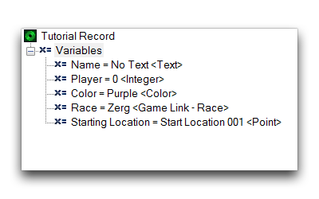
*记录解剖*

记录设计揭示了它的主要用途，顶部标题“教程记录”是记录的名称。由于记录本身永远不会用于存储变量，这个名称将成为记录的临时类型。当创建记录的实例时，它们将显示记录类型，即在本例中是“教程记录”。

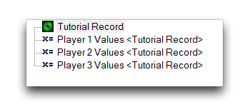
*记录实例*

在“变量”标题下是记录中包含的变量，称为“成员”。每个成员都有自己的类型和初始值。当您创建一个“教程记录”的实例时，它将创建每个成员，这意味着该实例将具有五个成员，类型分别为名称、玩家、颜色、种族和起始位置，每个成员都有各自的数据类型。

## 创建记录

记录是在触发面板中创建的，因为它们必须存在于全局范围内。右键单击面板，导航到“新建 ▶ 新建记录”。选择记录将在主视图选项卡中显示其内容。通过右键单击记录中的“变量”标题并导航到“新建 ▶ 新建变量”来创建记录变量。要创建记录的新实例，创建一个变量并将其类型设置为--记录。这将使任何可能的记录类型的列表在“记录”标题下可用。一旦选择了所需的类型，记录中的每个变量将自动创建，虽然在编辑器中不会直接显示。

[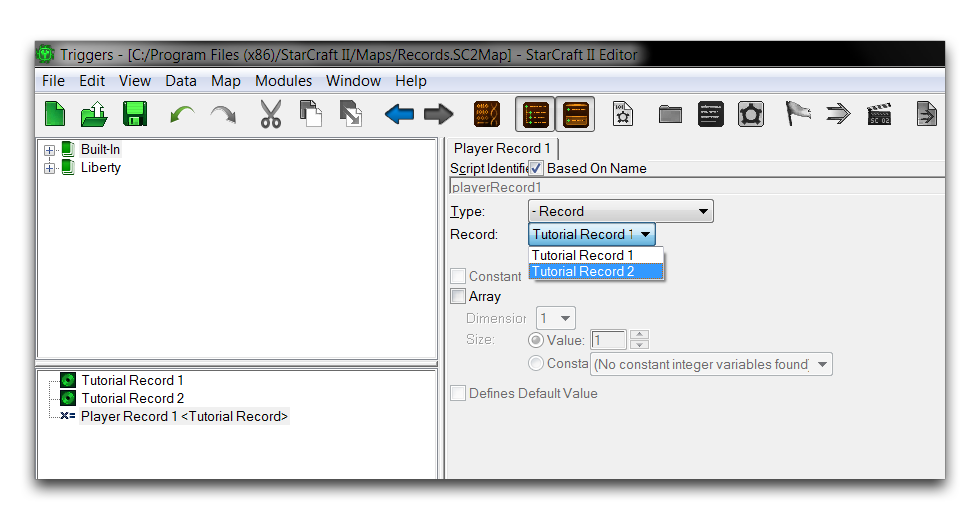](./resources/040_Records3.png)
*记录实例*

请注意，记录作为数据类型出现在触发面板中，表明具有全局范围。但是，由于它们不是实际实例，因此尚无特定范围。记录的各个实例可以存在于全局范围或局部范围。

## 引用记录变量

记录实例内创建的变量不是直接可访问的。它们不能像传统变量那样通过相同的方法进行更改或检查。在使用方面，记录变量必须通过一种称为引用的技术来访问。这允许您通过引用记录实例中的个别变量来调用它们。考虑以下记录。

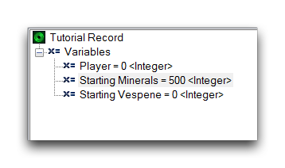
*带整数成员的记录*

已创建了这种记录类型的实例，称为玩家数据。在此实例中有一个起始矿物变量，就像其源记录一样。作为一项练习，尝试在游戏开始时将玩家的矿物设置为起始矿物数量500。这将需要您引用记录实例的属性。幸运的是，编辑器 GUI 在这里做了大部分工作。想象一下您将使用“修改玩家属性”操作，就像以下触发器中所示。

[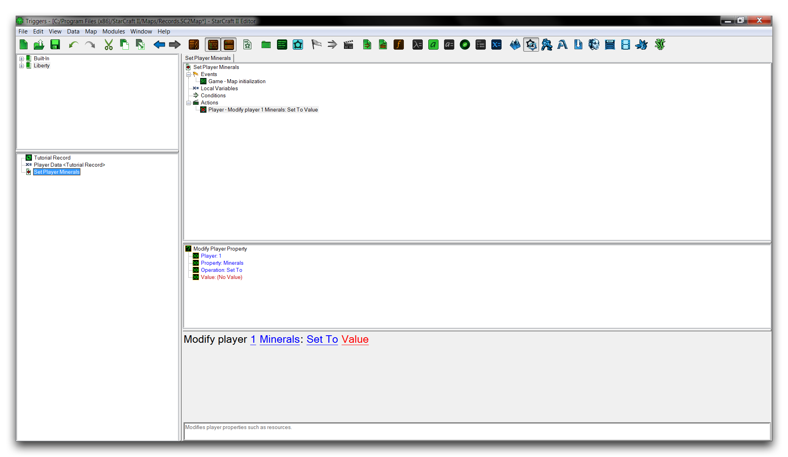](./resources/040_Records5.png)
*需要引用的变量触发器*

“值”字段是需要起始矿物变量的地方，但不清楚如何将其传递到那里。双击字段启动“整数”窗口，并导航到如下所示的变量选项卡。

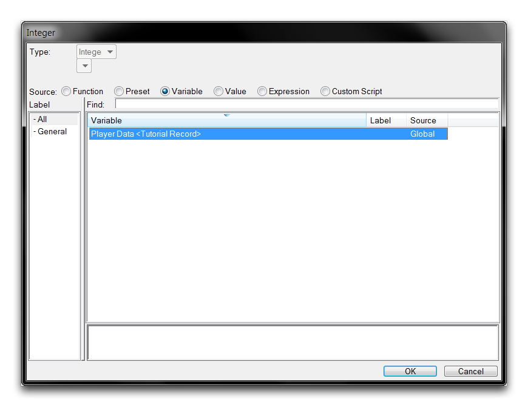
*整数字段窗口*

记录实例显示在字段查看器中。由于此记录中有一个整数类型变量，因此作为字段的输入可用。选择它并点击“确定”。您会看到对该操作的“值”字段进行了一些更改，如下所示。

[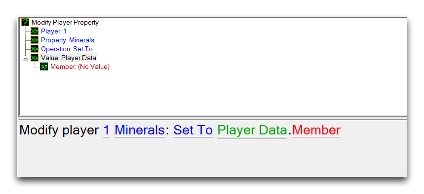](./resources/040_Records7.png)
*新的操作字段*

记录已输入字段，但您还揭示了一个额外的字段，标题为“成员”。如稍早提到的，变量成员指的是其组件变量。“.”分隔记录和成员字段是一种称为引用运算符的特殊运算符类型。通过引用运算符，记录实例的内部成员已变得可用。现在单击“成员”字段将显示如下视图。

[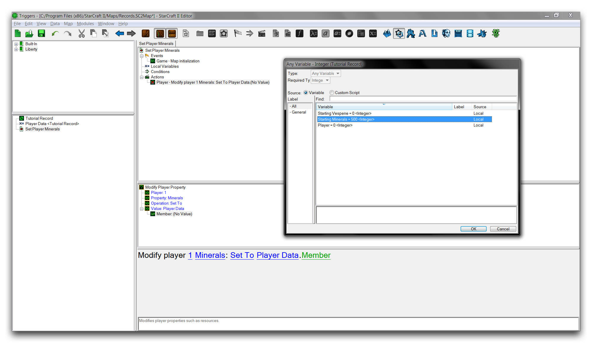](./resources/040_Records8.png)
*引用记录成员*

在这里，起始矿物成员可以被选中，选择它并点击“确定”。结果将如下所示。

[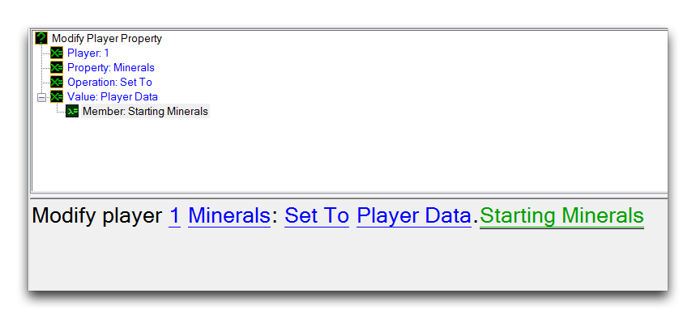](./resources/040_Records9.png)
*引用的记录变量*

在此设置成员变量已完成引用过程。现在，起始矿物值将设置为“值”字段，通过引用其记录实例玩家数据。当此操作运行时，它将传递给记录实例，然后跟随此引用到内部结构，获取变量值并使用它。

## 记录数组

记录实例还支持数组。在子视图中突出显示一个记录，选择“数组”。这将允许您设置“维度”和“大小”元素，就像任何典型的数组一样。数组的每个成员都具有标准记录设计，其所有成员都设置为标准的初始值。这对于在非常有序的包中处理大量数据非常有用。一个典型的记录数组如下所示。

[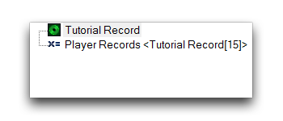](./resources/040_Records10.png)
*记录数组*

从记录数组中引用变量通常与引用标准记录变量相同。不同之处在于需要索引来选择您想要的特定实例。显示了一个典型视图，如下所示。

[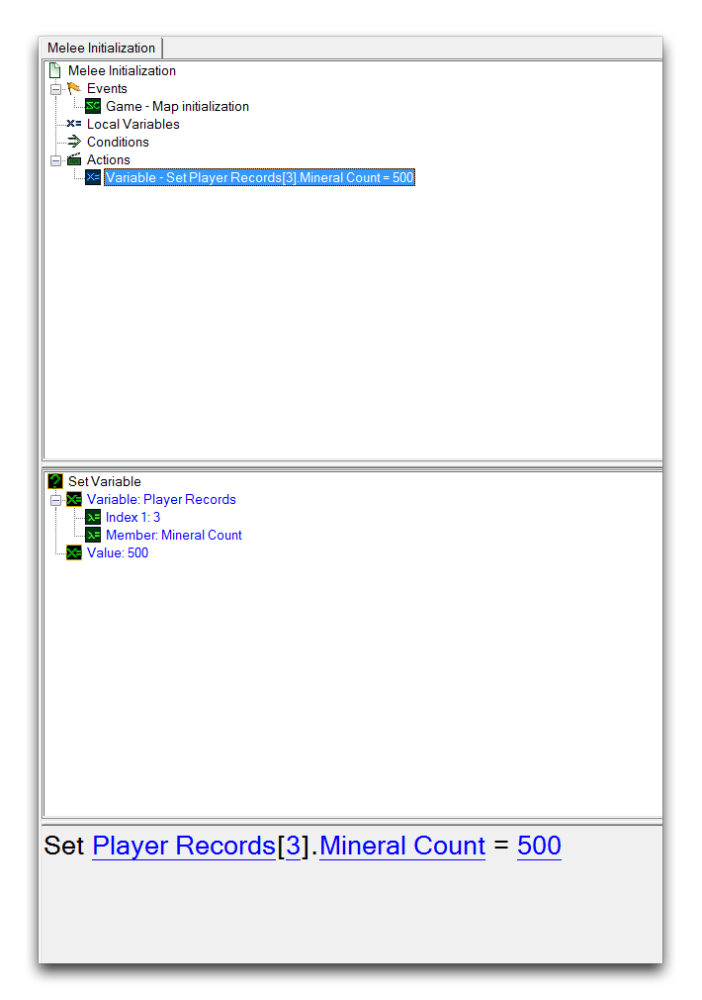](./resources/040_Records11.png)
*记录数组引用*