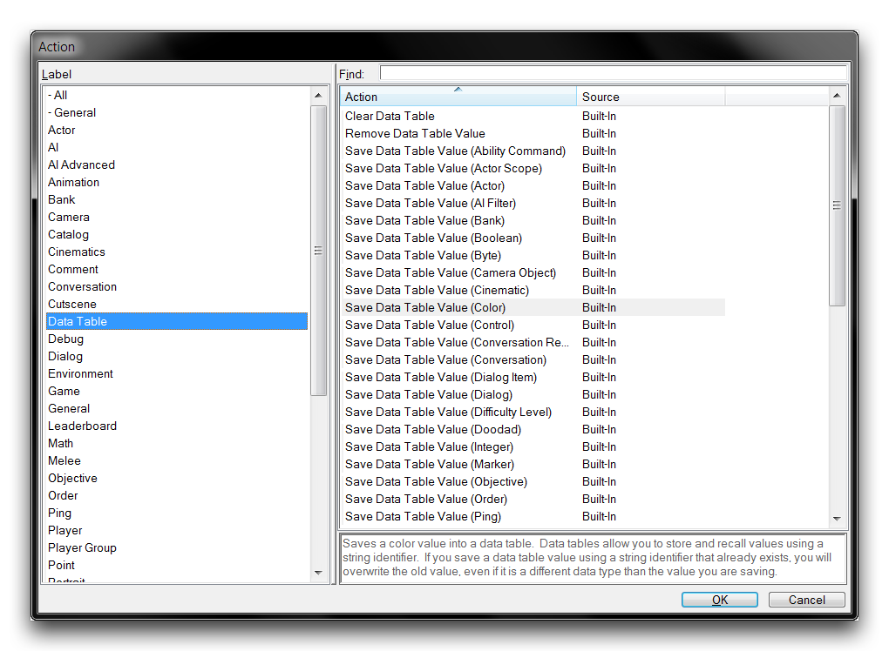
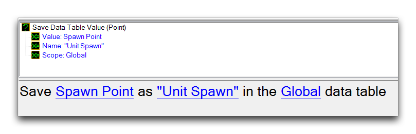

# 数据表

随着项目的发展和扩展，你很快会发现它需要超出简单变量和诸如文件夹、标签和触发库等工具的数据组织。为了组织大量数据，编辑器提供了一对更高级的数据结构。

其中之一是数组。这个元素在手册的其他地方有更详细的解释，但值得注意的是，编辑器中的任何变量都可以转换为数组。这将把变量扩展为一个大小适用于某种类型的任意数量的变量的数组，前提是在进行游戏之前在触发编辑器中定义了大小和类型。

数组具有很大的实用性，它们是强类型的并且很容易访问。它们是创建编辑器中事物的重要组成部分。不过，它们的结构是固定的。它们可以快速创建，但必须设计良好，因为你不能在游戏时更改它们的结构。对于需要更灵活的场景，你可以使用另一个更高级别的数据结构，即数据表。

正如它们的名称所暗示的，数据表将数据组织成存储在地图后端的表中。虽然你看不到这个表，但它采取以下抽象形式。

| 名称 | 值 |
| ---- | ----- |
| 名称 | 值 |
| 名称 | 值 |
| 名称 | 值 |
| ...  | ...   |

如上所示，数据表托管了作为名称-值对输入到表中的数据。名称将数据分类到在写入表时设置的唯一字符串下。这个字符串作为查找数据的句柄，无论是检索它以供使用还是从表中删除它。值是表条目的值，就像单个变量具有值或数组组件具有值一样。除此之外，每个条目都有自己的隐含类型；数据的类型是基于用于将数据写入表中的触发器动作来设置的。

## 数据表属性

与数组相比，数据表的结构在游戏时并非事先严格定义的。它们的大小可以增长或缩小，条目可以在游戏过程中追加或删除。此外，数据表本身没有类型，它可以包含任何混合数据类型，其组合可能在持续变化。

数据表具有这些特性，因为它们不会消耗固定的、恒定数量的内存，而是使用一种称为动态内存分配的东西。在动态内存分配下，内存被表声明和使用，然后在不再需要时释放。幸运的是，使用编辑器意味着你实际上不需要了解内存使用的具体细节。你需要从这里带走的是，数据表是动态的，而数组是静态的。

数据表和数组之间的另一个区别在于它们对性能的影响。由于这些结构操作作为容器，你可能已经意识到查找它们的内容会花费引擎一定的时间。这不仅是正确的，而且是一个可以定义的属性。每当从这些结构之一使用一个值时，都会有一个搜索时间，描述了编辑器在这些容器中查找某物需要多长时间，这取决于容器中有多少东西。数组具有线性搜索时间。每添加一个组件，搜索时间将线性增加。使一个数组变大10倍，将使搜索时间增加10倍。由于它们的名称-值配对特性，数据表具有恒定搜索时间。可能听起来很奇怪，使数据表变大10倍不会影响其搜索时间。

如果这个话题让你感到对编辑器后端的一瞥不受欢迎，不要担心。这里重要的是要学会数据表对于“大量”数据的表现要比数组更好。这里“大量”的确切定义取决于手头具体的项目，对于大多数“少量”数据，这两种结构都会提供足够的结果。对于经验不足的人来说，一个经验法则是在性能考虑之前提前考虑数据结构的其他有利属性是最好的。如果你开始看到游戏性能下降，将“大量”数组改为数据表是一种明显的改进方法。

最后要注意的是，动态内存分配存在一种缺陷，即内存泄漏的可能性。当分配了内存但在使用后没有释放时就会发生内存泄漏。正如在船上的漏洞会导致它慢慢进水一样，数据表的泄漏会导致项目消耗越来越多的内存。当没有更多的内存资源可用时，这将导致游戏开始下沉，变慢甚至最终崩溃。请记住，在游戏时，数据表比数组提供更多控制，但在更复杂的项目中，它们可能需要一些整理工作。

## 数据表操作

数据表通过一组触发动作的构建、使用和销毁。这些动作可以在创建操作时通过导航到“数据表”标签找到，如下所示。

*数据表操作*

尽管这个列表很长，但只有三个重要动作。列表之所以长是因为其中一个动作在许多版本中都是可用的。下表将这些动作分解开来。

| 动作                | 效果                                                                                                                                                                                                                                                                                                                                                        |
| ----------------------- | ------------------------------------------------------------------------------------------------------------------------------------------------------------------------------------------------------------------------------------------------------------------------------------------------------------------------------------------------------------- |
| 清空数据表        | 清除数据表，删除其中的所有条目。通过指定它所在的范围来选择数据表。                                                                                                                                                                                                                                          |
| 删除数据表值 | 从数据表中删除特定条目。通过名称选择条目，并指定存储在其中的数据表的范围。                                                                                                                                                                                                                         |
| 保存数据表值   | 向数据表添加一个条目。通过指定其名称和值对将条目写入表中，然后选择要写入的数据表的范围。几乎每种编辑器数据类型都有自己的版本，共有46个版本。根据所选版本，数据的类型将隐式设置在表内。 |

## 数据表范围

每个数据表存在于特定范围，可以是全局的或本地的。这些范围用于针对特定数据表读取或写入数据。以下是一个示例操作，将点“Unit Spawn”写入全局数据表。

*写入数据到全局数据表*

全局数据表具有全局访问权限，是唯一的，并且始终存在于项目中。相比之下，本地数据表的访问权限与单个触发器相关联。在使用保存数据表值动作在触发器中首次写入数据后，本地数据表就会被创建。然后，该表将在其范围内接收任何继续写入的数据，直到清除为止。类似于本地变量，当主机触发器结束时，本地数据表也会被清除。