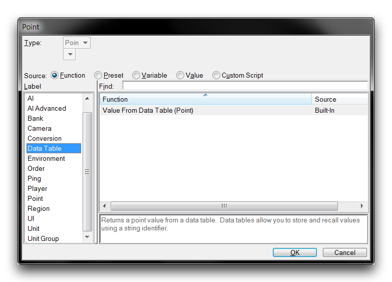
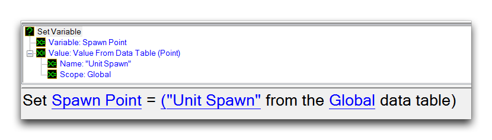

由于数据表的范围限制，用户在创建和定位数据表时存在伪限制。在项目逻辑的任何位置，只能直接使用全局表或当前触发器的本地表。值可以在触发器之间传递，以访问其他本地范围，这可能是程序设计中的一个重要考虑因素。

范围的主要优点在于防止项目发生内存泄漏。由于本地范围在触发器完成后被消除，因此在本地数据表中自动具有移除或清除数据的故障安全措施。与此相对应的是，全局数据表是内存泄漏的主要罪魁祸首，如果在项目中频繁使用，应该仔细监视它。

数据表函数值获取
-----------------

使用一组带版本的Value From Data Table函数从数据表中检索数据。您可以在任何填充字段时通过导航到“功能”源并按“数据表”标签进行排序来访问这些函数，如下所示。

*用于Points数据的Value From Data Table函数*

上述示例展示了用于Points的Value From Data Table函数。以下示例演示了此函数的用法。

*从全局数据表中读取Points数据*

在这里，从全局数据表中检索了一个名为“Unit Spawn”的点。然后将其设置为一个变量以供进一步使用。