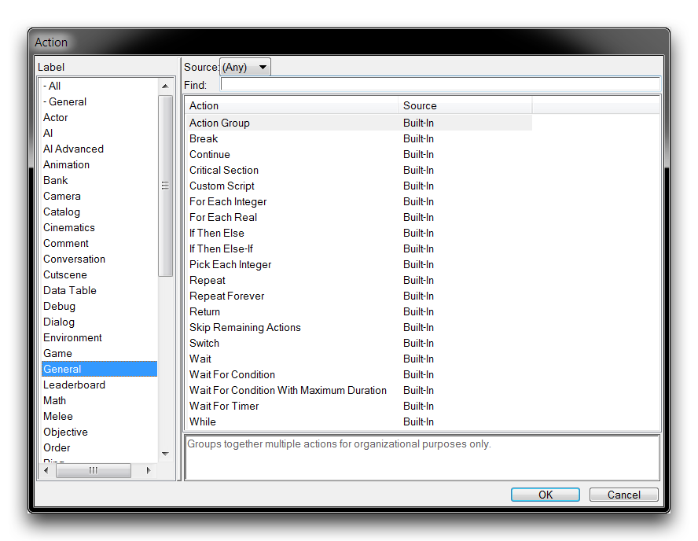
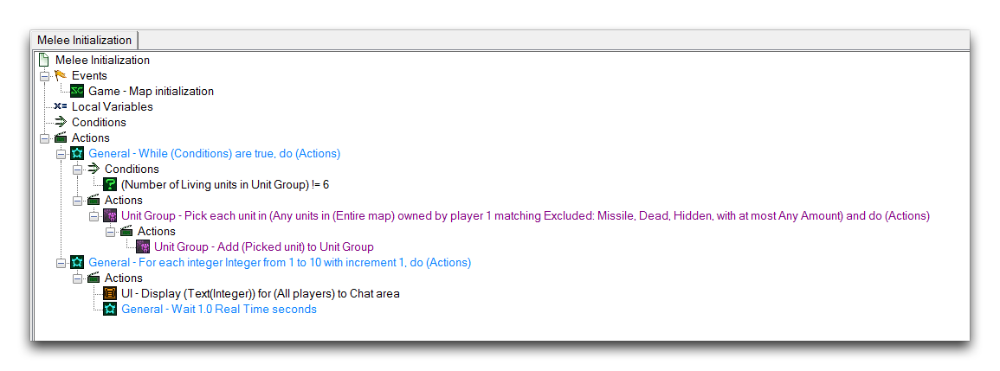
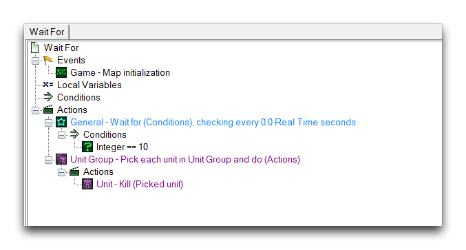
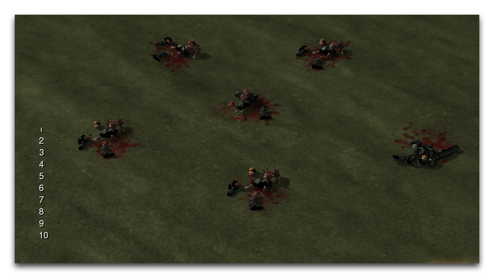

# 控制语句

控制语句是控制其他动作何时执行的操作。由于触发器编辑器中执行顺序是线性的，这些语句提供了打破线性流程并创建动态系统的独特能力。您可以在动作创建过程中在“一般”标签下找到控制语句，如下图所示。

*控制语句动作*

## 循环

循环创建一系列语句的重复循环，直到被打破为止。循环的类型通过它们被打破的方式及其执行包含语句的方式来区分。下表描述了循环的类型。

| 循环类型                        | 详细信息                                                                                                                                                                                                      |
| -------------------------------- | ------------------------------------------------------------------------------------------------------------------------------------------------------------------------------------------------------------- |
| 重复                             | 包含的动作将重复执行，直到达到计数变量。在执行所有内容后，计数会递增。                                                                                                                                           |
| 永久重复                         | 无限期运行，直到被另一个控制语句打破。                                                                                                                                                                       |
| 挑选每个整数                    | 运行直到其起始值达到终止值。此值在每次循环运行后递增。选定的整数函数标识符用于访问当前迭代的值。                                                                                                          |
| 挑选玩家组中的每个玩家           | 为玩家组中的每个玩家运行一次循环。选定的玩家函数标识符用于访问当前迭代的玩家。                                                                                                                              |
| 挑选单位组中的每个单位           | 为单位组中的每个单位运行一次循环。选定的单位函数标识符用于访问当前迭代的单位。                                                                                                                               |
| 对于每个实数                     | 循环运行直到其起始值达到终止值。每次循环迭代后，起始值都会以实数增量进行更改。                                                                                                                           |
| 对于每个整数                     | 循环运行直到其起始值达到终止值。每次循环迭代后，起始值都会以整数增量进行更改。                                                                                                                           |
| 对于玩家组中的每个玩家           | 为玩家组中的每个玩家运行一次循环。                                                                                                                                                                            |
| 对于每个UI框架                   | 为指定的UI变量中的每个框架运行一次循环。                                                                                                                                                                     |
| 对于单位组中的每个单位           | 为单位组中的每个单位运行一次循环。                                                                                                                                                                            |
| 当条件为真时                     | 运行直到提供的条件不再为真。                                                                                                                                                                               |

有两个辅助控制语句用于操作循环的行为。第一个是 Break，在遇到它时会终止包含的循环。第二个是 Continue，在遇到它时会跳过其下的每个动作，并返回到循环的起始点。这些语句通常与类似 If Then Else 的检查一起使用，以在特定条件下控制循环。这就是 Repeat Forever 无限循环中使用的策略，最终退出循环。

## 等待

等待授予暂停控制的能力。这种暂停可能是无限期的，直到事件发生，或者直到满足某种特定条件。等待类型在以下表格中进行了详细解释。

| 等待类型                                        | 详细信息                                                                                                                                                                                                |
| ----------------------------------------------- | ------------------------------------------------------------------------------------------------------------------------------------------------------------------------------------------------------ |
| 等待                                           | 暂停控制，直到经过一定时间。在设置等待持续时间时，还可以接受特定的时间类型。                                                                                                                          |
| 等待计时器                                     | 暂停，直到某个计时器计时达到经过的时间或剩余的时间。                                                                                                                                                   |
| 等待条件                                       | 暂停，直到某个条件满足。将根据时间间隔检查条件。                                                                                                                                                      |
| 具有最大持续时间的等待条件                     | 暂停，直到某个条件满足。将根据时间间隔检查条件。此外，还有一个安全的最大持续时间可以经过，然后控制才会恢复。                                                                                        |

## 使用控制语句

通过提供一种打破项目逻辑中标准线性流程的方式，控制语句成为打开使用编辑器制作更多种类项目的关键动作。看一下下面的触发器示例。

*使用控制语句的触发器示例*

这个触发器中使用了几个控制语句。包含一个在单位组中每个单位上进行拾取的 While 循环，用于从整个地图的单位内容中填充一个单位组。演示地图包含一组六个陆战队员，填充单位组使得在 While 循环中的内部 Pick Each 循环通过打破其条件退出了 While 循环。一旦该循环结束，会启动一个对于每个整数的循环。在这个循环中会等待 1.0 秒，还会输出该循环计数值的文本。这些动作将导致触发器在玩家的屏幕上创建一个从 1 到 10 的计数，每隔 1 秒发生一次。现在将注意力转向另一个触发器。

*计数结果触发器*

该触发器展示了从上一个触发器计数循环中的整数计数的另一个用法。当第一个触发器的计数结束时，该触发器将摧毁地图上的每个陆战队员。结果如下所示。

*文本标签样式并附加到单位*

这个演示展示了通过控制语句在定时基础上触发器之间进行通信，而不是在标准线性基础上实现的一些简单动态结构。 

## 附件

- [042_Control_Statements.SC2Map](./maps/042_Control_Statements.SC2Map)