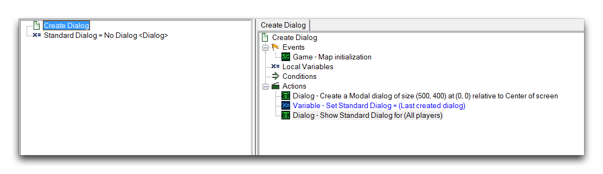
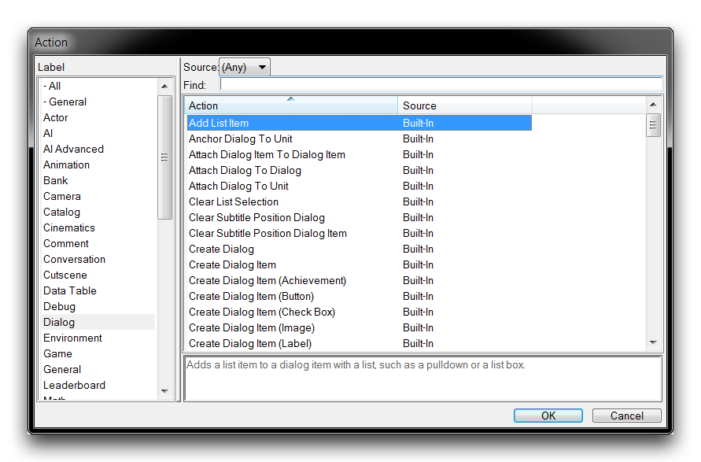
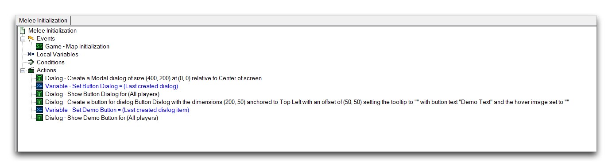
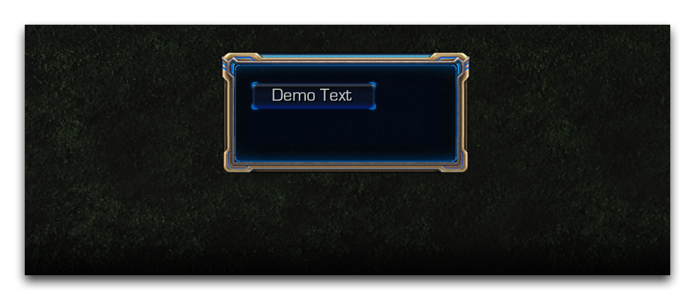
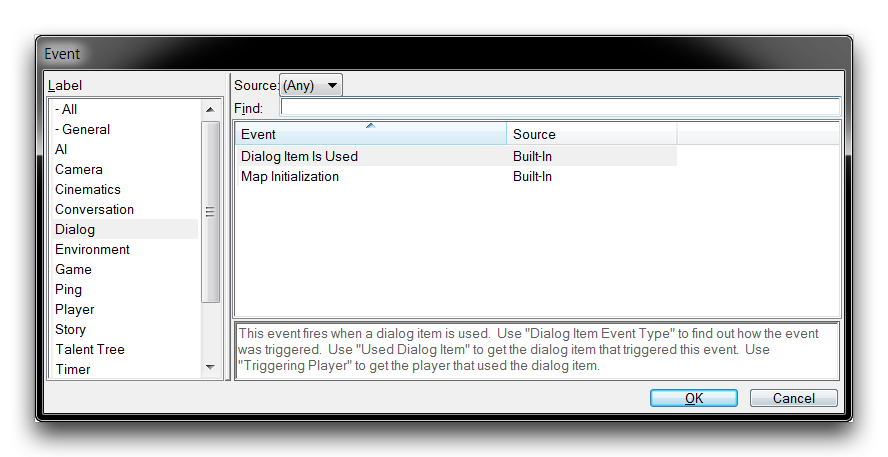
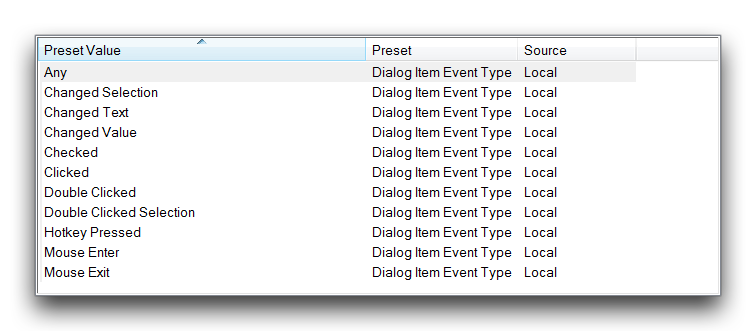
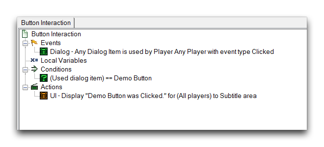
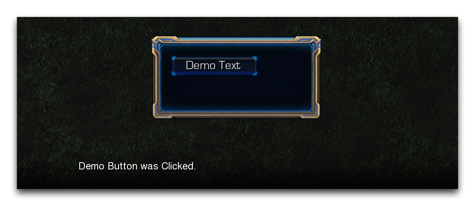
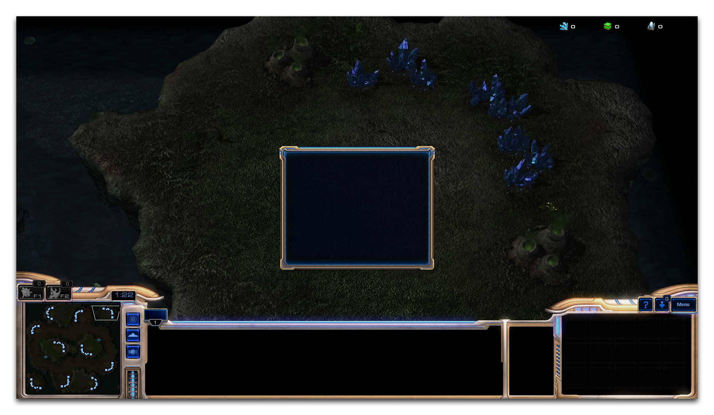
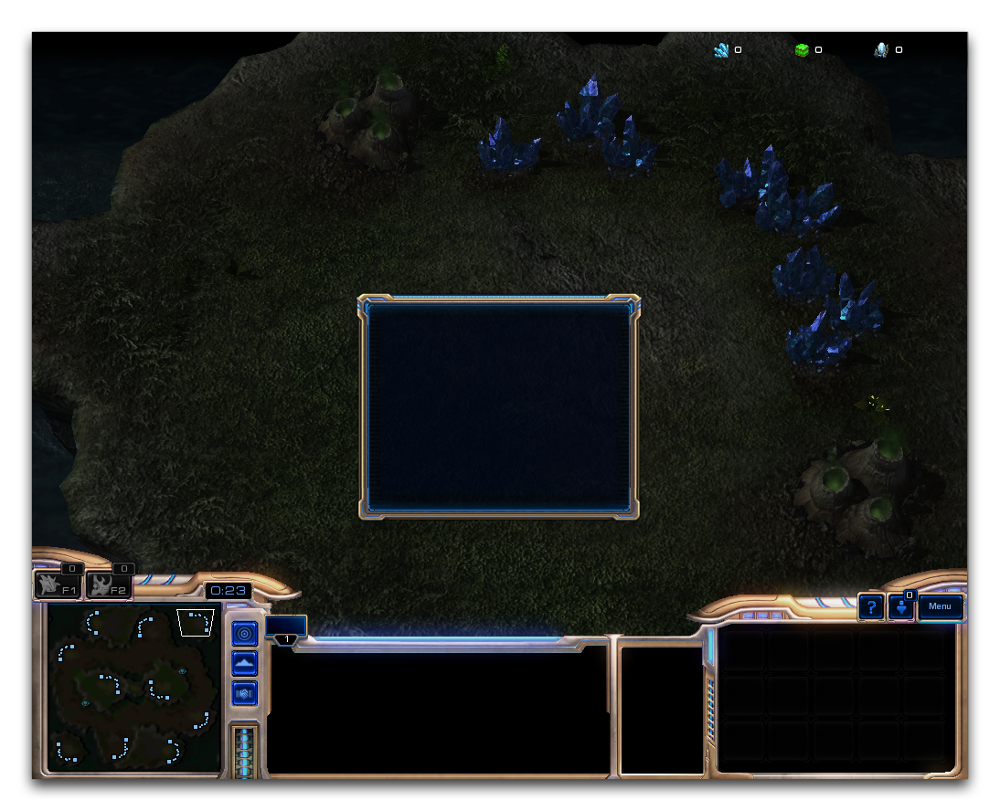

# 对话框

对话框是星际争霸 II 引擎中的一个总称，指的是可以出现在屏幕空间中的大量元素，包括文本、图片、动画和界面。对话框本身是一种容器，可以在玩家屏幕上显示上述元素的任意组合。这些元素中的每一个都被称为对话框项目（Dialog Item），并且是在选定的对话框内创建的。使用对话框系统可以产生多种类型的内容，包括简报、肖像对话序列、按钮、滑块等。

# 创建对话框

对话框通常通过两步过程创建，首先实例化对话框，然后显示在玩家组的屏幕上。此过程如下所示。

*对话框创建*

对话框创建的主要部分发生在“创建对话框”和“显示/隐藏对话框”选项下，这些选项允许对话框的大小进行设置，然后在屏幕上定位并显示。显示对话框是必需的，因为默认情况下对话框是隐藏状态。通常在此步骤之后，将对话框捕获到一个变量中，使用“设置变量”动作。这为对话框提供了一个常数句柄，用于引用它、移动它、进一步改变其可见性，或在其中构建项目。设置对话框为一个变量时，函数标识符“最后创建的对话框”是标准的。

# 对话框操作

编辑器具有大量的对话框操作，便于创建和维护对话框及其项目。下面显示了这些操作的视图。

*对话框操作*

以下表格详细介绍了常见类型的对话框操作并描述了它们。这个列表通常适用于对话框和对话框项目，稍后会进行讨论。

| 函数         | 描述                                                                                                                    |
| ------------ | ----------------------------------------------------------------------------------------------------------------------- |
| 附加对话框   | 将元素移动到特定锚点。                                                                                                 |
| 创建对话框   | 创建一个新元素，允许设置其大小、锚点、偏移和文本。                                                                      |
| 销毁对话框   | 销毁一个元素及其包含的项目。                                                                                            |
| 显示屏幕项目 | 直接在屏幕空间中创建一个元素，不需要包含对话框。                                                                       |
| 移动对话框   | 相对于特定锚点移动元素。                                                                                                |
| 设定对话框   | 设置特定元素的属性。属性包括大小、光照、文本、颜色、动画、字体样式等等。                                              |
| 显示/隐藏对话框 | 在目标玩家或组的屏幕中显示或移除一个元素。                                                                             |

## 对话框项目

对话框由对话框项目填充。没有任何项目，对话框只是一个矩形容器，其主题背景取决于玩家的阵营。对话框项目各不相同，各种选项与每种类型相关，但总体上遵循与对话框相同的一套原则。就像对话框本身一样，您可以使用“创建对话框项目”动作创建对话框项目，然后使用“显示对话框项目”动作显示它们。之后，通常会在变量中保存一个句柄，使用“设置变量”动作。同样，用于执行此操作的一个有用的标识符是“最后创建的对话框项目”。

作为练习，您将使用上述介绍的一般流程创建一个对话框项目。组装触发器如下所示。

*对话框和对话框项目组装*

创建对话框项目（按钮）可让您创建一个按钮对话框项目，这是一种接受玩家输入的特殊项目。将鼠标悬停在按钮上将更改其视觉状态，指示可以点击它。在项目创建期间设置了几个字段。

宽度和高度定义了按钮的区域，既显示项目的纹理又确定接受玩家输入的屏幕空间区域。锚点设置了项目将附加到的父对话框的哪一侧，而偏移 X 和偏移 Y 设置了距离锚点的距离，按钮将在该位置创建。对于按钮文本，输入了“演示文本”。此文本将在按钮中心创建。如果此文本太长无法适应按钮区域，它将被截断为“...”，直到纠正为止。测试此对话框将如下所示。

*游戏视图中的按钮对话框项目*

## 对话框事件 -- 使用对话框项目

目前，点击上一次演示中创建的按钮不会产生任何效果。对于设计用于接受用户输入的对话框项目，有一个特定的对话框事件称为“使用对话框项目”，需要接收并响应玩家输入。您可以通过在事件创建时按标签“对话框”进行排序找到此事件，如下所示。

*使用对话框项目事件*

此事件响应一系列可能的与对话框交互，这些在下图中显示。

*对话框项目交互类型*

在此示例中，事件类型“点击”是适当的。为识别特定对话框项目，可以使用一个条件，比较运算符位于标识符“使用的对话框项目”和对话框项目的变量句柄之间。为之前的演示创建一个交互触发器可能如下图所示。

*按钮点击触发器*

现在测试该演示将产生以下输出。

*按钮响应点击*

在此进行一个按钮试点击，已显示对话框事件的响应通过提供文本消息输出。

## 对话框格式化

对话框是固定结构，这意味着无论特定玩家屏幕的输出尺寸是多少，它们看起来都是一样的。这与基本近战游戏界面中使用的系统类似。这个系统确保了一定程度的可靠性，但在创建自定义内容时，这是您应该了解的一点。举个例子。在 16:9 分辨率下创建的居中对话框将如下所示。

*16:9 分辨率下的自定义对话框*

在 4:3 分辨率下创建相同对话框将如下所示。

*4:3 分辨率下的自定义对话框*