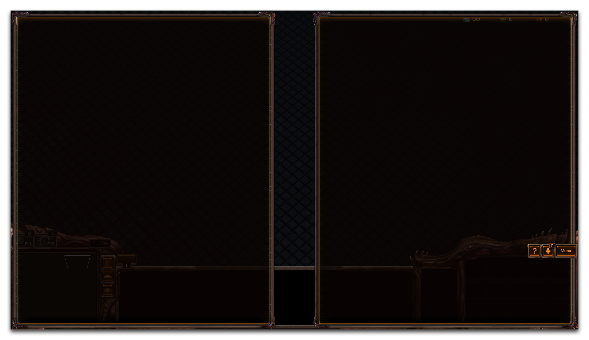
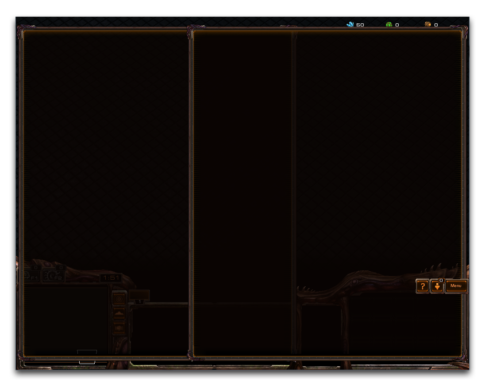

尽管分辨率有所不同，但对话框本身具有相同的尺寸。该系统通过星际争霸 II 客户端提供的内部分辨率来运作。内部分辨率针对每种屏幕比例具有以下数值。

> 4:3 比例 - 1600x1200
> 
> 16:9 比例 - 2133x1200
> 
> 16:10 比例 - 1920x1200

高度始终将被计算为固定的 1200，然后宽度将根据屏幕比例测量。虽然此系统将确保您的对话框在各种设备上保持相同水平的可见性，但值得注意的是，如果不小心处理，较大的对话框和对话框项目可能会被切断或裁剪。如果您在没有办法在各种系统上进行测试的情况下开发项目，那么在设计对话框或其他屏幕空间元素时，考虑到可用性的范围是很重要的。考虑另一个例子，标准的一组对话框在宽屏格式的计算机上可能会显示如下。

*宽屏对话框*

在不同的非宽屏显示器上测试此项目会显示如下内容。

*非宽屏显示器上的重叠对话框*

标准显示器的受限宽度导致两个对话框重叠，可能会遮挡重要信息。避免此类问题的一种方法可能是为不同类型的显示器提供临时选项。这将利用“显示/隐藏对话框”功能，并创建两个平行的对话框结构。或者，设计对话框系统的宽度不超过 1600 px，大多数情况下可以避免此类错误发生。