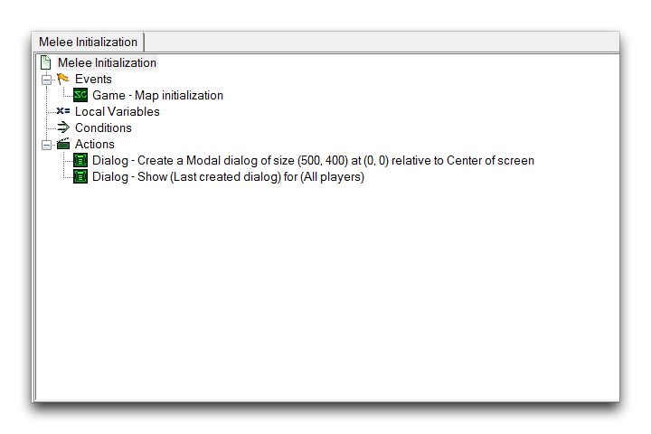
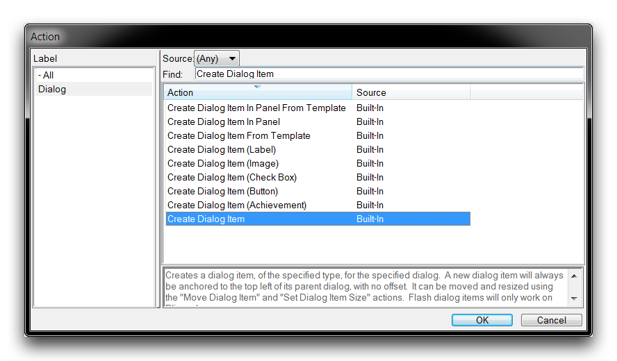
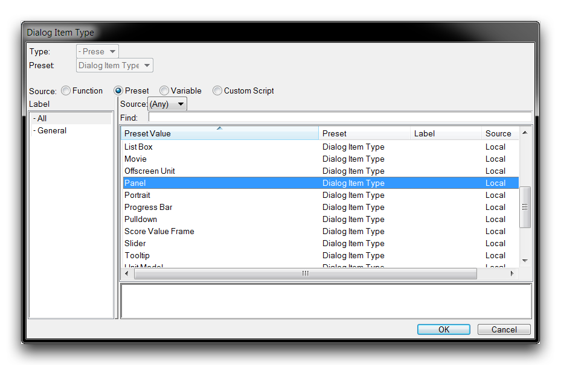
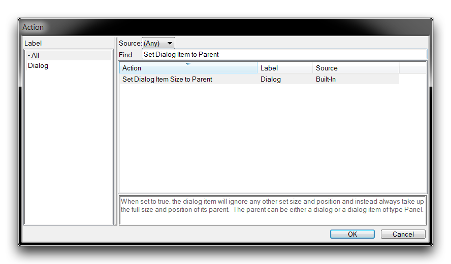
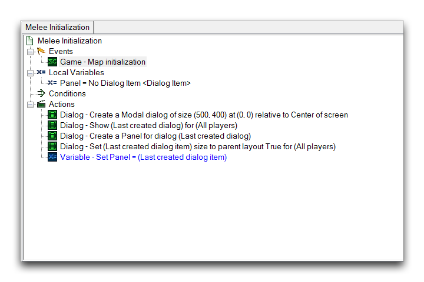
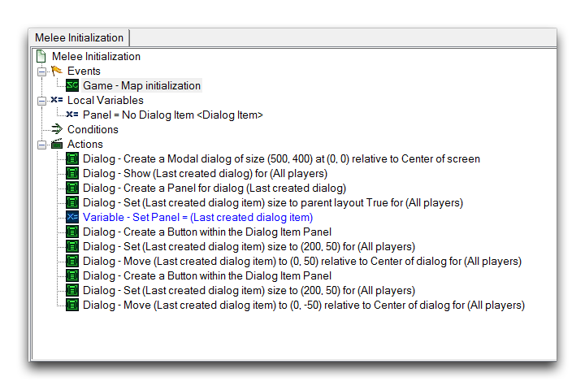
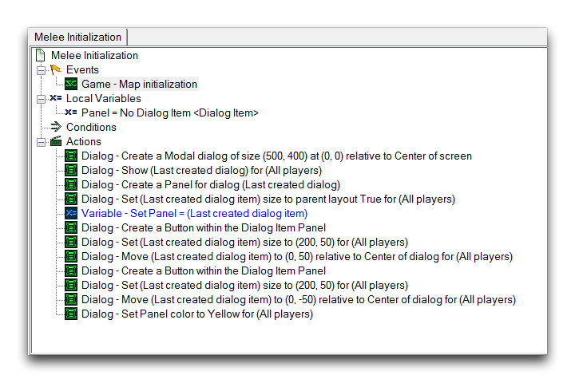
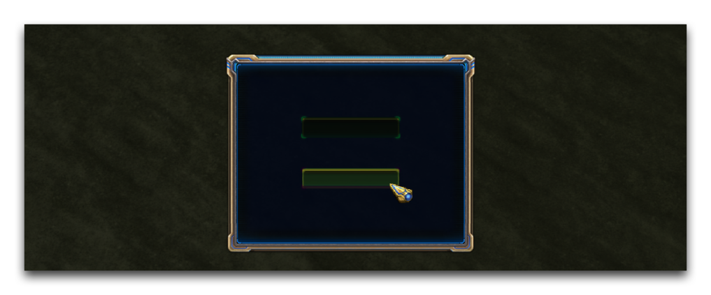

# 对话框面板

对话框面板是对话项的分组选项。通过创建面板并将对话项托管在其中，可以通过对面板应用更改来一起控制各个项。您所做的任何更改都将传播到属于面板的每个项。因此，这些面板在对话框和其他类型的对话项之间提供了一种层次结构。这最终类似于一个单位组或玩家组的操作。在功能上等同于对话框组。

## 创建对话框面板

例如，您可以在对话框内托管一个面板，就像托管其他对话项一样。

*创建主机对话框*

接下来，通过选择“创建对话项”操作创建一个面板，如下所示。

*创建面板对话项*

在创建对话项时，将Type字段设置为“面板”。

*选择用于创建的面板类型*

您可以通过“将对话项大小设置为父级对话框”操作将面板的属性设置为其父级对话框的宽度、高度和位置。

*设置面板大小*

现在，应该将该面板保存为一个变量，以提供一个一致的处理方式用于将来的操作。通过这些操作，实际上已经得到了一个完成的面板。它应该看起来如下图所示。

*已创建面板*

## 在对话框面板中创建项

设置对话框面板后，您可以通过在其中创建一些对话项来测试其功能性。在下面的触发器更新中，已经在面板内创建了一对按钮，并调整了它们的大小和方向。

*在面板内创建的对话项*

这里的重要区别在于，这些项不是在对话框内创建的，而是在面板内创建的。这是对话项在面板内“分组”并接受对其进行的任何更改的方式。您还应该注意，这里面板的变量句柄很重要，因为它确保可以为在面板内创建的每个对话项重复引用面板。有时，对话项是没有句柄的，因为它们可以完全由它们所托管的对话框或面板控制，但是面板本身通常需要一个句柄。

## 更改对话框面板及其包含项

现在，一切准备就绪，您可以快速演示对话框面板的实用性。在下面显示的触发器更新中，使用“设置对话框项颜色”来操作目标面板。

*更改面板属性*

像这样更改面板将使得每个对话项，例如这里的两个按钮，分别被发送“设置对话框项颜色”的操作。通过使用“测试文档”功能查看地图，将看到每个按钮都被设为黄色。您可以在下图中看到结果。

*已传播到其中的项的面板更改*

这应该让您对使用对话框面板可以为自己节省多少工作量有所了解。它们可以用于快速组合和管理大量的对话项。

## 附件

* [044_Dialog_Panels.SC2Map](./maps/044_Dialog_Panels.SC2Map)