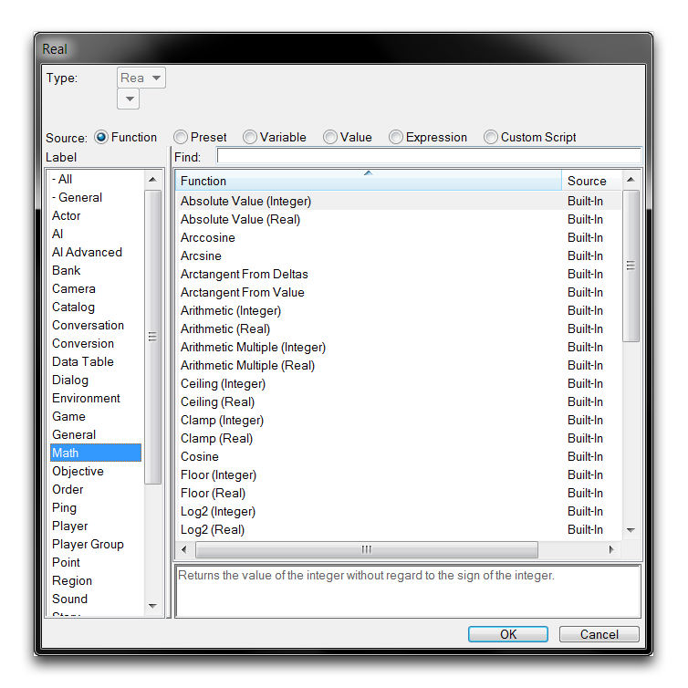
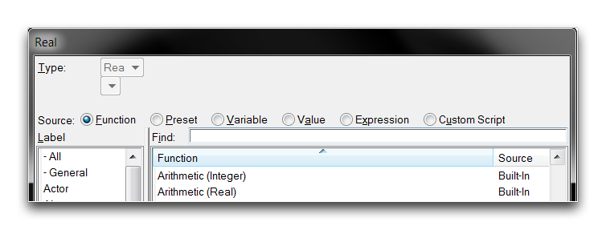
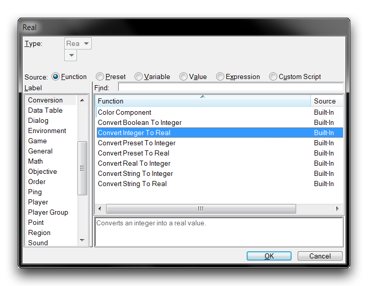
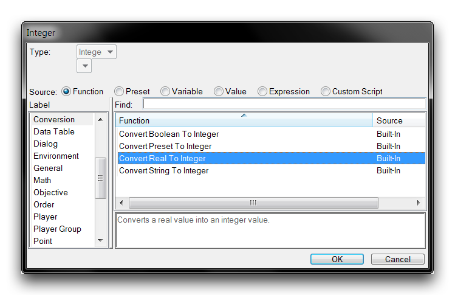

# 数学函数

编辑器带有标准的数学函数集，可用于触发器编辑器内的任何工作。您可以通过导航到“功能”来源并按“数学”标题排序来在填写数字字段时访问这些功能，如下所示。

*数学函数选择*

## 类型转换

如上图所示，大多数数学函数都提供了实数版本和整数版本。这些版本引用了最终输出的类型，这些函数的输入类型可能会有所不同。下面提供了一个这样的示例的详细介绍。

*函数版本*

在这个例子中，算术数学函数列出了一个输出整数的版本，算术(整数)，以及一个输出实数的版本，算术(实数)。请注意，正在设置一个实数字段，但列出了整数和实数函数。这是因为所有整数函数都包含了隐式类型转换为实数的功能，使它们可以在这种情况下被选中。类型转换只是将从函数得到的整数结果附加一个等于零的小数部分。因此，例如算术(整数)函数 1 + 1 的结果将是整数 2，它会隐式转换为实数 2.0。

算术函数的两个版本，整数和实数，每个都接受与其输出相同类型的输入。但是有些带版本的数学函数只接受实数输入，但输出对应的整数或实数类型。Log2函数就是这样一个例子，它只接受实数以确保其计算精度足够高。Log2实数和Log2整数版本，仍然分别输出对应的类型。

对于这类需要整数输入的情况，有明确的类型转换可用。您可以在填写实数字段时通过导航到“功能”来源，然后选择“转换”标签来找到这一功能，如下所示。

*整数转换为实数函数*

显式整数转换的工作方式与隐式转换相同，即向数值附加一个零小数部分。该函数还可用于将整数值输入到仅具备实数版本的数学函数中，稍后在本文中将对此进行探讨。对于需要相反方向的任何转换，填写整数字段时将提供一个明确的实数到整数转换功能。

*实数转换为整数函数*

“转换实数为整数”会将实数四舍五入为最接近的整数。所有以 .5 结尾的实数都将向下舍入。

## 共享数学函数

在可用的数学函数中，有 16 个是共享操作，具有输出实数和整数类型的版本，这些在下表中列出。尽管本文未对涉及的数学进行全面讨论，但一些操作已配有示例。每个函数将采用其对应的实数或整数输入，除非另有说明。