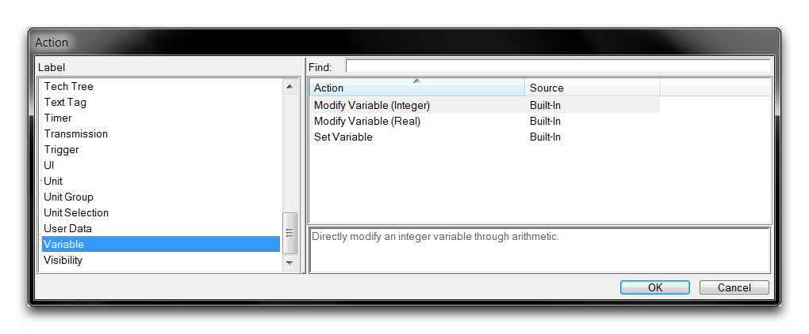
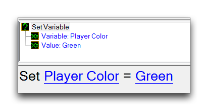
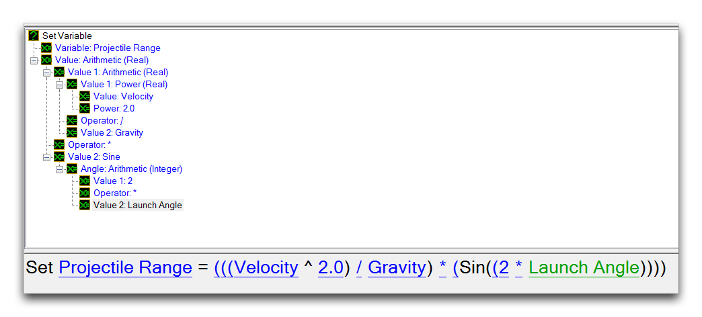
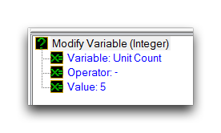
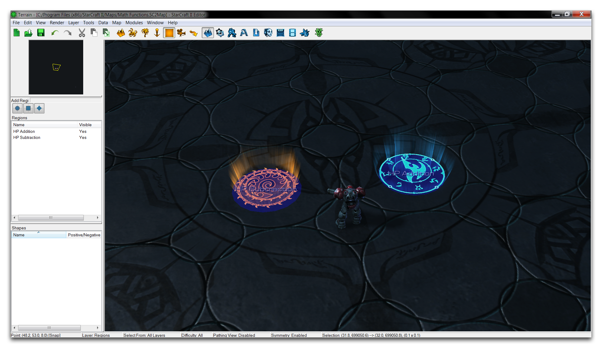
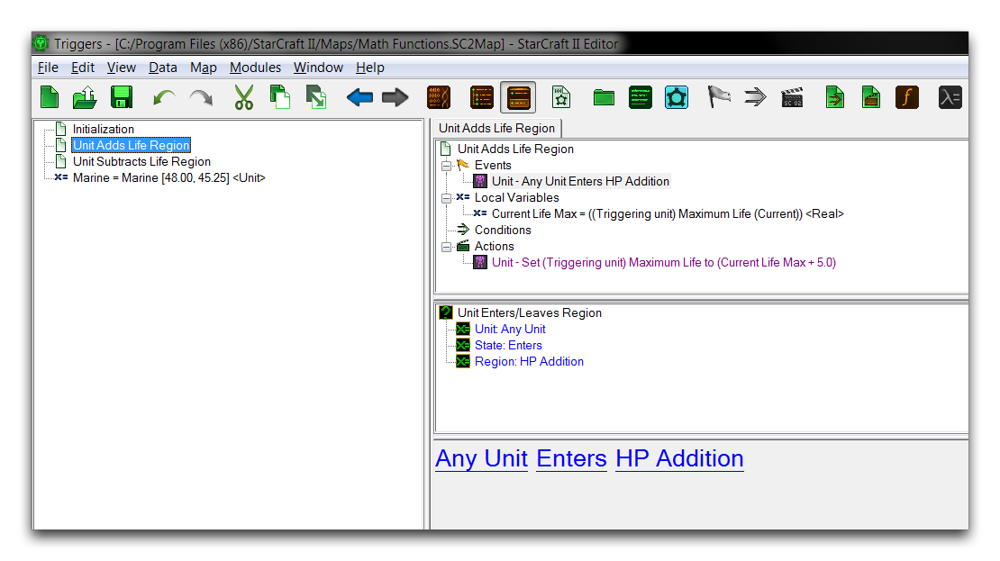
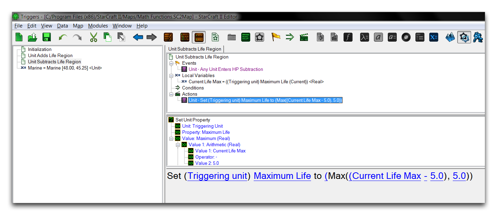

您可以在使用数字字段的任何操作、事件或条件中使用数学函数。话虽如此，它们在支持非常有用的变量操作方面得到了广泛的应用。这三种操作负责修改和初始化变量。您可以在操作创建过程中通过导航到“变量”标签来访问它们，如下所示。

*变量操作*

这里的核心是设置变量操作，它创建一个方程，可以将任何类型的变量设置为一个值，如下图所示。

*设置变量操作*

变量设置的值可以直接指定，可以从另一个变量中设置，可以从预设中设置，也可以从函数中设置。最后一种情况支持数学函数，这些元素结合在一起可以强大地用于修改游戏变量。下面的示例使用设置变量操作来使用一系列数学函数设置数字实字段。

*使用数学函数设置变量*

修改变量（整数）和修改变量（实数）操作是设置变量操作的同类，但目的更为具体。它们允许使用基本上是内置算术函数的方法修改数值变量。每种数字类型都有一个版本。通过拥有这种表单，这些操作不如它们的设置变量表亲稳健，但可以快速应用于模拟或简单变量更改。下面显示了这些操作的示例。

*修改变量操作*

与任何共享的数学函数一样，修改变量（整数）操作在必要时使用隐式实数转换。

## 示范数学函数

此时，请将注意力转向本文附带的演示地图，以演示数学函数的实际操作。打开它将显示以下内容。

*演示地图课程*

此处的海军士兵面临一些有趣的选择。每个信标都连接到一个触发操作，该操作将应用一个数学函数到一个游戏变量上，该变量就是这名海军士兵的生命值。查看区域图层，您会发现每个信标都已连接到适当大小的圆形区域内。进入触发器编辑器以进一步调查。

*触发器编辑器视图*

在逻辑方面，这个地图已经设置了一个初始化触发器，设置了地图的一些摄像机和文本标签功能，然后将海军士兵连接到一个单位变量以供其他地方使用。此后，一对单独的触发器会响应“单位进入区域”事件。如上所示的触发器中，HP增加区域入口将运行一个使用数学函数的操作。您可以在下面更仔细地查看。

进入该区域时，海军士兵的最大生命值将使用算术数学函数增加 5 点。测试该地图将产生如下结果。

*海军士兵的生命值增加了5点*

数学函数直接对游戏变量进行了更改。如果需要的话，继续将海军士兵移动到信标中以重复效果。如果您继续查看“单位减少生命区域”触发器，您将看到以下内容。

*单位减少生命触发器*

该触发器也应用了算术函数，但在这个实例中，它执行了减法操作以减少海军士兵的 HP。为了解决这个问题，还有一个附加的数学函数，最大值（实数）已被排序以确保海军士兵的 HP 不会归零。这些函数的效果可以从下面的快速测试中看出。

*海军士兵的生命值减少到5*

反复进入该区域将导致触发器最终触发最大函数，将其内部算术运算的输出固定为 5。

## 附件

 * [045_Math_Functions.SC2Map](./maps/045_Math_Functions.SC2Map)