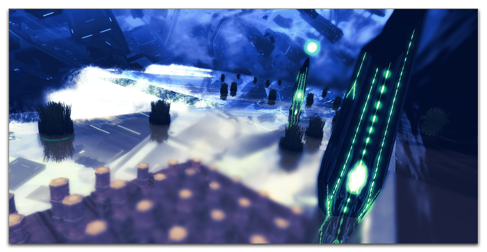
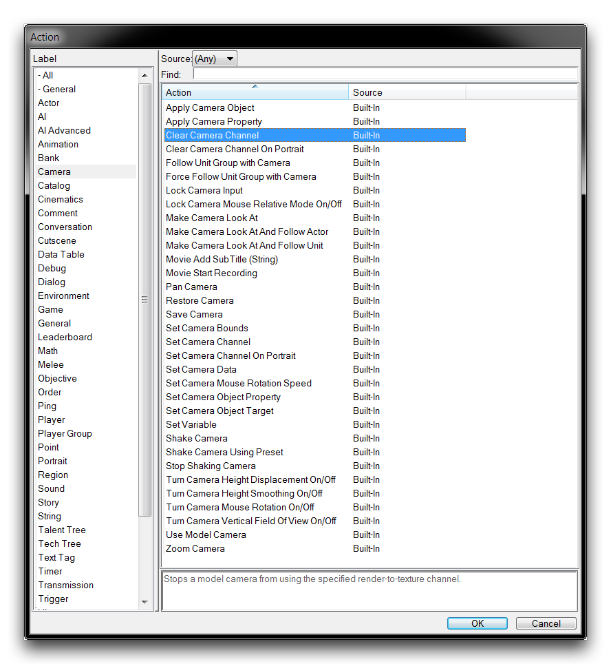
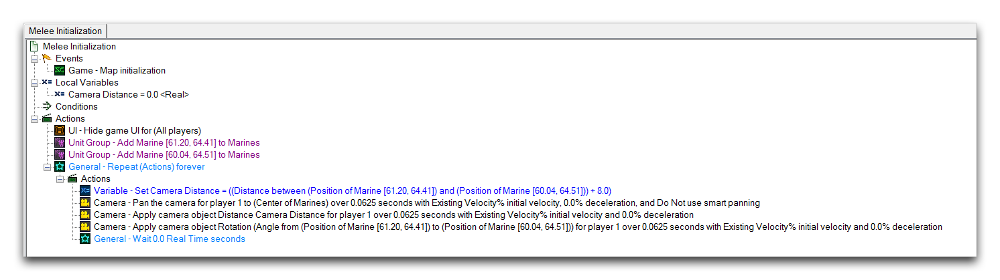

# 摄像机操作

编辑器的摄像机系统提供了一个强大的工具包，用于控制玩家在游戏中看到的方式。真正将这作为创意力量释放的是添加摄像机操作。通过这些操作，您可以为摄像机添加动画效果，在它们之间切换，并应用一系列效果和滤镜。这种动态摄像机使用方式使您能够在项目的叙事或游戏中加入电影元素。

*joecab的《Optical Illusion Piece》中的创意摄像机角度*

## 摄像机操作列表

在创建操作时，您可以通过导航到“摄像机”标签来访问摄像机操作。这将带您到以下视图。

*摄像机操作*

下表包含一些摄像机操作的详细信息。

| 操作                                        | 效果                                                                                                                                                                                                                                                                                                                                                                                                |
| ---------------------------------------- | ------------------------------------------------------------------------------------------------------------------------------------------------------------------------------------------------------------------------------------------------------------------------------------------------------------------------------------- |
| 应用摄像机对象                               | 将摄像机设置为玩家的主摄像机，在一段时间内，使用初始速度和减速设置进行过渡。                                                                                                                                                                                                                                                                                                                              |
| 应用摄像机属性                               | 在一段时间内，将属性应用于摄像机，使用初始速度和减速设置进行过渡。这不会改变该玩家的摄像机对象。                                                                                                                                                                                                                                                                                                            |
| 使用摄像机跟随单位组                        | 切换玩家对其当前选择的单位组进行跟随/不跟随的状态。跟随状态的摄像机将平稳地、持续地移动到其目标上。                                                                                                                                                                                                                                                                                                      |
| 锁定摄像机输入                             | 切换玩家的锁定状态。这将阻止玩家对摄像机进行任何修改。这经常用于过场动画。                                                                                                                                                                                                                                                                                                                           |
| 打开/关闭相对鼠标模式锁定摄像机                  | 切换玩家的相对鼠标模式为打开/关闭状态。这种模式将让玩家的鼠标移动变为实际上的拖动滚动行为，类似于按住鼠标中键。它还会隐藏鼠标指针。通常与打开/关闭鼠标旋转一起使用，以创建通常在第一人称游戏中找到的移动类型。                                                                                    |
| 使摄像机对准                               | 调整摄像机，使其对准区域内的目标点供玩家查看。该功能将在XY平面上本质地跟踪摄像机的目标，而不会破坏任何其他功能。过渡期间发生，使用初始速度和减速设置进行过渡。                                                                                                                                                                                                                                   |
| 使摄像机对准并跟随演员                          | 类似于使摄像机对准和使用摄像机跟随单位组的组合。它通过接受一个演员输入，与该组合有所区别。                                                                                                                                                                                                                                                                                                           |
| 使摄像机对准并跟随单位                          | 类似于使摄像机对准和使用摄像机跟随单位组的组合。它通过接受一个单位输入，与该组合有所区别。                                                                                                                                                                                                                                                                                                           |
| 移动摄像机                                 | 调整摄像机，使其对准区域内的目标点供玩家查看。该功能将在等距平面上本质地跟踪移动，而不会破坏任何其他功能。过渡期间发生，使用初始速度和减速设置进行过渡。如果启用了智能移动，摄像机不会在已经对准目标点的情况下移动。                                                                                                       |
| 恢复摄像机                                 | 将摄像机恢复为玩家先前保存的配置。过渡期间发生，使用初始速度和减速设置进行过渡。                                                                                                                                                                                                                                                                                                                        |
| 保存摄像机                                 | 保存玩家当前的摄像机配置。                                                                                                                                                                                                                                                                                                                                                                             |
| 设置摄像机范围                               | 将一组玩家的摄像机范围设置为一个区域。这将限制摄像机的移动范围在这些边界内。选择小地图参数Do将调整其大小以适配摄像机范围。在战役中，这是一个常见选择，用于将地图分成可独立探索的较小区域。                                                                                                                                                                                                              |
| 设置摄像机鼠标旋转速度                        | 设置玩家摄像机的偏航或俯仰灵敏度。当打开摄像机鼠标旋转时启用。                                                                                                                                                                                                                                                                                                                                        |
| 设置摄像机对象属性                           | 将摄像机的属性设置为一个值。属性包括距离、旋转和滚动。                                                                                                                                                                                                                                                                                                                                               |
| 设置摄像机对象目标                           | 将摄像机对象的目标设置为区域内的一个目标。                                                                                                                                                                                                                                                                                                                                                               |
| 抖动摄像机                                 | 为玩家抖动摄像机。抖动沿着方向由基础频率控制，在持续时间内被一个随机值打乱。如果持续时间参数设置为0，摄像机将一直抖动，直到使用停止摇晃摄像机动作。                                                                                                                                                                                                                                                |
| 使用预设抖动摄像机                            | 通过从预设列表中选择设置幅度和频率来为玩家抖动摄像机。该抖动支持其持续时间内的混合进和混合出。                                                                                                                                                                                                                                                                                                       |
| 停止抖动摄像机                              | 停止为玩家抖动摄像机。                                                                                                                                                                                                                                                                                                                                                                                |
| 打开/关闭摄像机高度位移                        | 切换玩家的摄像机高度位移为打开/关闭状态。此功能为当前正在被跟随的任何飞行单位提供高度调整，以确保它们在摄像机缩放期间可见。                                                                                                                                                                                                                                                                             |
| 打开/关闭摄像机高度平滑                        | 切换玩家的摄像机高度平滑为打开/关闭状态。此功能在摄像机在地形高度之间移动时提供平滑过渡。                                                                                                                                                                                                                                                                                                               |
| 打开/关闭摄像机鼠标旋转                        | 切换玩家的摄像机鼠标旋转为打开/关闭状态。当打开时，将使玩家的拖动滚动相机移动以自由查看方式旋转摄像机，而不是拖动摄像机。这可以与打开/关闭相对鼠标模式一起使用，以创建一种通常在第一人称游戏中看到的摄像机类型。                                                                                                           |
| 打开/关闭垂直视野旋转                        | 将垂直视野旋转切换为打开/关闭状态。默认情况下，横向屏幕空间在宽高比之间保持不变，而纵向空间会根据需要进行裁剪或扩展。当打开垂直视野时，纵向屏幕空间将在宽高比之间保持不变，而横向空间会根据需要进行裁剪或扩展。                                                                                                                                                                  |
| 缩放摄像机                                 | 将摄像机缩放到玩家的某个位置。缩放从DistanceFrom到DistanceTo逐步进行，在持续时间内进行。                                                                                                                                                                                                                                                                                                                 |

## 使用摄像机操作

查看以下摄像机操作序列。

*摄像机操作序列*