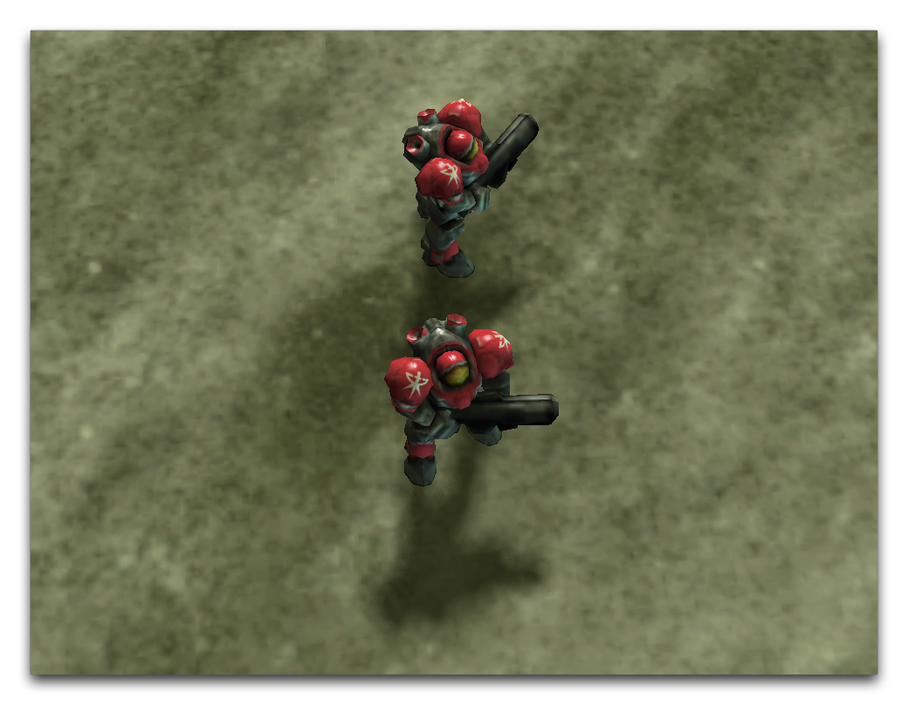

这个序列首先通过移除游戏UI并添加一组海军。之后，使用一系列摄像头动作。Pan Camera动作将摄像头放置在海军配对的中心位置。通过使用极小的持续时间值和无减速度，实现了这个转换的几乎瞬间完成。然后使用Apply Camera Object动作通过设置一个小的距离值来放大摄像头。另一个Apply Camera Object动作改变了摄像头的轴通过设置旋转角度使其位于两个海军之间。这些属性与之前动作的持续时间相同，几乎瞬间完成。这个动作序列的结果如下图所示。

*使用动作的自定义摄像头设置*

## 附件

* [046_Camera_Actions.SC2Map](./maps/046_Camera_Actions.SC2Map)