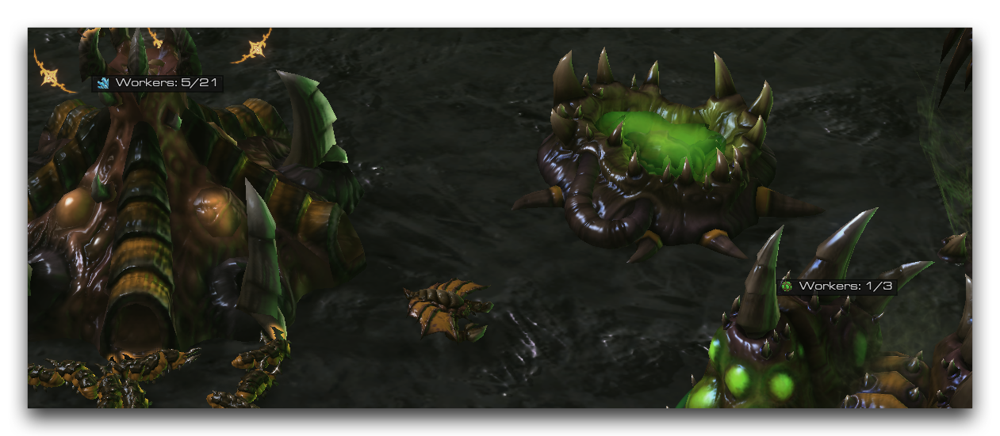
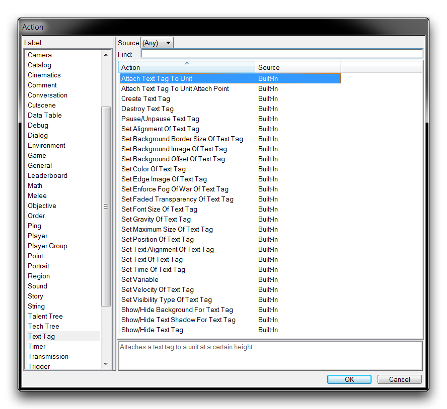
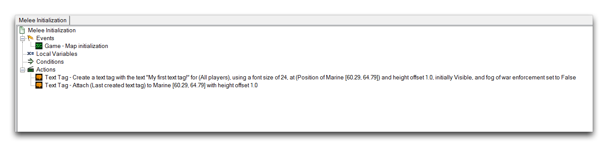
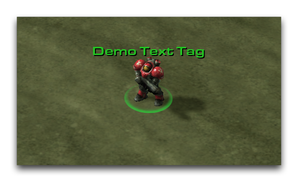

# 文本标签

文本标签在游戏空间中显示文本，而不是像任何界面或对话框选项一样在屏幕空间中显示。它们被设计为具有一种视觉属性，将它们悬挂在目标单位的上方，并对摄像机移动做出反应。这确保它们位于环境中。因此，它们通常用于介于界面元素和游戏元素之间的文本元素。文本标签的典型应用包括玩家名字、地点名称和伤害数字。在下面的图像中，您可以看到文本标签显示在一座孵化场和一个萃取器上方，提供了关于每个资源上的工人数量的相关信息。

 显示工人数量的文本标签

## 文本标签操作

您可以在创建操作时通过导航到“文本标签”标签来访问文本标签操作。这将呈现给您以下视图。

*文本标签操作*

这些操作在以下表格中进行了分解。

| 操作                            | 效果                                                                                                                                                                     |
| ----------------------------- | ------------------------------------------------------------------------------------------------------------------------------------------------------------------------------ |
| 将文本标签附加到单位           | 将文本标签附加到单位，带有高度偏移。                                                                                                                                           |
| 将文本标签附加到单位附着点      | 将文本标签附加到单位的附着点，带有X和Y的偏移量。请注意，单位包含特定的附着位置在其模型数据中，包括状态栏。                                                                           |
| 创建文本标签                  | 使用玩家的字体大小在位置和高度偏移处创建一个带有文本的标签。                                                                                                                    |
| 销毁文本标签                 | 移除文本标签。                                                                                                                                                                |
| 暂停/恢复文本标签             | 暂停或恢复发送到文本的任何操作。                                                                                                                                                   |
| 设置文本标签的对齐方式           | 设置文本标签的水平对齐和垂直对齐。                                                                                                                                                 |
| 设置文本标签的背景边框         | 将文本标签的背景边框设置为水平和垂直值。                                                                                                                                             |
| 设置文本标签的背景图像          | 使用特定平铺类型设置文本标签的背景图像。                                                                                                                                            |
| 设置文本标签的背景偏移         | 将文本标签的背景偏移设置为水平和垂直值，以屏幕尺寸百分比为单位。                                                                                                                    |
| 设置文本标签的颜色             | 设置文本标签的颜色。                                                                                                                                                             |
| 设置文本标签的边缘图像          | 使用X和Y偏移设置文本标签特定边缘的图像。                                                                                                                                             |
| 设置文本标签的雾效            | 设置文本标签的雾效使用状态。                                                                                                                                                          |
| 设置文本标签的渐隐透明度       | 设置文本标签的渐隐透明度类型。                                                                                                                                                       |
| 设置文本标签的字体大小          | 设置文本标签中使用的字体大小。                                                                                                                                                    |
| 设置文本标签的最大大小         | 文本标签根据摄像机距离调整其大小。此操作允许您设置文本标签的最大尺寸，以宽度和高度为单位。                                                                                                 |
| 设置文本标签的位置             | 设置文本标签在带有高度偏移的位置。                                                                                                                                                  |
| 设置文本标签的文本对齐方式       | 设置文本标签在水平和垂直坐标轴上的对齐。                                                                                                                                             |
| 设置文本标签的文本内容         | 设置文本标签的文本内容。                                                                                                                                                           |
| 设置文本标签的时间             | 将文本标签的持续时间设置为时间。设置这样的时间会导致标签在持续时间后到期。                                                                                                         |
| 设置文本标签的可见类型          | 设置文本标签的可见类型。                                                                                                                                                            |
| 显示/隐藏文本标签的背景       | 显示或隐藏文本标签的背景图像。                                                                                                                                                       |
| 显示/隐藏文本标签的阴影       | 显示或隐藏文本标签的阴影。                                                                                                                                                           |
| 显示/隐藏文本标签            | 为玩家显示或隐藏文本标签。                                                                                                                                                           |

## 使用文本标签

与对话框一样，文本标签经常在创建后重新定位、移动和调整大小。为了支持这一点，您应该给每个标签一个持久的句柄，使用“设定变量”操作和文本标签函数标识“最后创建的文本标签”。

查看下面的文本标签操作序列。

*文本标签操作序列*

在此序列中，使用“创建文本标签”操作创建了一个文本标签。该操作确定了标签的文本和字体大小，然后将标签设置为海军兵在高度偏移处的位置。随后，使用“将文本标签附加到单位”操作将标签植入到海军兵中，目标单位的高度偏移处。这一对操作在使用文本标签时是标准的。还应注意，附件已覆盖了标签位置，并且将导致文本标签随着其主机单位移动。

*文本标签样式化并附加到单位*

## 附件

* [047_Text_Tags.SC2Map](./maps/047_Text_Tags.SC2Map)