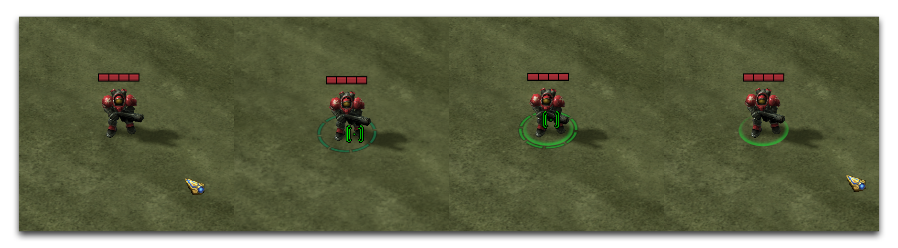
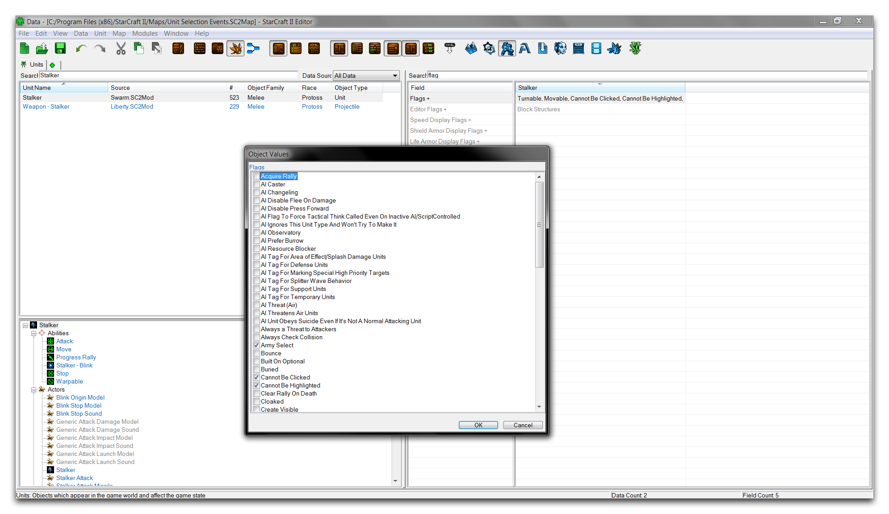
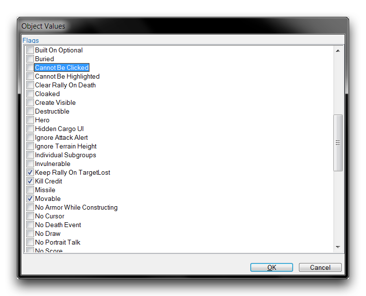
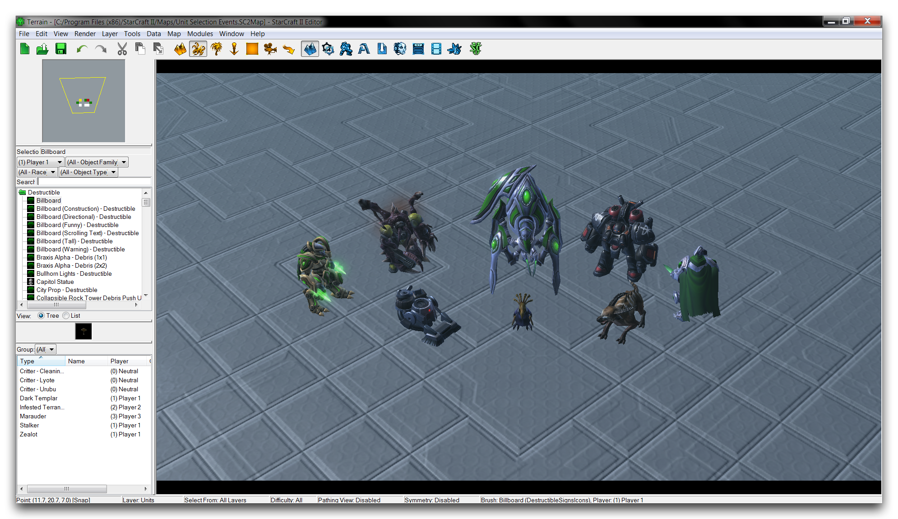
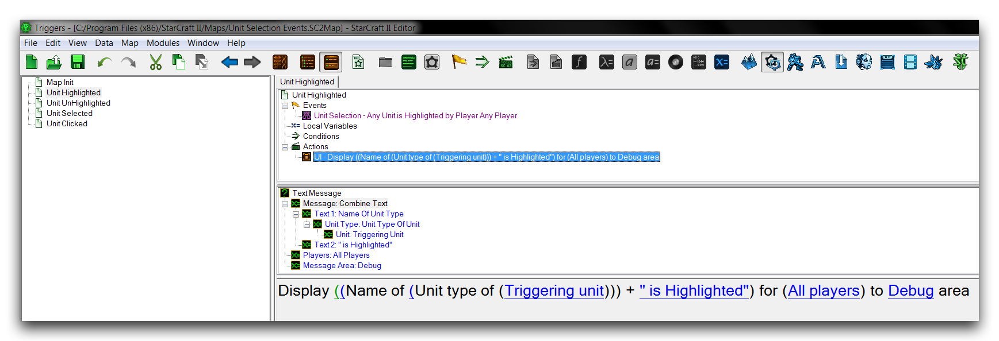
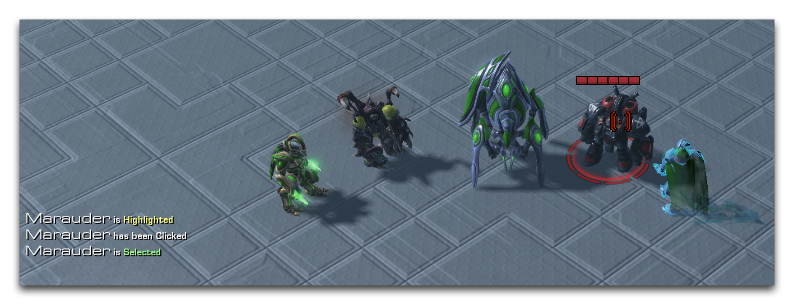

# 单位选择事件

在添加与单位交互方式时，“单位选择”事件类别可以非常有用。这些事件是由玩家的鼠标操作引起的单位状态变化触发的。有三种类型的变化，如下表所示。

| 事件              | 详情                                                                                                                                                                                                                                                                                                                                                                                                                                                                                        |
| ----------------- | ------------------------------------------------------------------------------------------------------------------------------------------------------------------------------------------------------------------------------------------------------------------------------------------------------------------------------------------------------------------------------------------------------------------------------------------------------------------------------------------ |
| 单位被选中       | 当玩家第一次点击单位时触发该事件，这将选择该单位。该单位现在进入已选中状态。一旦单位处于此状态，直到玩家取消选择并恢复到基本状态之前，它将无法再次选中。当玩家选择任何其他游戏实体时，也可以取消选择单位。玩家可以通过使用鼠标的框选或按住CTRL键单击单位来用一次动作选择许多单位。         |
| 单位被点击       | 每次由玩家用鼠标单击单位时触发。可以无限次发生。对一个取消选择的单位的第一次点击符合单元单击事件和单位选中事件的标准。每次玩家只能点击一个单位。                                                                                                                                                                                                                                                     |
| 单位被高亮/取消高亮 | 高亮和取消高亮事件触发取决于玩家鼠标进入或离开单位区域的位置。当鼠标指针首次穿过单位的区域时，单位触发其单位高亮事件并变为高亮状态。当鼠标指针离开高亮单位的区域时，单位触发其取消高亮事件，并返回到基本状态。玩家一次只能突出显示一个单位。                                                                                                                                                 |
| 单被高亮           |                                                                                                                                                                                                                                                                                                                                                                                                                                                                                          |

## 选择状态

StarCraft 的用户界面可以帮助识别选择状态，如下图所示。图片下方的标题解释了每个状态。

单位基本状态 -- 单位高亮 -- 已选择的单位和高亮 -- 已选择的单位

这里最左边的图片显示单位处于其基本状态，既未被选择也未被高亮显示，并且模型没有任何特殊的改变。从左起第二幅图中，鼠标进入了该单位的区域，使该单位处于高亮状态。此时，会触发一个单位高亮事件。将光标悬停在高亮状态的单位上会导致一对说明性的用户界面变化；鼠标指针变为目标标记，单位被标记为一个虚线圆。圆圈的颜色取决于单位的所有者，对于属于玩家的单位为绿色，对于盟友或中立单位为黄色，对于敌对单位为红色。

在最左边的第三张图片中，该单位已被点击选中。这种变化会导致触发单位选中和单位被单击事件。已选择单位的模型在用户界面中用一个完整的圆圈标记。这个圆圈的着色与高亮光标相同。在这种情况下，光标仍停留在单位上方，使单位既被高亮也被选中。因此，两套用户界面功能会叠加在一起。单位同时具有选择圈和高亮圈，并且光标仍然是高亮标记。

在最右边的图片中，鼠标已从单位区域移开，导致单位取消高亮事件。该单位仍处于选择状态，并仍由完整的选择圈标记。光标已恢复到基本指针，因为单位不再被高亮显示。

## 选择标志

尽管 StarCraft 引擎中的每个单位都可以被点击和高亮显示，但触发事件的数据消息默认情况下是未启用的。你需要编辑一些游戏数据以启用这些行为。转到数据编辑器，然后到+ ▶︎ 编辑游戏数据 ▶︎ 单位。找到要监控选择事件的单位类型。在此单位中，导航到“单位：标志”字段，并双击以启动“对象值”窗口。有关示例，请参阅下图中对猎魔者所做更改。

*修改猎魔者的“单位：标志”字段*

滚动浏览单位标志，直到找到“不可点击”和“不可高亮”。这些标志分别控制发送“单位被单击”和“单位高亮/取消高亮”事件。一旦取消选中这些标志，该单位类型将将其相应类型的任何事件传递到触发编辑器，并且应如下图所示。

*为单位启用单位被单击和高亮/取消高亮事件*

## 检查单位选择事件

打开本文提供的演示地图，该地图提供了一个课程，您可以通过它来尝试选择事件。这将有助于建立对玩家行为中选择事件如何发生的直观感受。该课程应如下所示。

*演示地图课程*

您会发现地图包含几种已通过数据编辑器配置为接受单击和高亮显示的单位类型。请注意，这些单位还分为玩家、盟友玩家、敌人玩家和中立单位。切换到触发编辑器，查看单位选择事件在该示例中的使用方式。

*对单位选择事件的响应输出*

地图设置了一些实用的显示器、联盟控制和无敌触发器在“地图初始化”触发器中。除此之外，每个主要单位选择事件都有一个触发器：高亮、取消高亮、选择和点击。像上面所示的“单位高亮”示例触发器一样，这些触发器通过向屏幕空间发送调试消息来响应其事件。使用这个设置，地图可以为玩家的每一个可能的选择动作提供直接的反馈。您可以通过在编辑器中点击“测试文档”按钮来探索它。

下面显示了一些单位选择事件的示例。

*海盗被突出显示，然后被单击和选中*