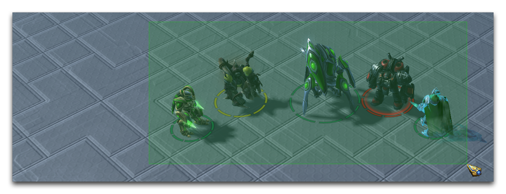
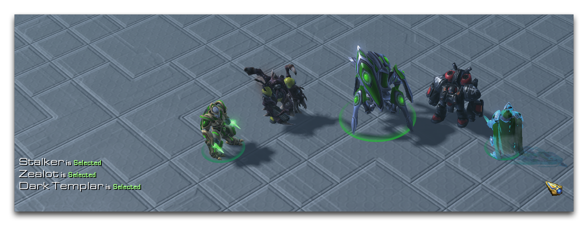
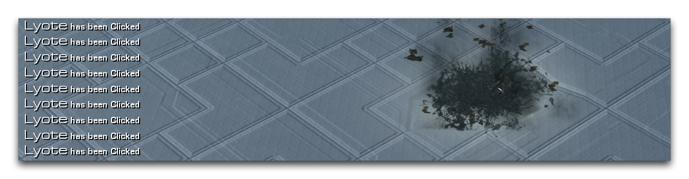

这里敌对掠夺者已经被鼠标悬停然后点击。这样做产生了一个依次出现的Unit Highlighted、Unit Clicked和Unit Selected事件。请注意，在编辑器中最后两个事件同时发生，但点击事件将始终首先出现在任何列表中。您还可以看到掠夺者的UI更改各自显示为红色，表明其为敌人的状态。

*框选所有受控单位*

在下一个情况中，围绕单位进行了框选。尽管单位被框选覆盖，但这本身不会触发任何事件。

*幽灵、狂热者和暗影神殿战士同时被选中*

释放框选将导致属于该玩家的所有单位同时被选中。每个单位都会触发一个Unit Selected事件，然后转入到已选择状态。

*重复点击Lyote*

在这个例子中，一个中立的Lyote动物已经被重复点击。这表明一种单位可以接受无限数量的玩家点击，每次都会触发一个Unit Clicked事件。

## 附件

* [048_Unit_Selection_Events.SC2Map](./maps/048_Unit_Selection_Events.SC2Map)