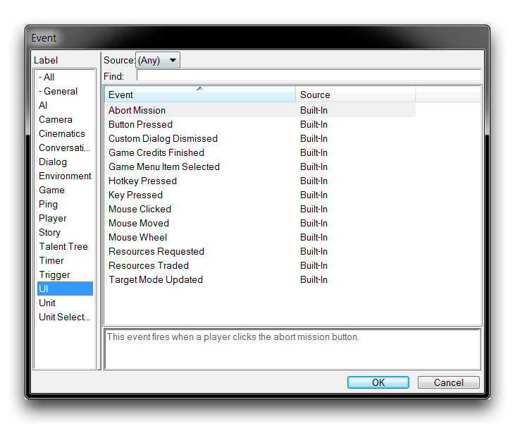
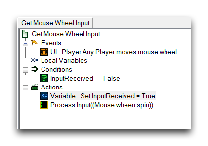
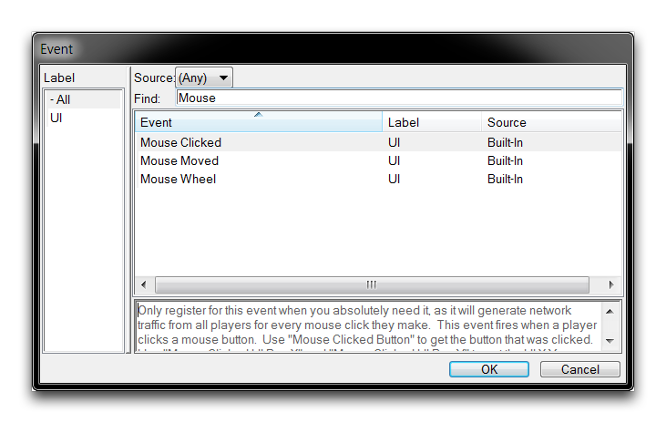
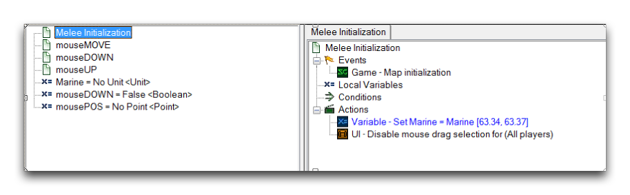
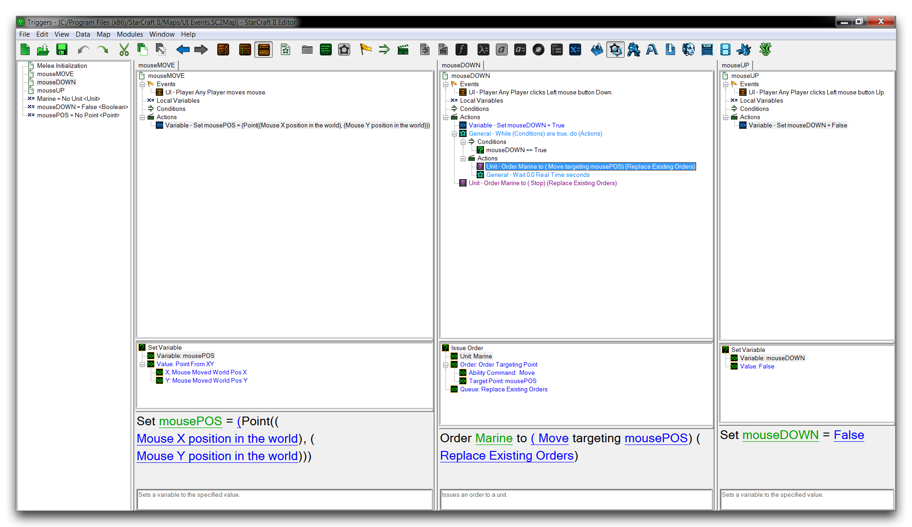

# Ui 事件

StarCraft 对玩家输入的具体机制有时会感觉晦涩难懂且难以访问。尽管编辑器提供了极大的控制能力，但依然存在许多未知因素，这些因素源于硬件、操作系统和后端引擎的混合考虑。为了应对这种封闭的感觉，有许多方式可以在玩家输入和游戏反应之间进行沟通。在触发方面，重点是一组响应玩家输入的事件，合称为 UI 事件。您可以按照下面展示的方式按 'UI' 标签排序，在事件创建过程中看到这些事件。

*UI 事件列表*

以下表格提供了这些事件的细分。

| 事件                   | 详情                                                                                                                                                                                                                                                                                                                                                                                                                                                                                                                   |
| ----------------------- | ------------------------------------------------------------------------------------------------------------------------------------------------------------------------------------------------------------------------------------------------------------------------------------------------------------------------------------------------------------------------------------------------------------------------------------------------------------------------------------------------------------------------- |
| 中止任务               | 当玩家从游戏菜单中点击“中止任务”按钮时触发。                                                                                                                                                                                                                                                                                                                                                                                                                                              |
| 按钮按下               | 当玩家从指令卡中点击按钮时触发。可以使用按钮按下功能标识该按钮。这是一个性能密集型事件。                                                                                                                                                                                                                                                                                                                                                      |
| 自定义对话框关闭       | 当玩家通过特定结果关闭对话框（如“是”、“否”或“任何”）时触发。结果可以使用自定义对话框结果功能标识，玩家可以使用触发玩家功能标识。                                                                                                                                                                                                                                                                                                            |
| 游戏结束演职员表演完成 | 当游戏结束演职员表演完成时触发。                                                                                                                                                                                                                                                                                                                                                                                                                                                           |
| 游戏菜单项选择         | 当玩家选择游戏菜单项时触发。示例包括“保存”按钮、“退出”按钮、“中止任务”或“成就”按钮。此处可用的标识符是游戏菜单已选择和触发玩家功能。                                                                                                                                                                                                                                                                                             |
| 热键按下               | 当玩家按下热键使其处于某种状态（按下或释放）时触发。热键是各种实用控制的集合，每个都绑定到单个按键，例如“选择部队”、“闲置工人”和“传送”。可用标识符是热键按下功能用于热键，触发玩家功能用于玩家。请注意，如果已编写处理热键按下的代码，则热键将不再触发此事件。这是一个性能密集型事件。 |
| 按键按下               | 当玩家按下按键使其处于某种状态（按下或释放），并激活多个修改键（Shift、Control 和 Alt）时触发。每次按键按下都可以使用按键按下、Shift 键按下、Control 键按下和 Alt 键按下函数标识。这是一个性能密集型事件。                                                                                                                                                                                                      |
| 鼠标点击               | 当玩家按下鼠标按钮使其处于某种状态（按下或释放）时触发。可用的鼠标按钮包括左、右和中。可以使用鼠标点击按钮功能标识点击本身，然后通过鼠标点击 UI 位置 X 或 Y 函数以及鼠标点击世界位置 X、Y 和 Z 函数在屏幕空间或游戏空间中识别坐标。这是一个性能密集型事件。                                                                                        |
| 鼠标移动               | 当玩家移动鼠标时触发。可以使用鼠标点击 UI 位置 X 或 Y 函数以及鼠标点击世界位置 X、Y 和 Z 函数在屏幕空间或游戏空间中识别坐标。这是一个性能密集型事件。                                                                                                                                                                                                                                                                              |
| 鼠标滚轮               | 当玩家滚动鼠标滚轮时触发。鼠标滚动移动函数提供了移动的幅度。这是一个性能密集型事件。                                                                                                                                                                                                                                                                                                                                                               |
| 请求资源               | 当玩家使用团队资源菜单请求资源时触发。                                                                                                                                                                                                                                                                                                                                                                                                                                                  |
| 交易资源               | 当玩家使用团队资源菜单将资源交易给接收玩家时触发。                                                                                                                                                                                                                                                                                                                                                                                                                              |
| 目标模式更新           | 当玩家将能力命令的目标模式更改为特定状态（开启、关闭或任何）时触发。                                                                                                                                                                                                                                                                                                                                                                                                         |

## 性能考虑

监控玩家输入可能导致某些 UI 事件触发大量次数。主要是按钮按下、热键按下、按键按下、鼠标点击、鼠标移动和鼠标滚轮事件会引起这种情况。因此，您应谨慎使用这些事件，仅在必要时使用。如果需要使用这些事件，避免性能下降的一种技术是将监控触发器与一个条件配对，一旦不再需要则关闭事件。下面展示了一个示例。

*输入事件节流*

## 检查 Ui 事件

每个 UI 事件响应特定玩家输入，通常提供一些标识符函数来帮助描述输入的用途。这对鼠标事件特别适用，鼠标事件是 UI 事件的子集，提供大量的标识函数来描述玩家可用的鼠标移动次数和鼠标按钮按下次数。您可以通过在事件创建屏幕上搜索“Mouse”来查看这些事件，如下所示。

*鼠标 UI 事件*

在本教程提供的演示地图中，您将找到一些示例触发器，展示了如何通常使用 UI 事件。打开地图并转到触发器编辑器，您将看到以下视图。

*地图触发器编辑器视图*

地图中包含一个单独的海军单位，该单位在初始化时已经被识别并设置为变量。其余的触发器将使用玩家输入来创建一个直接将海军单位的控制与鼠标连接起来的控制方案。当然，这与 StarCraft 传统的 RTS 控制设置有明显的不同，后者允许选择和控制大量单位。为了支持这种控制方案，这里禁用了鼠标拖选或“方框选择”。如果查看“mouseMove”、“mouseDown”和“mouseUP”触发器，您将看到以下内容。

*鼠标 UI 触发器*

通过使用两个鼠标点击事件（“mouseDOWN”和“mouseUP”）和一个鼠标移动事件（“mouseMove”）的组合构建了一个直接控制单位的系统。这通过不断监控鼠标位置并使用两个标识函数 Mouse Moved World Pos X 和 Mouse Moved World Pos Y 记录该位置实现。当玩家点击鼠标时，“mouseDown”事件触发，进入一个 While 循环，为该单位创建一个持续的移动命令，使其移动到鼠标的上次存档位置。