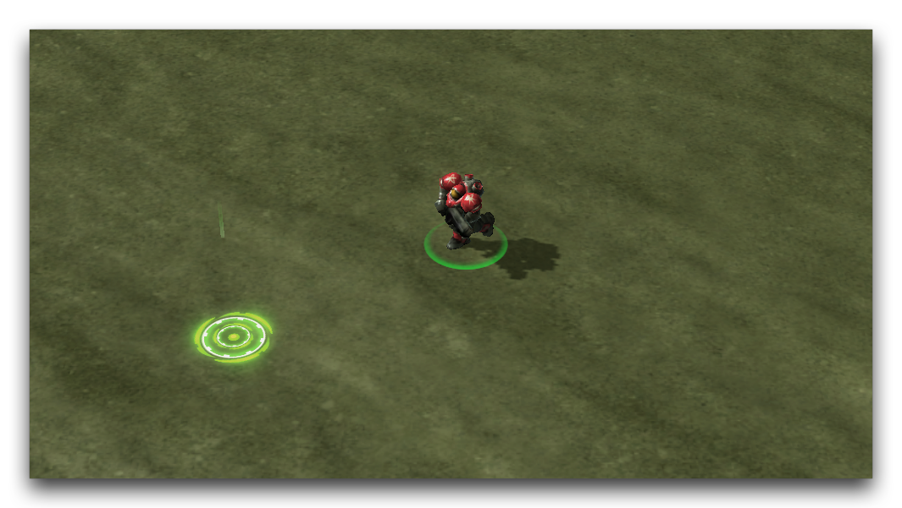
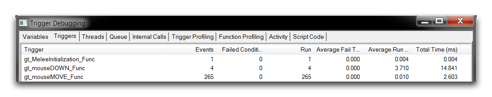

这个过程会一直持续，只要玩家按住鼠标按钮不放，单位就会根据这两个触发器共同作用而持续移动。当鼠标按钮未被按下，或者“松开点击”时，“mouseDown”中的While循环被打破，移动停止。测试地图应该会给你呈现类似下方图片所示的画面。

*直接操控海军*

这展示了为什么你可能想要介入玩家输入并利用UI事件的原因之一。这里已经被用来给玩家一种新的控制游戏的方式，这可以是很有趣的。不过，为了保持移动的平滑性，需要很多事件。如果你打开触发器调试器，你会对这个过程有一些了解。

*直接操控海军*

在这里，你可以看到不断监控鼠标导致在短短几秒钟内触发了250多个事件。这应该让你对这样的操作如何在性能方面变得非常昂贵有所了解。

## 附件

* [049_UI_Events.SC2Map](./maps/049_UI_Events.SC2Map)