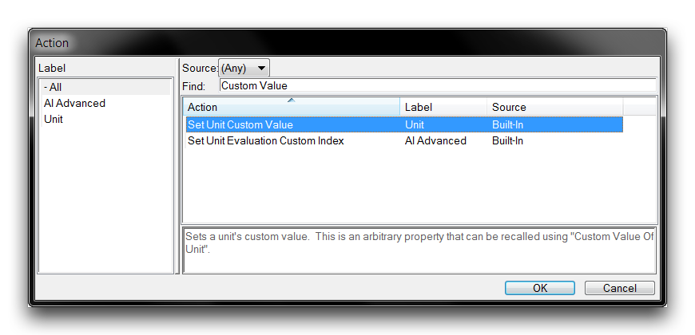
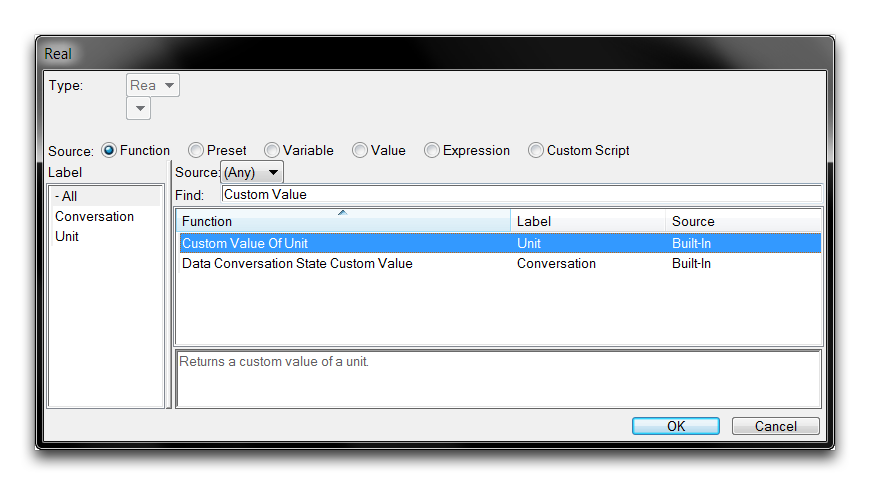
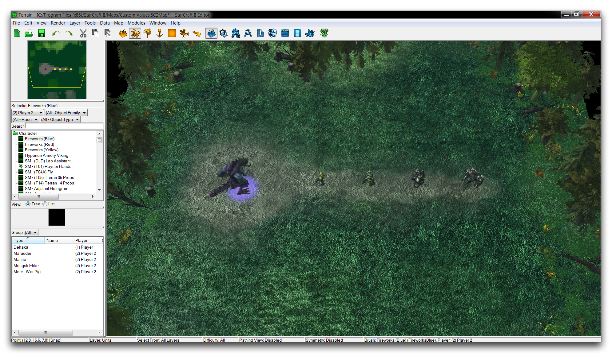
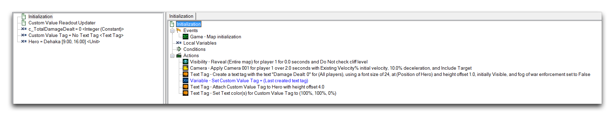
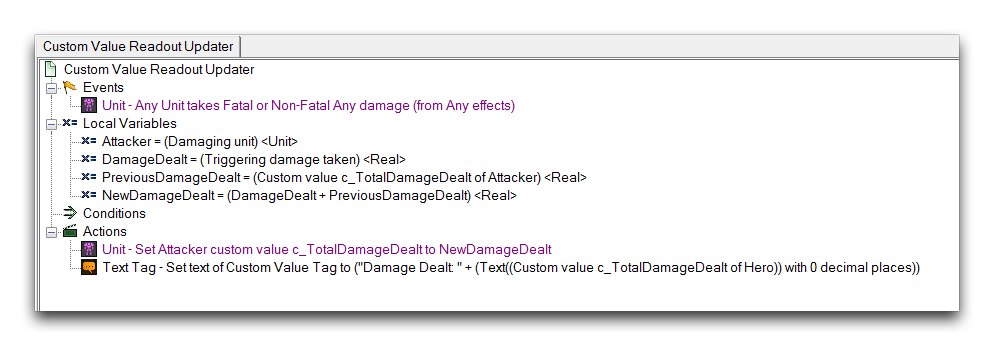
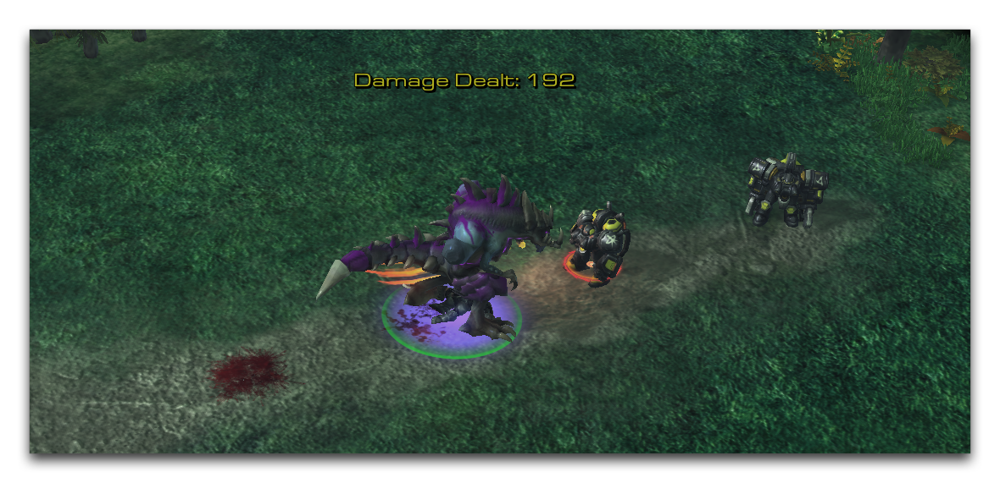

# 自定义数值

自定义数值是指以单位为中心的存储数组。一旦将一个数字设置为单位的自定义数值，该数组就变为活动状态，可以再次设置任何值，读取、修改并以任何方式使用。这些数字是实数类型，并限定为每个单位64个数值的数组。实质上，自定义数值相当于存储在特殊单位范围内的一个Real\[63\]。

自定义数值代表一种与数组或记录不同的组织数据类型。通过在单位内预先组织数据，您无需声明或管理数组。结合这些数据与其源的接近性，这为像英雄单位这样的复杂实体提供了支持快速计算和数据跟踪的简单方法。

## 设置自定义数值

使用动作“设置单位自定义值”来设置自定义数值。您可以在动作创建过程中在“单位”标签下找到它，如下所示。

*自定义值操作*

## 获取自定义数值

使用函数“单位自定义值”来提取自定义数值。您可以在“功能”来源下的填写实数字段时找到它。

*自定义值函数*

## 演示自定义数值

打开本文提供的演示地图。您会看到Zerg英雄Dehaka在森林中排列一些敌人的画面。

*演示地图路径*

在触发器编辑器中，您会找到一组触发器，用于监视并更新Dehaka的自定义数值，记录他所造成的伤害。随后，这些触发器将把这个自定义数值更新到文本标记。

如果您检查全局变量范围，您会发现一个关于自定义数值使用的重要提示。为任何自定义数值创建一个索引整数常量是创建特定自定义数值的一种有用习惯。然后，在处理该值的每个时机上，可以插入索引以避免处理硬编码的自定义值数组索引。下面您可以看到处理自定义值文本标记的触发器。

*文本标记构造触发器*

在这里，一个文本标记被整洁地构建并附加到Dehaka上，作为显示他自定义值的读数。然而，这个练习的关键部分在于“自定义值读数更新器”触发器中，您可以在下面看到。

*自定义值读数触发器*

该触发器在每次造成伤害后更新，然后使用“设置自定义值”动作更新自定义值。请注意这里的整数索引c\_TotalDamageDealt；它充当一个快速的句柄。每次更新自定义值后，文本标记读数也会重置。所有这些行动共同造就了通过文本标记可视化内部自定义值的效果。像这样将自定义数值理解为单位为中心的数据对于起草如何使用它们的方式是有帮助的。如果您自己测试这个地图，应该会得到如下所示的结果。

*自定义值伤害追踪*

最后，自定义数值在触发调试器中不算作变量。这意味着，当您调试诸如此类演示或其他以自定义数值为中心的设计系统时，通常会值得开发一个自定义的调试界面。

## 附件

* [050_Custom_Values.SC2Map](./maps/050_Custom_Values.SC2Map)