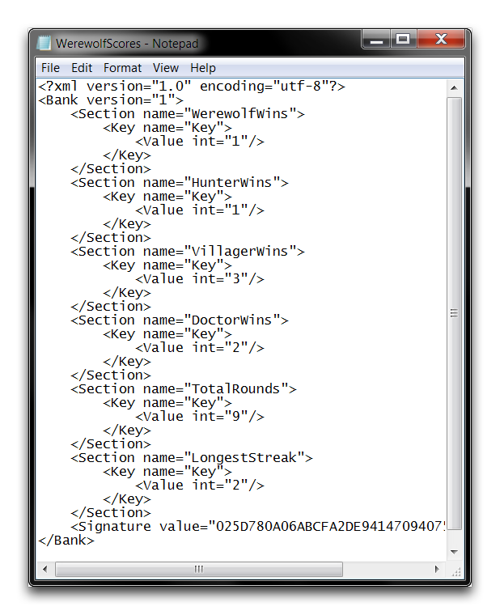
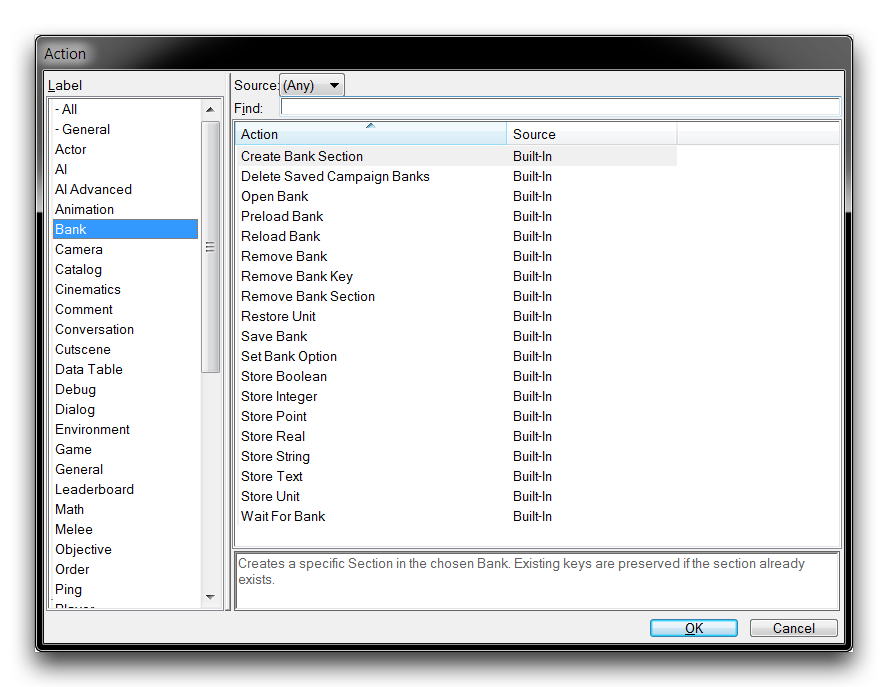
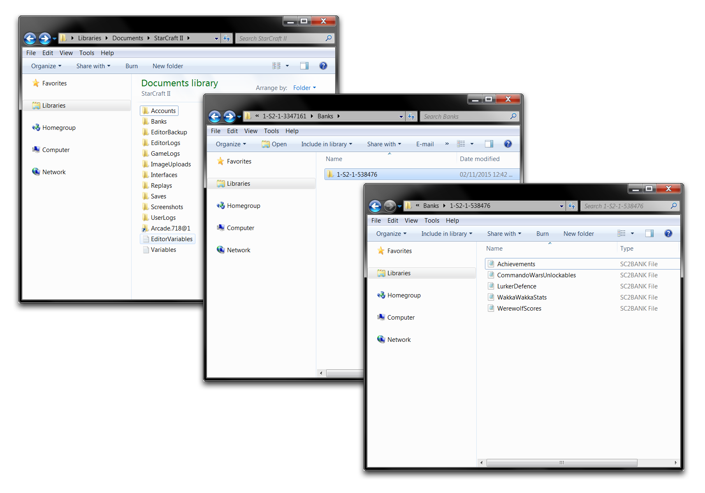

# 银行

银行是编辑者用来存储信息并在项目之间使用的方法。以下是一个示例银行文件。

*自定义游戏银行文件*

该银行存储了玩家在一种自定义游戏中的个人统计数据。请注意这里的结构。银行首先按部分分层，然后按键值对分层。当值存储在银行中时，它们按照与其相关键相对应的目标部分写入银行文件，但除此之外没有特定顺序。

## 银行操作

银行处理的控件可以在操作创建期间找到，在标签'银行'下显示如下，后面跟着一个详细介绍这些控件的表格。

*银行操作*

| 操作               | 效果                                                                                                                                                                                                                     |
| ------------------- | -------------------------------------------------------------------------------------------------------------------------------------------------------------------------------------------------------------------------- |
| 预加载银行          | 预加载并同步特定玩家的银行。                                                                                                                                                                                              |
| 创建银行部分       | 创建一个银行部分，然后接受键值对。                                                                                                                                                                                      |
| 保存银行           | 保存银行，确保游戏后文件的所有更改都得以保留。                                                                                                                                                                           |
| 存储数据           | 将值存储为银行的某个部分的键。有几种类型可供存储：Boolean，Integer，Real，Point，String，Text和Unit。                                                                                                                  |
| 重新加载银行       | 重新加载银行，还原可能发生在保存之间的任何更改。                                                                                                                                                                          |
| 打开银行           | 打开银行以供使用和修改。                                                                                                                                                                                                  |
| 恢复单位           | 通过Store Unit操作存储的以前存储的单元。该单元通过从银行的部分中的一个键进行恢复。这导致该单元在某一点为玩家创建，并面朝某个角度。                                                                            |
| 等待银行           | 这是一个等待控制语句，暂停直到特定银行重新加载的条件为True。                                                                                                                                                               |
| 设置银行选项       | 将银行的签名选项设置为启用或禁用。签名为银行提供了一种加密选项，使得玩家无法更改它们。                                                                                                                                   |
| 删除银行键         | 从银行的部分中删除一个键及其相关值。                                                                                                                                                                                      |
| 删除银行部分       | 从银行中删除一个部分以及其中包含的所有键值对。                                                                                                                                                                            |

## 查找本地银行存储

您可以在以下描述的Windows位置找到本地银行存储。

  - 资源库
      - 文档
          - 星际争霸 II
              - 星际玩家.ID@\#
                  - 银行
                      - ID代码
                          - 银行文件

以下图片序列显示了该过程。

*访问本地银行存储*