# 触发器组织

随着您的项目不断增长并纳入越来越多的元素，它可能会倾向于某种程度的混乱。这可能相当危险。在编程中，工作质量通常取决于开发人员能够轻松理解整个系统如何协同工作。一团乱糟糟的元素直接违反了这种清晰理解的方式，因此开发一个组织项目的系统是必须的。为此，触发器编辑器中有几种工具可帮助您整理。组织项目可能会产生相当显著的影响，如下图所示。

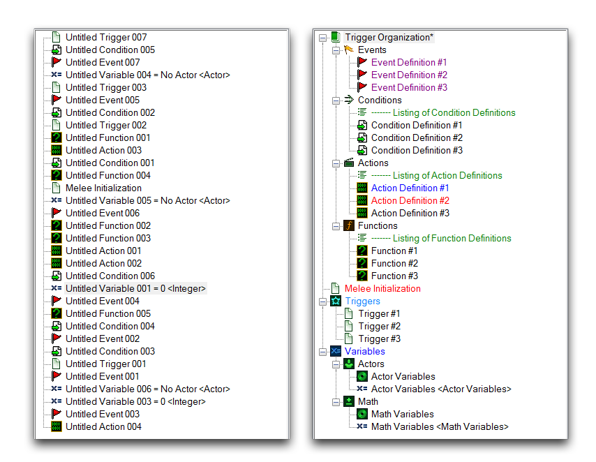
*无组织的触发器-- 触发器带有组织措施*

## 文件夹

文件夹是计算机工作组织的基本元素，因此它们可能不需要太多解释。它们在编辑器中的运作基本如您所期望的那样。触发器编辑器文件夹能够将项目项分组到一个容器对象中，通过其左侧的 + 或 - 控件来展开或折叠。

通过在触发器面板内右键单击并导航至新建 ▶︎ 新建文件夹，或使用在触发器栏中找到的新建文件夹按钮来创建文件夹。下面展示了这些步骤。

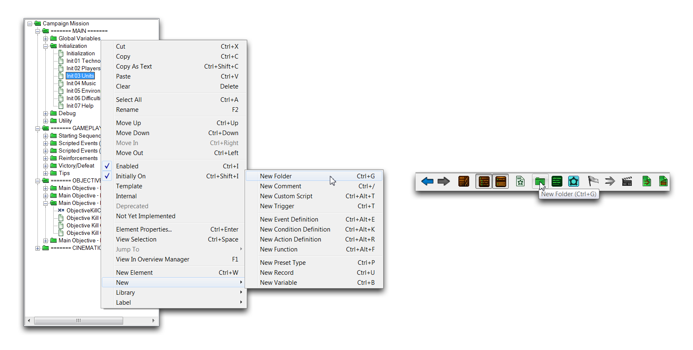
*从触发器面板创建文件夹-- 从触发器栏创建*

移动或创建文件夹到另一个文件夹内会创建一个子文件夹。您可以重复此过程来为您的项目创建一个层次结构。虽然您应该避免过度使用这一点，但几层层次结构可能是组织的一个强大的第一步。下图显示了正式的星际争霸战役地图的组织方式，首先按其一般类型（MAIN，GAMEPLAY，OBJECTIVES 和 CINEMATIC）分成文件夹，然后按其具体目的，例如 'Global Variables'，'AI' 或 'Victory Cinematic' 进一步分类。

[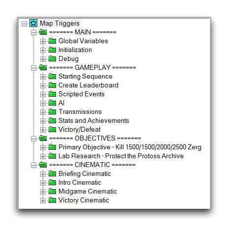](./resources/052_Trigger_Organization3.png)
*战役地图中的文件夹组织*

## 注释

注释是项目文档的工具。它们添加了直接写入编辑器的文本元素。这些元素对游戏过程没有影响，而是留在编辑器内部，为描述项目部分运作方式提供了有用的沟通工具。您可以为个人使用或其他可能看到您地图的用户创建注释，无论是队友还是社区的成员。扩展的注释节还可用于许多实用目的，包括手册、发布历史、调试代码列表和待办事项列表。一些典型的注释如下所示，以它们的绿色文本和  标记。

[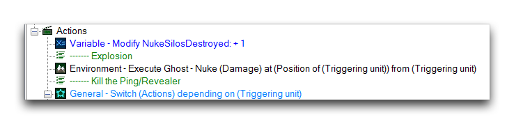](./resources/052_Trigger_Organization5.png)
*已注释触发器*

您可以在触发器面板或触发器内容面板中创建注释。通过在任一位置右键单击，然后导航至新建 ▶︎ 新建注释来执行此操作。或者，您也可以使用触发器栏中的新建注释按钮执行此操作，在光标当前位置创建一个注释。

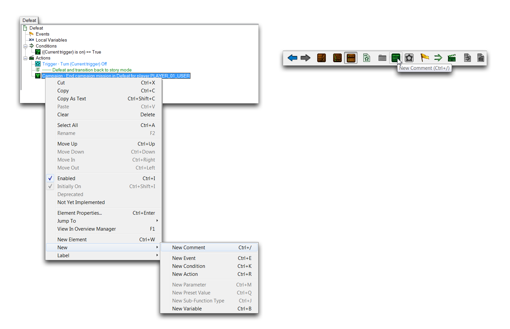
*从触发器内容面板创建注释-- 从触发器栏创建*

在触发器面板中添加注释被认为不太有用，因为这往往会很混乱。但是，该选项适用于描述诸如文件夹内容之类的小注释。

## 库

库允许您将触发器编辑器的元素组织到集合中，并可通过其导入和导出功能在项目之间共享。您可以在库面板中看到项目中处于活动状态的库，通常包括内置，自由，虫群，虚空等。这些是标准依赖项的触发器库，它们是编辑器中所有预制动作、条件、函数和事件的来源。下面展示了项目库的标准视图，以它们的  标记。

[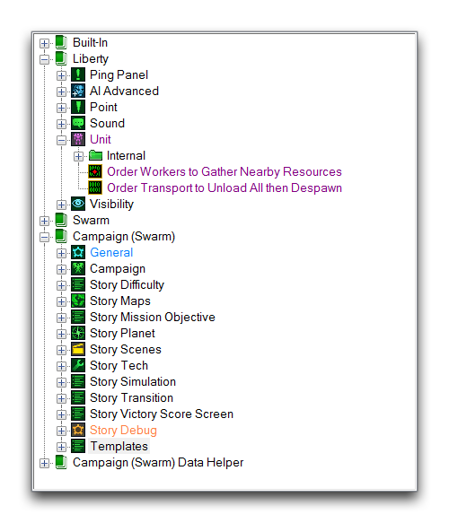](./resources/052_Trigger_Organization8.png)
*项目库*

## 标签

除了每个触发器编辑器元素外，都有一个称为"标签"的小说明性图标。每个标签通过图标对其元素进行分类，并且还可以将元素的描述更改为与标签关联的颜色。每当您在触发器内容面板中从标准库创建一个元素时，它将被分配一个预定的标签。例如，任何“相机”类别的动作将被设置在  标准标签以及其描述颜色旁边，如下图所示。

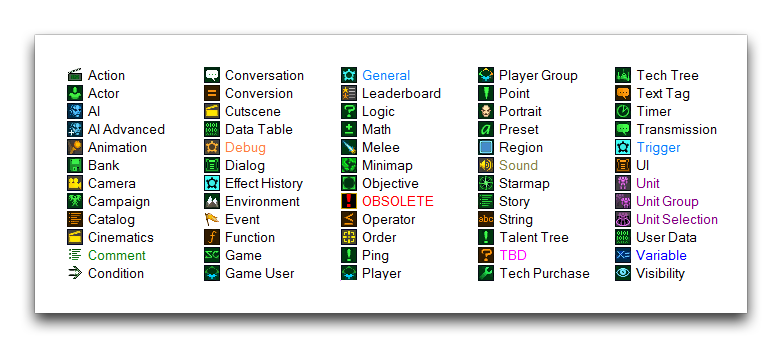
*元素标签*

这些标签预设是通过标准依赖库提供的，可以重新用于任何项目。通过选择元素，右键单击，然后导航至标签，可以设置元素的标签，如下所示。

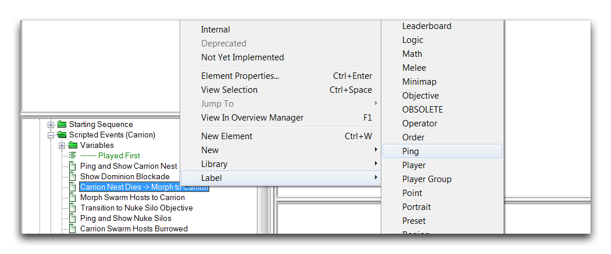
*设置元素的标签*

为定义设置一个标签将把所选标签和所选择元素的标签添加到该定义的所有元素中。如果为触发器、变量或记录等仅在触发器面板中存在的元素选择标签，则该标签仅会更改元素的颜色。在使用触发器编辑器的“查找”功能搜索元素时，标签也很有用。

如果您发现需要更多的自定义，请考虑添加自定义标签。通过导航至数据 ▶︎ 修改标签 可以创建自定义标签。这将启动下面显示的“触发标签”窗口。

[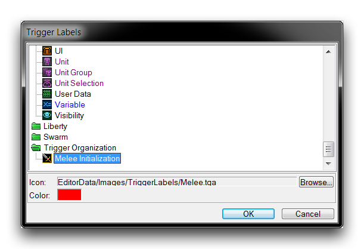](./resources/052_Trigger_Organization12.png)
*创建自定义标签*

在这里，您可以设置颜色和标签。您可以通过存档浏览器将任何大小为 16 x 16 像素的图像设置为标签图标。

## 记录

记录呈现变量的布局，通常对模板对象很有用，因此它们也是一种自然的组织工具。下面的图片显示了使用记录来组织变量的标准用法。

[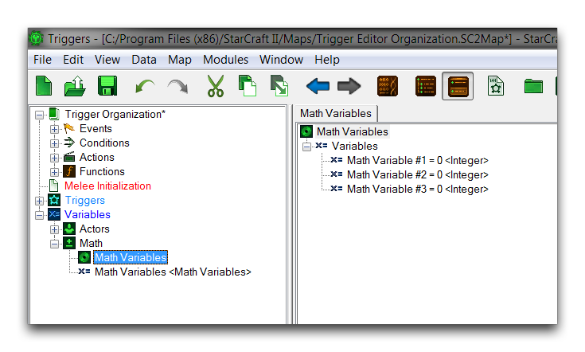](./resources/052_Trigger_Organization13.png)
*记录作为变量组织者*

## 组

主要的触发器内容面板实际上是由称为触发器组的组织者组成的。每个组允许您在主内容面板的一个部分中浏览触发器编辑器的不同元素。编辑器支持在给定项目中最多三个组。打开一个额外组将分割面板空间，如下所示。

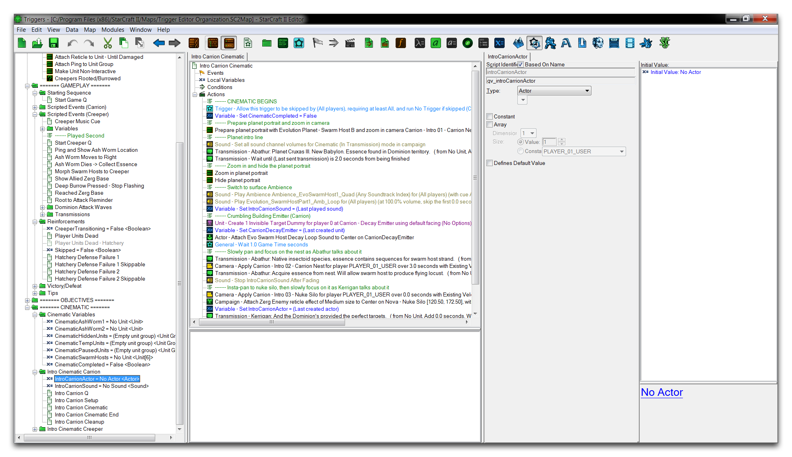
*触发器内容分为两个组*