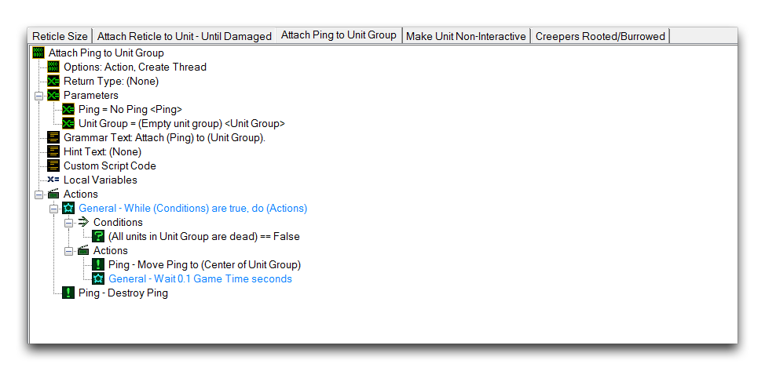
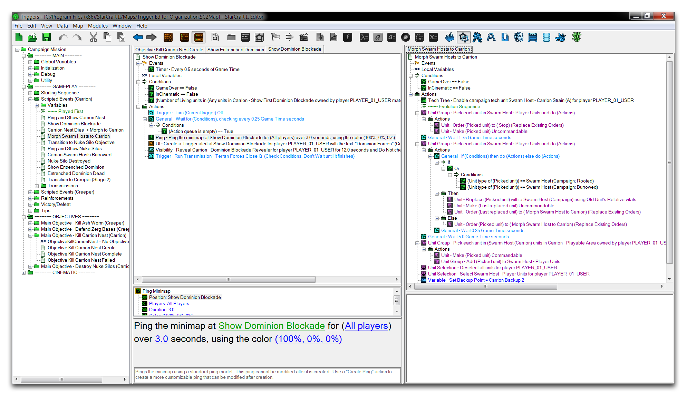

查看上面的图像，以并排的方式查看事物可能是比较项目不同部分的有效方式。总体而言，它提供了用户可以配置编辑器的灵活性。您可以通过转到View ▶︎ Show Groups来在Trigger Editor视图中启用额外的分组。在那里，您会找到四个配置选项。

- 智能 -- 触发器分组将根据当前需求持续添加或删除。
- 1 -- 允许一个触发器分组。这是默认设置。
- 2 -- 允许两个触发器分组。
- 3 -- 允许三个触发器分组。

## 标签

标签是存在于某个触发器分组中的子面板。标签允许您查看任意数量的元素，并通过顶部的标签标题快速在它们之间导航到触发器内容面板。在下面的图片中展示了标签式浏览触发元素的操作。

*触发组内的标签浏览*

您可以通过在触发器面板中选择多个元素，然后按Enter键来为当前活动分组打开标签。一旦打开，您可以通过右键单击标签标题并导航到关闭标签（CTRL+Shift+A）或关闭所有标签（CTRL+Alt+A）来关闭标签。标签和分组的组合提供了对如何组织触发编辑器的大量自定义选项。下面您可以看到这些功能的示例。

*在触发编辑器中同时使用分组和标签*

## 附件

- [052_Trigger_Organization.SC2Map](./maps/052_Trigger_Organization.SC2Map)