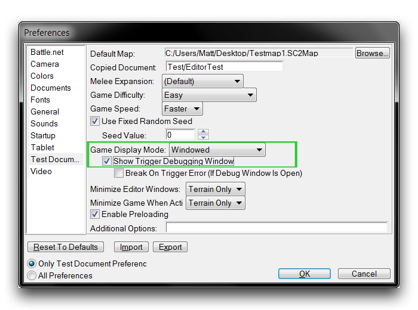
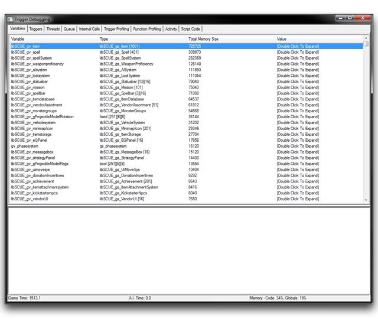
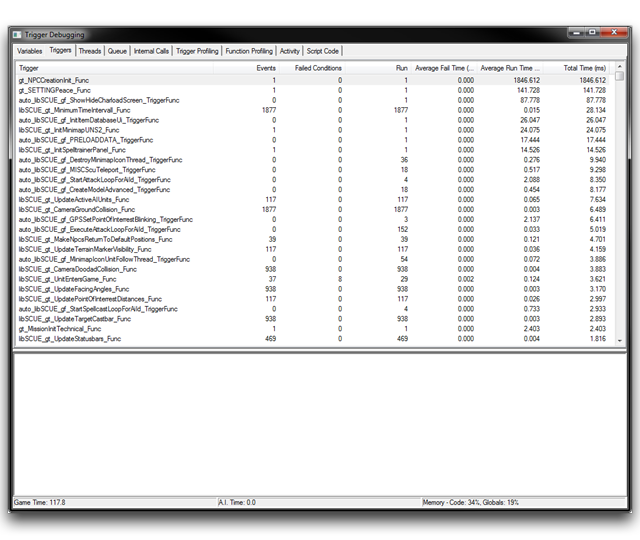
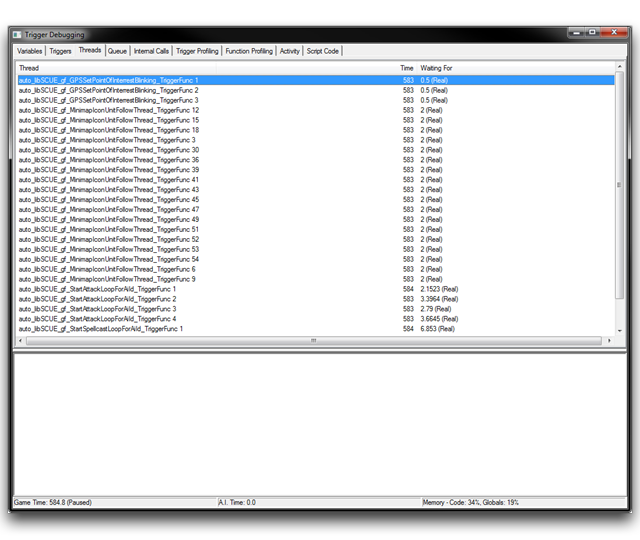

# 触发器调试器

对于高级用户，编辑器提供了一个触发器调试器。这使您可以以精细的方式进行性能分析。

## 启动调试器

在运行时，您可以启动调试器来监视地图脚本在地图测试期间被调用的情况。它作为一个有用的辅助工具，能够对各种效率低下和错误进行分类。有三种主要方法可以访问调试器。

- 通过文件 ▶︎ 首选项 ▶︎ 测试文档 中激活编辑器设置 '显示触发器调试窗口'。
- 在测试地图时，在聊天框中使用作弊命令 'trigdebug'。
- 在触发器编辑器中，使用本机操作 '调试 -- 打开或关闭调试窗口'。

最后一种技术是最强大的，因为它的包含在触发器中允许动态使用、停止和在一个会话中重复使用。重要的是，这是唯一支持在线多人游戏测试的方法。

要以任何方式使用调试器，您的游戏客户端必须设置为 '窗口化' 模式。如果您使用上面列出的第一种方法，您需要在编辑器显示调试窗口之前将选项测试文档 ▶︎ 游戏显示模式 设置为 '窗口化'。下图中突出显示了此设置。

­­

通过设置激活调试器

## 配置调试器

在启动新项目时，您会希望修改默认的调试器设置以最好准备它供使用。启动调试器，右键单击底部的子视图。您将看到几个配置选项。取消选中所有以 '显示' 为前缀的选项，除了显示错误和显示用户输出之外。接下来，导航到 '变量' 选项卡，在顶部视图内右键单击并取消选中 '显示常量'。在其默认设置下，调试器可以输出大量的诊断数据。具有讽刺意味的是，这可能会导致性能明显下降。这里描述的选项将最小化调试器对性能的影响。

## 调试器的组成部分

'触发器调试' 窗口呈现了待检查项目的九个单独的按选项卡排序的视图。在不同时间点，这些信息可能更或较少有用，从而导致以下各部分的一般应用的分解。

| 调试部分     | 分析部分         |
| ------------ | ---------------- |
| 变量         | 变量             |
| 线程         | 线程             |
| 脚本代码     | 触发器分析       |
| 触发器       | 函数分析         |
|              | 触发器           |
|              | 活动量           |

在功能上，每个选项卡包含一个以列分隔的数据表。如果单击表头，数据将按该字段排序。您还可以再次单击表头，以在升序或降序排序之间切换。您还应注意，在每个选项卡底部的状态栏。在这里，您将找到一些高级项目属性；'游戏时间'，自测试开始以来经过的时间；'人工智能时间'，AI 代码在测试中运行的经过的时间；以及 '内存 -- 代码，全局'，编辑器项目可用内存的百分比值的硬编码最大值。

## 变量选项卡

*变量选项卡*

变量选项卡显示当前正在使用的每个全局变量的列表。全局变量以它们的大内存分配而臭名昭着，所以通过按 '总内存大小' 对此列表进行排序可能非常有用，以查找哪些部分的项目需要最多的内存。您还会在此选项卡中找到自定义类型，包括记录和数组。在游戏的任何时间点查看变量值的整体情况是调试的一个有用的初始方法。在下面，您将找到此选项卡中的每个可用字段的描述。

| 字段                | 详情                                                                                                                                                                                                                                          |
| ------------------- | --------------------------------------------------------------------------------------------------------------------------------------------------------------------------------------------------------------------------------------------- |
| 变量                | 变量的 Galaxy 脚本名称。                                                                                                                                                                                                                      |
| 类型                | 变量的 Galaxy 类型，标准类型包括 int、bool、string、struct 和 array。                                                                                                                                                                         |
| 总内存大小          | 以字节表示的元素内存大小。复杂的数据类型显示它们的整个内存分配；数组内存大小是元素数量乘以基本元素大小，而结构内存大小是每个基本元素大小的总和。                                                                                          |
| 值                  | 变量的当前值。复杂的数据类型给出 '双击展开' 选项。单击将显示包含在其中的每个变量的列表。                                                                                                                                                   |

## 触发器选项卡

触发器选项卡显示游戏中发生的每个触发器的列表，以及它们使用的详细信息。这些详细信息可以让您了解触发器被激活的次数以及它们的条件经常通过的频率，同时还提供了运行时间的指标。从这个视图中可以获取一些独特而有用的功能。通过右键单击一个元素，您可以选择 '运行触发器' 来执行触发器的调试运行。在需要在触发器主体中使用外部事件参数的情况下，此操作将失败，但您可以通过使用默认值来计划此操作。

*触发器选项卡*

| 字段                   | 详情                                                                                                                                                                    |
| ---------------------- | ------------------------------------------------------------------------------------------------------------------------------------------------------------------------- |
| 触发器                | 触发器函数的 Galaxy 脚本名称。                                                                                                                                          |
| 事件                  | 触发器触发的次数。                                                                                                                                                      |
| 条件失败次数          | 触发器条件失败的次数，随后不运行触发器的主体语句。                                                                                                                     |
| 运行次数              | 触发器运行其主体语句的次数。通常等于 (事件 -- 条件失败次数)，但使用 '运行触发器' 选项可能会扭曲此结果。                                                               |
| 平均失败时间          | 触发器条件失败所需的平均时间（毫秒）。                                                                                                                                  |
| 平均运行时间          | 触发器执行所需的平均时间（毫秒）。                                                                                                                                      |
| 总时间                | 触发器使用的总时间（毫秒）。此值可以通过以下方式粗略估计：(平均失败时间 \* 条件失败次数) + (平均运行时间 \* 运行次数)。                                               |

## 线程选项卡

在线程选项卡下，您将找到每个活动触发器线程的列表。这包括任何使用等待控制语句的事物，例如触发器或多线程范例内的任何动作定义。由于这些通常是复杂和性能密集的程序，因此此选项卡在正确构建这些系统方面非常重要。在此处，右键单击一行并选择 '查看脚本' 将引导您到脚本代码选项卡，自动滚动到所选函数的第一行。

*线程选项卡*