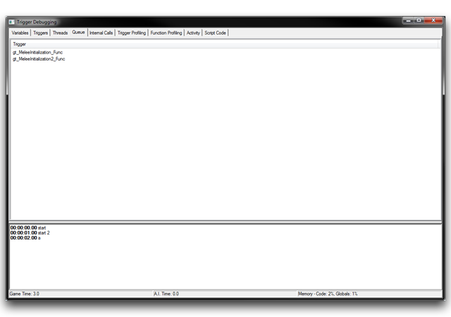
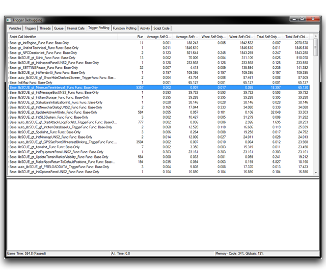
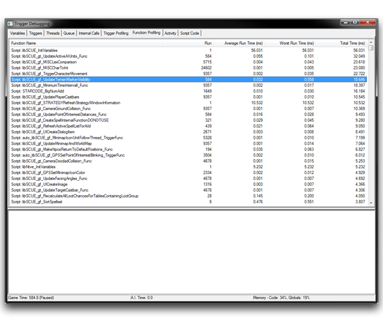
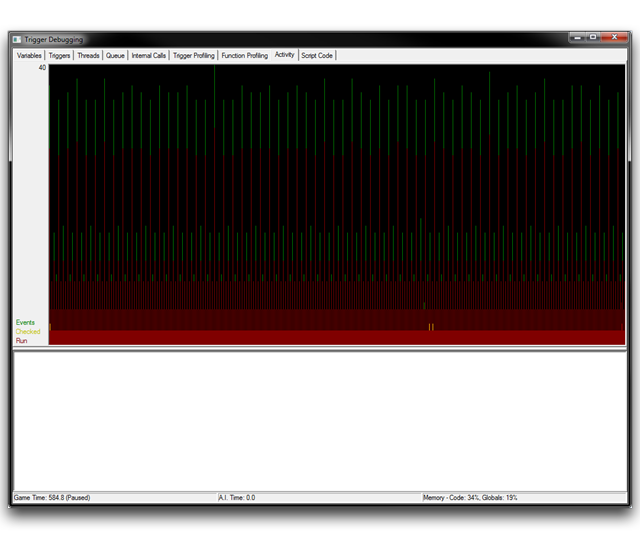

| 领域         | 详细信息                                                                                                                                                                                                                                                                                                      |
| ----------- | ---------------------------------------------------------------------------------------------------------------------------------------------------------------------------------------------------------------------------------------------------------------------------------------------------------- |
| 线程        | 对于触发器，此处将显示触发函数的脚本名称。当使用动作定义多线程时，这将接收隐式生成的触发器函数的函数名称。这些可以通过它们的前缀 auto 和显示线程 ID 的数字后缀轻松识别。 |
| 时间        | 线程已活动的总时间（毫秒）。                                                                                                                                                                                                                    |
| 等待中      | 显示线程当前正在执行的“等待”时间类型和数量（以秒为单位）。有两种类型，Real 和 Game，分别表示真实时间和游戏时间。在发现哪个触发器内的“等待”语句当前控制时，此区分可能很重要。            |

## 队列标签

*队列标签*

队列标签列出当前正在使用动作队列的每个触发器。使用队列的动作包括特殊的 Galaxy 脚本函数 TriggerQueueEnter() 和 TriggerQueueExit()。只有等待其队列动作被处理的触发器才会显示在这里。由于此标签非常具体，因此往往很少使用，这解释了其缺乏附加字段。

## 触发器分析标签

*触发器分析标签*

在触发器分析标签中，您将找到触发器标签的一个更有针对性的版本，专注于分析和性能监控。这里的列表仅包含用于多线程使用的触发器和动作定义。与显示运行时不同的是，此标签通过“仅自身时间”和“自身+子项时间”进行分析。这些术语在下文中有详细定义。

| 术语               | 定义                                                                                                                                                                                                                                                                                                                                                              |
| ------------------ | ----------------------------------------------------------------------------------------------------------------------------------------------------------------------------------------------------------------------------------------------------------------------------------------------------------------------------------------------------------------------- |
| 仅自身时间     | 原生 Galaxy 语言特性的执行时间。这测量运行原始操作所需的时间，比如修改变量、运行控制结构或复制参数。它不包括子函数的调用时间，即使是原生 Galaxy 函数的调用也是如此。但它包括函数调用本身的开销。 |
| 自身+子项时间 | 触发器的总执行时间，包括所有子函数和调用。请注意，“子项时间”指的是每个关联的“自身时间”中的子函数调用。这一术语是通过将其添加到“仅自身时间”中提供的。                                                                                                                |

与触发器标签一样，您可以右键单击一行并选择“查看脚本”，将选定的触发器传送到脚本代码标签，它将滚动到函数的第一行代码。您还会在此看到一些有用的选项。通过右键单击主窗口，您可以选择“显示本机函数”，这将允许视图为从基本函数调用的每个本机函数创建子项。您还可以选择“显示子调用”，这将在分析器视图中显示完整的调用堆栈。

以下是触发器分析标签中每个字段的描述。您应该记住，这些字段中的几个是根据先前描述的不同时间系统引用的。

| 领域                       | 详细信息                                                                 |
| --------------------------- | ----------------------------------------------------------------------- |
| 脚本调用标识符      | 基本函数的 Galaxy 脚本名称。如果启用了“显示本机函数”，这还将显示特定本机函数的名称。 |
| 运行                         | 触发器运行其主体语句的次数计数。与触发器标签中找到的领域相同。                   |
| 平均仅自身时间       | 触发器的平均执行时间（毫秒）。                                         |
| &                           |                                                                                                     |
| 平均自身+子项时间 |                                                                                                     |
| 最长自身时间           | 触发器的单个最长执行时间（毫秒）。用于发现延迟峰值的可能原因。                    |
| &                           |                                                                                                     |
| 最长自身+子项时间   |                                                                                                     |
| 总仅自身时间         | 触发器的总执行时间（毫秒）。                                            |
| &                           |                                                                                                     |
| 总自身+子项时间     |                                                                                                     |

## 函数分析标签

*函数分析标签*

函数分析标签是触发器分析标签的功能对应。它提供了有关当前测试会话中函数性能的额外洞察。部分“运行时间”部分中的时间以函数规模表示，并且等于前面部分描述的“仅自身”时间。这种区分可能有些令人困惑，但在评估不同元素的整体性能时非常有用。

| 领域               | 详细信息                                                                                                                                                          |
| -----------------   | ------------------------------------------------------------------------------------------------------------------------------------------------------------------- |
| 功能名称           | 函数的 Galaxy 脚本名称。                                                                                                                                         |
| 运行                 | 函数被调用的次数计数。                                                                                                                                           |
| 平均运行时间     | 函数的平均执行时间（毫秒），单个最长执行时间（毫秒）和总执行时间（毫秒）。请注意，这些数字是以函数规模的运行时间而计算的。它们等于“仅自身”时间形式。 |
| &                    |                                                                                                                                                                   |
| 最长运行时间     |                                                                                                                                                                   |
| &                    |                                                                                                                                                                   |
| 总运行时间       |                                                                                                                                                                   |

## 活动标签

*活动标签*

在活动标签中，您会找到表示当前会话期间游戏活动的数据可视化。 “活动”是一个术语，描述了下列三个属性的组合。

| 描述属性         | 标记颜色  |
| ---------------- | ------------ |
| 触发事件         | 绿色         |
| 检查条件         | 黄色         |
| 执行触发器       | 红色         |

图表将每个属性绘制在执行次数 vs 时间（毫秒）的图中，执行次数在 y 轴上，时间在 x 轴上。您应该注意，由于执行触发器需要检查条件，所以红线将是黄线的子集，始终适合其中的区域。总体上，这个标签本身对性能要求较轻。您可以通过观察绿线的突然大幅移动来看到这里的延迟峰值。您也可以粗略地估计任何给定时间的总活动或引擎负载，以更直接地了解哪些代码部分可能需要进一步调查。