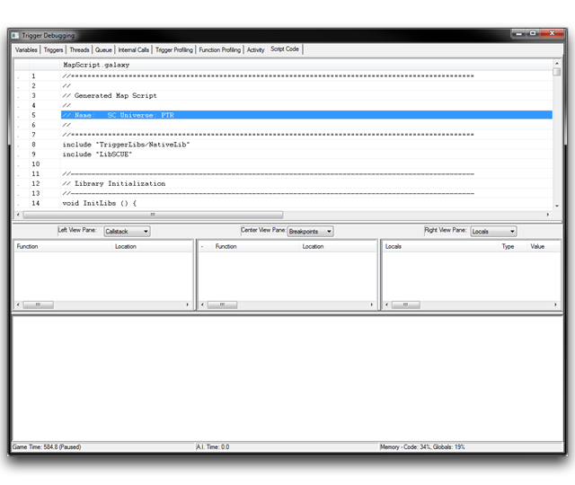
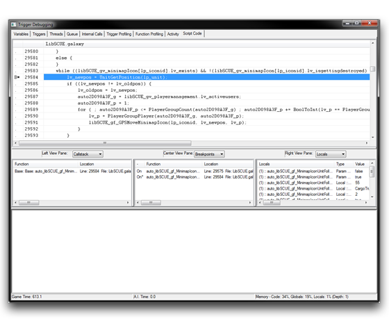

## 脚本代码标签

本质上，脚本代码标签显示加载项目的脚本代码。然而，其主要优势在于其能够作为一个完整的脚本调试器，具有设置断点、检查本地变量和逐行执行代码的能力。因此，在触发调试器中，此部分拥有最有用的调试功能核心。您可以在此找到错误发生的位置和时间，而不是使用输出和直觉来尝试追踪问题。这两种方法各有优势，但修复错误的最细致工作应该在这里进行。

*脚本代码标签*

## 设置断点

要在运行时调试脚本，您必须首先设置断点。断点充当调试器开始分析您的代码的入口点。一旦代码执行流程达到断点，游戏将暂停，并且调试器将开始显示数据。您可以通过右键单击窗口并选择“添加/删除断点”来向脚本代码添加断点。您可以通过选择已经标记了断点的代码部分，然后重复相同的过程来删除断点。

## 进一步的调试考虑

重要的是要注意这种技术是如何随着项目代码规模的增长而扩展的。一旦您的项目达到一定规模，找到正在寻找的特定代码行将变得乏味。您可以通过切换到 Triggers 标签或 Trigger Profiling 标签，按名称对条目进行排序，并找到要调试的函数来解决此问题。然后，右键单击该行并使用“查看脚本”。正如前面提到的，这将使您回到脚本代码标签，滚动到所选函数的第一行代码。

另外，您还可以在星系地图脚本中使用关键词 Breakpoint 在所需位置设置断点。当执行流程遇到此关键字时，触发调试器将打开并跳转到断点位置。目前不支持 GUI，因此您必须使用宏或自定义脚本元素。

您还应该注意，脚本代码标签一次只能显示单个库的内容。这意味着，在处理使用多个库的项目时，您需要根据需要在库之间切换显示。您可以通过对要切换的库中的触发器使用“查看脚本”命令来实现这一点。

## 分析数据

在游戏执行流程中设置并遇到断点后，游戏将暂停并将调试器置于焦点。此时，它将在主视图的脚本代码标签中显示额外的信息，如下图所示。

*脚本代码标签中达到的断点*

您可以使用每个子视图顶部的下拉菜单来更改显示的数据，以便解析当前系统状态。您可以在下表中找到可用选项的详细信息。

| 选项         | 详细信息                                                                                       |
| ----------- | ------------------------------------------------------------------------------------------------- |
| 无         | 隐藏选定的视图窗格。                                                                           |
| 全局变量     | 所有全局变量的列表，类似于“变量”标签。                                                          |
| 本地变量      | 关于每个本地变量的信息，包括事件参数。                                                           |
| 观察          | 包含已标记为有用的“添加观察项”选项的变量构成的列表。                                        |
| 调用栈       | 当前调用栈或从下到上显示的函数调用层次结构。                                                     |
| 断点          | 所有当前设置的断点的列表。                                                                     |

在实际应用中，本地变量选项在实用性方面远远超过其他选项。它允许您展开当前执行函数中的每个值以便轻松查看。通过研究这些本地变量和参数，您可以跟踪特定函数的控制，并确认其值是否在预期范围内。