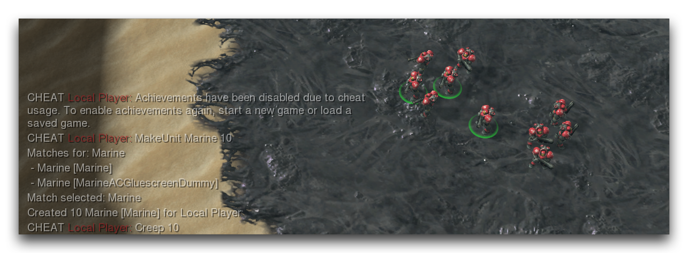

| 作弊指令         | 效果                                                                                                                                                                                                                                        |
| ----------------- | --------------------------------------------------------------------------------------------------------------------------------------------------------------------------------------------------------------------------------------------- |
| 盟友              | 改变选定玩家之间的所有盟友状态。默认情况下，如果您只键入“盟友”，所有玩家将与您共享所有盟友状态。                                                                                           |
| 盟友失败          | 改变选定玩家之间的失败盟友状态。默认情况下，如果您只键入“盟友失败”，所有玩家将与您共享失败状态。                                                                                |
| 盟友控制          | 改变选定玩家之间的控制盟友状态。默认情况下，如果您只键入“盟友控制”，则所有玩家将与您共享控制状态。                                                                             |
| 盟友提供帮助      | 改变选定玩家之间的提供帮助盟友状态。默认情况下，如果您只键入“盟友提供帮助”，所有玩家将响应您单位的求助。                                                                     |
| 盟友被动          | 改变选定玩家之间的被动盟友状态。与您不是被动盟友的玩家将被视为对进攻有敌意的对象。                                                                                              |
| 盟友可推动        | 改变选定玩家之间的可推动盟友状态。这控制着玩家单位是否会穿过其他玩家单位，将其推开。                                                                                             |
| 寻求帮助盟友      | 改变选定玩家之间的寻求帮助盟友状态。控制玩家单位是否向指定目标玩家求助。目标玩家可以根据其提供帮助盟友设置选择是否响应。                                                        |
| 盟友消耗          | 改变选定玩家之间的消耗盟友状态。您正在共享资源的玩家被允许花费您的金钱购买物品。                                                                                                      |
| 盟友交易          | 改变选定玩家之间的交易盟友状态。您正在进行交易的玩家可以发送资源。                                                                                                             |
| 盟友视野          | 改变选定玩家之间的视野盟友状态。                                                                                                                                               |
| 行为添加          | 向选定单位添加所请求的行为。                                                                                                                                                   |
| 行为持续时间      | 设置所请求行为的持续时间。                                                                                                                                                     |
| 移除行为          | 从选定单位中移除所请求的行为。                                                                                                                                                 |
| 法术充能          | 切换法术充能验证。                                                                                                                                                           |
| 冷却时间          | 切换法术冷却验证。                                                                                                                                                           |
| 刷怪              | 在光标位置添加指定半径内的刷怪单位。                                                                                                                                           |
| 造成伤害          | 将玩家单位造成的伤害乘以指定值。默认情况下，这将使您行动的玩家单位造成10倍的伤害。                                                                                                 |
| 承受伤害          | 将玩家单位受到的伤害乘以指定值。默认情况下，这将使行动玩家承受的所有伤害降至0。                                                                                                    |
| 全体死亡          | 杀死地图上的所有单位。                                                                                                                                                       |
| 除选定单位外全部死亡 | 杀死地图上的所有单位，除了选定单位。                                                                                                                                           |
| 死亡一方          | 杀死选定玩家所有拥有的单位。                                                                                                                                                 |
| 单位死亡          | 杀死选定单位。可以指定死亡类型作为参数。                                                                                                                                        |
| 失败              | 对选定玩家以失败结束游戏。                                                                                                                                                   |
| 销毁持久效果      | 销毁光标指定半径范围内的所有持久效果。                                                                                                                                         |
| 效果执行          | 对选定单位执行请求的效果。                                                                                                                                                   |
| 快速建造          | 切换快速建造、研究和训练时间。                                                                                                                                                  |
| 快速治疗          | 切换快速治疗时间。                                                                                                                                                             |
| 发呆              | 强制选定单位执行指定的发呆动作。                                                                                                                                               |
| 食物              | 切换食物使用验证。                                                                                                                                                           |
| 自由              | 切换资源成本验证和支出。                                                                                                                                                       |
| 上帝模式          | 为选定玩家开启上帝模式。处于上帝模式的玩家拥有的单位将造成加倍伤害，并且不受损害。                                                                                                    |
| 战利品掉落        | 为指定玩家掉落一种类型的战利品。                                                                                                                                               |
| 制造单位          | 为指定玩家创建N单位。单位将被创建在光标位置周围，或者如果光标位置无效，则在地图中心创建。                                                                                              |
| 矿物              | 为选定玩家添加指定数量的矿物。                                                                                                                                                |
| 移动              | 将选定单位移动到光标位置。                                                                                                                                                   |
| 无失败条件        | 禁用失败条件。                                                                                                                                                                |
| 无胜利条件        | 禁用胜利条件。                                                                                                                                                               |
| 指令              | 命令选定单位使用某项能力。                                                                                                                                                   |
| 所有权            | 将选定单位的所有权更改为选定玩家。                                                                                                                                             |
| 自定义资源        | 为选定玩家添加指定数量的自定义资源。                                                                                                                                          |
| 设置所有          | 将选定单位的生命、护盾和能量设置为指定值。默认情况下，这将将这些值设定为最大值。                                                                                                            |
| 设置生命          | 将选定单位的生命设置为指定值。                                                                                                                                               |
| 设置能量          | 将选定单位的能量设置为指定值。                                                                                                                                               |
| 设置护盾          | 将选定单位的护盾设置为指定值。                                                                                                                                               |
| 设置资源          | 将选定单位包含的可收获资源设置为指定值。                                                                                                                                       |
| 显示地图          | 切换战争迷雾显示和验证。                                                                                                                                                     |
| 科技树            | 切换科技树依赖验证。                                                                                                                                                         |
| 特拉辛气         | 为选定玩家添加指定数量的特拉辛气。                                                                                                                                            |
| 平局              | 将所有未决定的玩家标记为平局结果。                                                                                                                                             |
| 白天时间          | 将白天时间设置为指定时间。                                                                                                                                                   |
| 白天时间速率      | 设置白天时间更改速率为指定值。触发调试窗口。                                                                                                                                   |
| 运行触发器        | 运行指定触发器。                                                                                                                                                             |
| 移除刷怪          | 在光标位置删除指定半径内的刷怪单位。                                                                                                                                       |
| 未决定            | 将选定玩家的结果标记为未决定。                                                                                                                                             |
| 升级              | 将选定升级应用到选定玩家。                                                                                                                                                 |
| 维斯珀因          | 为选定玩家添加指定数量的维斯珀因。                                                                                                                                           |
| 胜利              | 对所有不与选定玩家分享失败盟友状态的玩家以失败结束游戏。                                                                                                                          |
| 经验值            | 为选定单位添加相对数量的经验值。可用于更改经验等级。                                                                                                                             |

下面是部分测试文档作弊指令的示例试用。

*测试文档作弊指令*