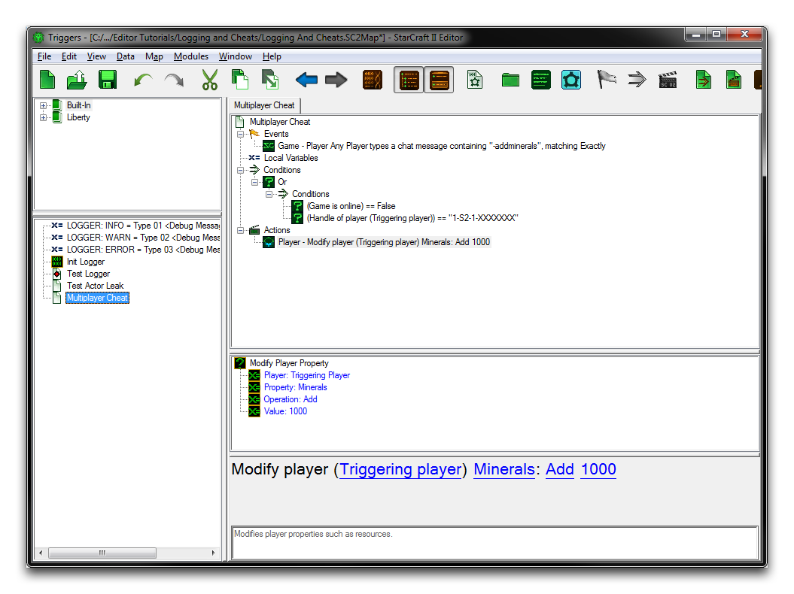
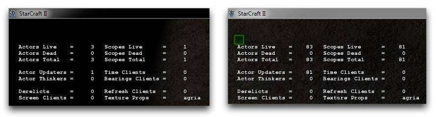

请注意，无法为多人游戏测试启用这些作弊功能。如果您需要类似的功能，您将需要设计一种自定义解决方案。如果需要进行私人和公共测试的混合，建议仅限开发者和信任的用户访问作弊功能。这可以通过保密完成，但更好的方法是使用玩家句柄，并在进入游戏时或每个作弊触发条件内检查它们。这样做将确保只有硬编码玩家列表有权访问您在多人游戏试验中的测试文档作弊功能的等价物。下面是一个类似这种系统的示例。

*多人游戏测试文档作弊*

## 角色作弊

在从编辑器中测试文档时，也可以使用角色作弊。这些作弊提供了许多创建和控制角色的方式，而无需创建自定义测试准备。需注意，**角色作弊是调试角色的唯一方法，因为触发器调试器不包含有关它们的任何信息，这是由于它们的异步性质**。角色作弊类似于测试文档作弊，因为它们是通过在游戏内聊天中输入文本来激活的。

一个特别有用的角色作弊命令是`actorinfodisplay`。此命令将显示一个游戏内叠加，显示当前活动的角色和角色作用域数量，以及其他有用信息。以下图像显示了在压力测试试验前后的角色状态。

*压力测试前的角色状态 -- 压力测试后的角色状态*