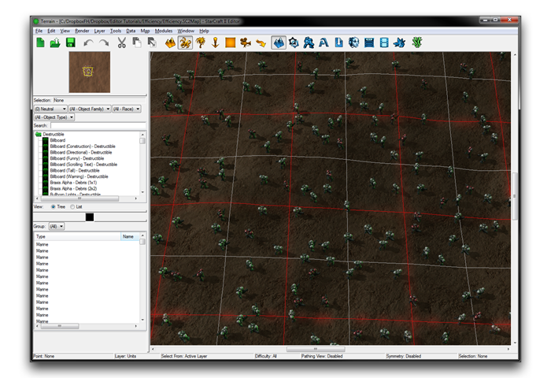
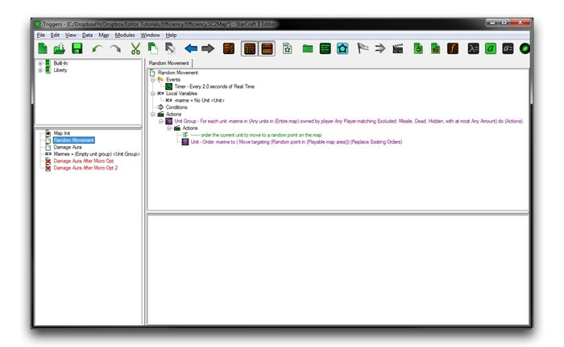
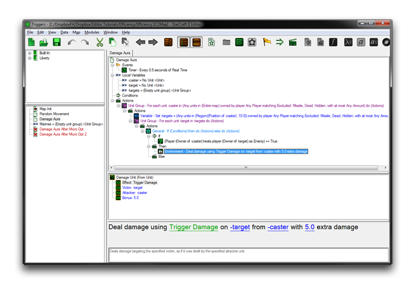
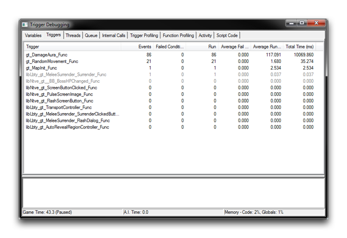
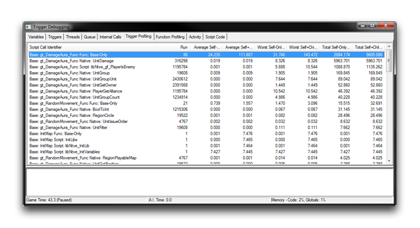

# 代码优化

确保游戏运行顺畅对于观众的体验至关重要。尽管StarCraft及其引擎在其封闭的后端中高度优化，但一旦用户开始使用编辑器添加自定义内容，他们就存在着创建显著性能问题的风险。在这里工作在代码层面的开发人员面临更大的风险。也就是说，编辑器中有一些优化选项可以帮助减轻任何关键问题。

性能问题可以分为两大类，即延迟波动和密集的后台任务。延迟波动是许多玩家熟悉的问题。它们导致帧率突然严重中断，随后游戏状态会突然跳到未来。相比之下，密集的后台任务会导致帧率长时间下降，可能影响整个游戏的性能。因此，它们可能影响观众的享受，但从未被识别为技术错误。

无论您遇到的性能问题属于哪个类别，解决方法都是优化。

## 定位性能问题

任何优化过程的第一步是调查减速的原因。虽然本文侧重于代码优化，您最好先封锁所有其他可能的性能优化领域。在这个级别更改代码可能会大大降低代码的可读性和可维护性，不应轻率对待。

触发器调试器是编辑器中用于查找优化目标的主要工具。在调试器中，有一个特别重要的触发器标签页，用来识别性能问题。该标签页展示了地图中的所有触发器列表，按照“平均执行时间”字段进行排序。这里执行时间较长的触发器是延迟波动的主要候选者。查看另一个字段“总时间”的领导者，将帮助您找到导致密集后台任务类型延迟的触发器。调试器中的高级标签，如触发器剖析标签和函数剖析标签，可以提供证据来支持您的首次观察。

## 实践中的优化

以下是一个练习，可以帮助您理解查找和解决性能问题的原则。

创建一个具有默认设置的新街机地图。现在在用户玩家1和敌对玩家15之间放置大量的海军陆战队员。您可以从“玩家属性”中确认这些控制设置。您应该添加足够多的海军陆战队员，使地图看起来像下面的图片一样。

*海军陆战队覆盖*

这些海军陆战队员将定期被命令移动到地图上的随机点。每个海军陆战队员还将具有伤害区域效应，对半径为10个单位内的任何敌方单位造成伤害。转到触发器编辑器，创建负责第一个行为的触发器，使用下面显示的计划。

*随机移动触发器*

每两秒，此触发器循环遍历地图上的每个单位，并命令它们进行随机移动。您可以按照下面的计划构建第二个触发器。

*AOE区域效应触发器*

该触发器使用两个嵌套循环来对每个海军陆战队员周围的单位应用伤害。外部循环遍历地图上的每个单位，寻找伤害区域效应的潜在目标。然后内部循环使用此列表，在半秒内找到任何位于10个单位半径内的单位。每半秒，通过这一过程找到的敌对单位会受到伤害区域效应的影响。阅读完每个行为的描述后，您可能已经猜测哪个会更有问题。即便如此，在启用触发器调试器的情况下运行地图进行调查。这将产生一个类似下图所示的视图。

*触发器调试试验*

触发器标签页中的“总时间”字段确定了“伤害区域”触发器是迄今为止最为耗时的。它需要总执行时间为10069毫秒，平均运行时间为117毫秒。这几乎比“随机移动”触发器的35毫秒长300倍。优化潜力方面的显著差异可能非常大。显然，将优化工作集中在“随机移动”触发器上将是一个大错误。要继续调查您的目标，转到触发器剖析标签，并启用其“显示本机”和“显示子调用”功能。

*触发器剖析标签*

在这一详细级别，您可以看到“伤害区域”触发器中UnitDamage和PlayerIsEnemy调用是问题的主要原因。这两个函数都在内部循环中，该位置的运行次数通常比代码的其他位置更多。

## 解决性能问题

找到目标后，现在是时候了解关于性能解决的一些令人沮丧的真相。由于这些问题各不相同，可用的通用解决方案非常有限。每个问题都需要关注和理解才能解决。

在一般范例方面，有一些有用的方向。首先，质疑算法本身，并考虑效率。确保您避免了不必要的操作，以实现目标。经过彻底检查后，您可以进行微优化。在微优化中，您将手动微调代码，挤出更好的性能，但付出自己的努力。

“伤害区域”示例过于简单，没有潜在的算法问题。然而，您可以考虑使用数据编辑器解决方案。对于编辑器中的每个触发操作，通常都存在一些纯数据或两种学科的组合。数据通常可以以稍微更高的效率代价提供一些优越性。一般来说，如果您发现自己为了在数据中工作而做出大量安排，那么您很可能已经跨越了性能节省的门槛。

## 微优化

微优化通常是一种为代码挤出微小改进的非平凡方式，但在某些情况下，它们可能会带来惊人的结果。其中一部分原因是Galaxy脚本编译器应用的本机优化较少。此外，还有几个为了易用性而设计的GUI结构，无法顺畅地转化为Galaxy代码。尽管工作量很大，微优化相对于复杂的算法更简单。它们也可以应用于大量代码，并产生累积节省。

为了演示，创建一个“伤害区域”触发器的副本。保留原始内容以供稍后比较。此时，需要进行一些代码阅读，以找到微优化的目标。下表详细列出了显着问题及其优化。请注意，其中一些要求通过在编辑器中优化代码的实践获得的一定程度的知识。