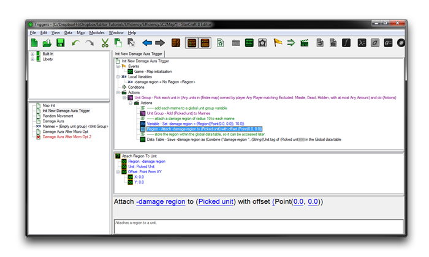
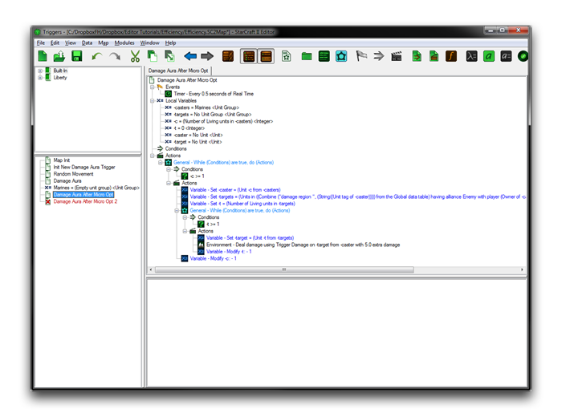
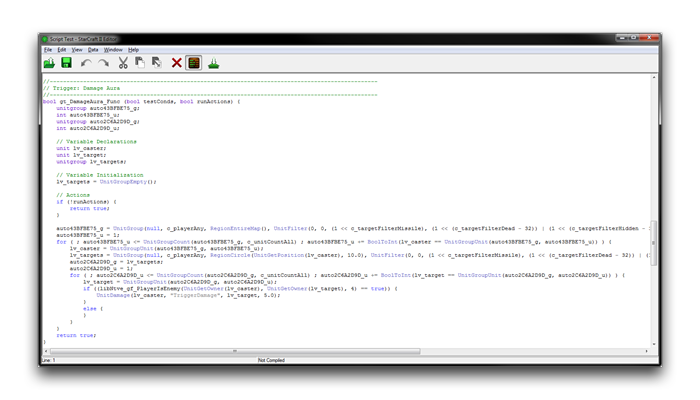
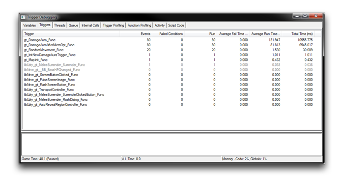

| 问题                                                                                                                | 优化                                                    |
| ------------------------------------------------------------------------------------------------------------------- | ------------------------------------------------------- |
| 触发器当前在每次执行时通过循环遍历地图上的每个单位来构建新的海军单位组。 | 仅将海军添加到单位组中一次。                               |
| 每个海军在每次检查时创建一个新的光环区域。                                                                      | 创建一次区域并重复使用。                                  |
| '-targets'单位组使用'空单位组'初始化，创建不必要的空组。                                                       | 用'无单位组'进行初始化，这是一个成本更低的空值。            |
| 内部循环中关键的玩家联盟检查有一个更低成本的替代方案。                                                        | 使用效率更高的单位组构建本机函数替代。                      |
| 对于在循环过程中未被操纵的单位组，GUI循环对其效率不高。                                                        | 使用定制的循环替代。                                       |

以下是解决上述前两个问题的优化。

*通过触发器重新组织进行微调优化*

光环区域和海军单位组的构建任务已移至“地图初始化”触发器，结果是它们的昂贵操作仅需执行一次。下面解决了表中的第三、第四和第五个问题。

*手工编码的微调优化*

在这里，“伤害光环”触发器已经进行了之前提到的手工编码优化。具体细节超出了本文的范围，但值得考虑的是，尽管其外观更为复杂，但在某个时候所有的GUI代码将变成Galaxy脚本，那时的情况可能会有所不同。下面您将看到触发器的旧版本和新版本的原始代码。

*Galaxy脚本比较*

当以Galaxy代码呈现时，微调优化版本变得简单得多。这种截断主要是由于使用定制的While循环，而不是GUI中的循环，对于每个单位。这个GUI循环设计得易于使用和实用，但对于这个任务来说并不适用。使用自定义解决方案已经节省了许多操作，考虑到“伤害光环”触发器在迭代过程中没有对单位组进行修改。

通过使用Galaxy函数UnitGroupAlliance而不是GUI的UnitGroup，多余的玩家联盟检查也已经被移除。GUI的设计是为了所有用户的外观和使用的简易性。有了经验，您可能选择在适当的时候中止它。您还应注意，较短的代码不一定是更快的代码，因此您应该通过返回触发器调试器来确认新代码的效率。

*优化节省*

正如您所看到的，“伤害光环”触发器通过对代码进行微调优化，加速了大约40％，这是一个令人印象深刻的结果。